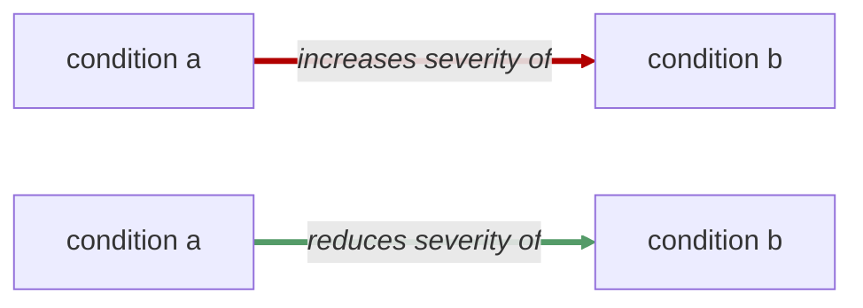
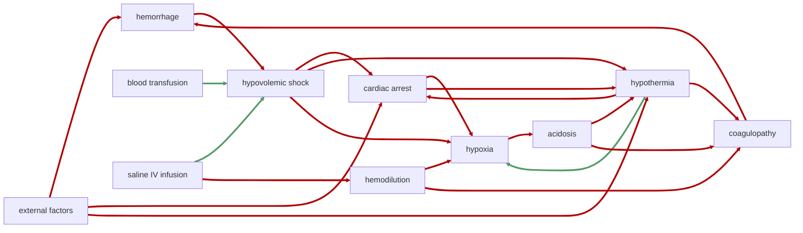
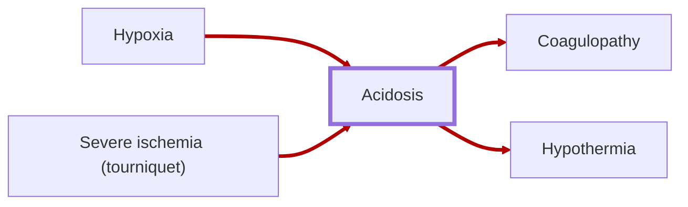
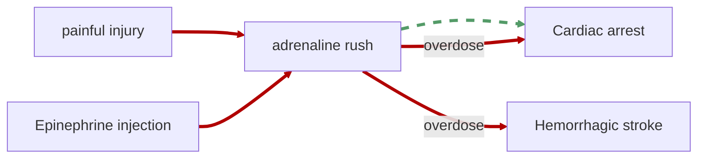
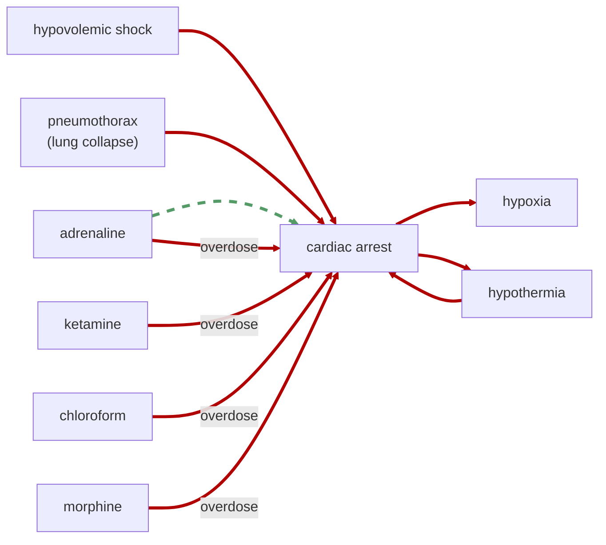
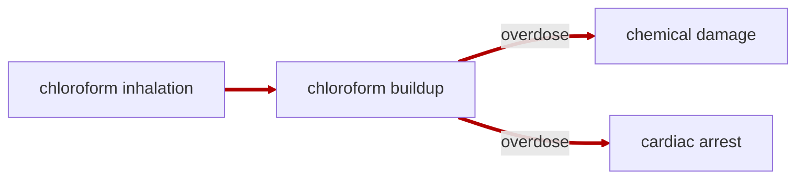
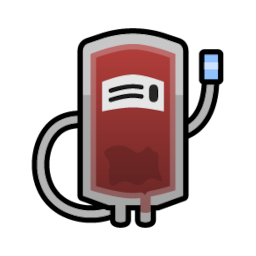
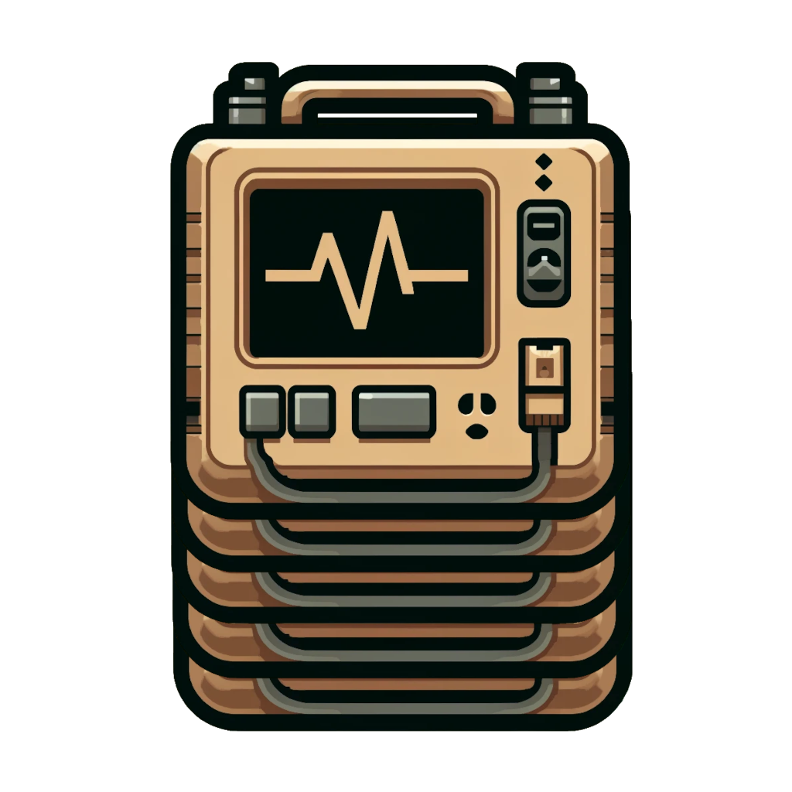
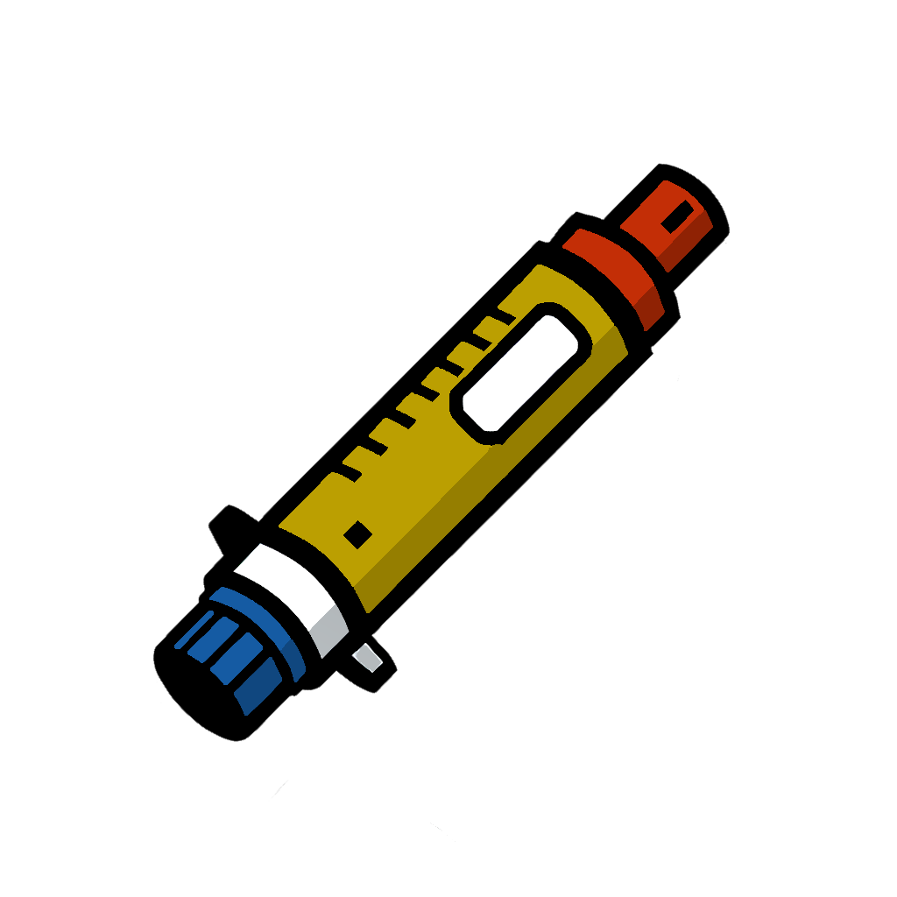
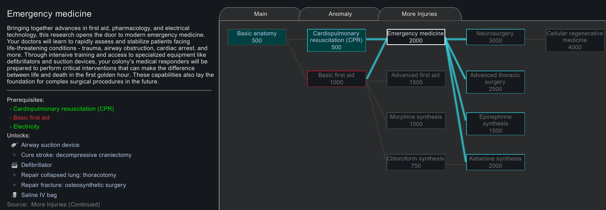

# More Injuries User Manual

_This document is intended to provide a comprehensive guide to the More Injuries mod for RimWorld. It is intended to be a reference for players who are looking to understand the mod's features and mechanics, as well as how to use them effectively._

_For instructions on how to install the mod, please refer to the [installation guide](https://github.com/frederik-hoeft/rimworld-more-injuries/blob/main/INSTALL.md)._  
_If you would like to contribute to this project or improve the documentation, please refer to the [contribution guidelines](https://github.com/frederik-hoeft/rimworld-more-injuries/blob/main/CONTRIBUTING.md) to get started._

## About More Injuries

The More Injuries mod aims to increase the simulation depth of RimWorld's medical system by adding a variety of new injuries, medical conditions, and treatment options, as well as simulating body part damage in more detail and introducing pathophysiological interactions between injuries and medical conditions; meaning that injuries and medical conditions can affect each other in complex ways, leading to cascading effects that can be difficult to manage. The mod also adds new body parts, medical devices, procedures, surgeries, research projects, and work types to enhance the medical gameplay experience.
Its goal is to make the medical system more challenging and interesting in some aspects, while also making it more realistic and immersive. A detailed mod settings menu is provided to allow players to customize many aspects of the mod to their liking.

## Table of Contents
<!-- @import "[TOC]" {cmd="toc" depthFrom=1 depthTo=6 orderedList=false} -->

<!-- code_chunk_output -->

- [More Injuries User Manual](#more-injuries-user-manual)
  - [About More Injuries](#about-more-injuries)
  - [Table of Contents](#table-of-contents)
  - [Pathophysiological System](#pathophysiological-system)
  - [Concepts](#concepts)
    - [Lethal Triad of Trauma](#lethal-triad-of-trauma)
  - [Injuries and Medical Conditions A-Z](#injuries-and-medical-conditions-a-z)
    - [Acidosis](#acidosis)
    - [Adrenaline Rush](#adrenaline-rush)
    - [Brain Damage](#brain-damage)
      - [Agnosia](#agnosia)
      - [Aphasia](#aphasia)
      - [Executive Dysfunction](#executive-dysfunction)
      - [Hippocampal Damage](#hippocampal-damage)
      - [Motor Dysfunction](#motor-dysfunction)
      - [Personality Shift](#personality-shift)
    - [Cardiac Arrest](#cardiac-arrest)
    - [Chemical Damage](#chemical-damage)
    - [Chemical Peritonitis](#chemical-peritonitis)
    - [Chloroform Buildup](#chloroform-buildup)
    - [Choking](#choking)
      - [Choking on Blood](#choking-on-blood)
      - [Choking on Tourniquet](#choking-on-tourniquet)
    - [Coagulopathy](#coagulopathy)
    - [Concussion](#concussion)
    - [EMP Shutdown](#emp-shutdown)
    - [Enclosed Injuries](#enclosed-injuries)
    - [Fractures](#fractures)
      - [Bone Fracture](#bone-fracture)
      - [Healing Bone Fracture](#healing-bone-fracture)
      - [Bone Fragment Laceration](#bone-fragment-laceration)
    - [Gangrene](#gangrene)
      - [Dry Gangrene](#dry-gangrene)
      - [Wet Gangrene](#wet-gangrene)
    - [Hearing Loss](#hearing-loss)
      - [Temporary Hearing Loss](#temporary-hearing-loss)
      - [(Permanent) Hearing Loss](#permanent-hearing-loss)
    - [Hemodilution](#hemodilution)
    - [Hemorrhage (Spontaneous)](#hemorrhage-spontaneous)
    - [Hemorrhagic Stroke](#hemorrhagic-stroke)
    - [Hydrostatic Shock](#hydrostatic-shock)
    - [Hypothermia](#hypothermia)
    - [Hypovolemic Shock](#hypovolemic-shock)
    - [Hypoxia](#hypoxia)
      - [Hypoxia (Brain)](#hypoxia-brain)
    - [Inhalation Injury](#inhalation-injury)
    - [Ischemia](#ischemia)
    - [Ketamine Buildup](#ketamine-buildup)
    - [Lung Collapse](#lung-collapse)
    - [Mechanite Therapy](#mechanite-therapy)
    - [Morphine High](#morphine-high)
    - [Paralysis](#paralysis)
    - [Spalling Injury](#spalling-injury)
    - [Vasodilation](#vasodilation)
  - [New Body Parts](#new-body-parts)
    - [Small and Large Intestines](#small-and-large-intestines)
    - [Femoral and Popliteal Arteries](#femoral-and-popliteal-arteries)
    - [Spinal Cord](#spinal-cord)
  - [Medical Devices and Procedures](#medical-devices-and-procedures)
    - [Airway Suction Device](#airway-suction-device)
    - [Bandage](#bandage)
    - [Blood Bag](#blood-bag)
    - [Chloroform-Soaked Cloth](#chloroform-soaked-cloth)
    - [CPR](#cpr)
    - [Defibrillator](#defibrillator)
    - [Epinephrine Autoinjector](#epinephrine-autoinjector)
    - [First Aid](#first-aid)
    - [Hearing Protection](#hearing-protection)
    - [Hemostatic Agent](#hemostatic-agent)
    - [Ketamine Autoinjector](#ketamine-autoinjector)
    - [Morphine Autoinjector](#morphine-autoinjector)
    - [Saline IV Bag](#saline-iv-bag)
    - [Splint](#splint)
    - [Thoracoscope](#thoracoscope)
    - [Tourniquet](#tourniquet)
  - [Surgeries](#surgeries)
    - [Cellular Regenerative Neurosurgery](#cellular-regenerative-neurosurgery)
    - [Cellular Regenerative Otologic Surgery](#cellular-regenerative-otologic-surgery)
    - [Decompressive Craniectomy](#decompressive-craniectomy)
    - [Osteosynthetic Surgery](#osteosynthetic-surgery)
    - [Stereotactic Surgery](#stereotactic-surgery)
    - [Thoracotomy](#thoracotomy)
    - [Trepanation](#trepanation)
    - [Video-Assisted Thoracoscopic Surgery](#video-assisted-thoracoscopic-surgery)
  - [New Research Projects](#new-research-projects)
    - [Basic Anatomy](#basic-anatomy)
    - [Cardiopulmonary Resuscitation (CPR)](#cardiopulmonary-resuscitation-cpr)
    - [Basic First Aid](#basic-first-aid)
    - [Advanced First Aid](#advanced-first-aid)
    - [Emergency Medicine](#emergency-medicine)
    - [Neurosurgery](#neurosurgery)
    - [Advanced Thoracic Surgery](#advanced-thoracic-surgery)
    - [Epinephrine Synthesis](#epinephrine-synthesis)
    - [Cellular Regenerative Medicine](#cellular-regenerative-medicine)
  - [New Work Types](#new-work-types)
    - [Defibrillation](#defibrillation)
    - [Airway Management](#airway-management)
    - [Performing CPR](#performing-cpr)
    - [Blood Transfusions](#blood-transfusions)
    - [Splinting Fractures](#splinting-fractures)
    - [Tourniquet Recovery](#tourniquet-recovery)
  - [Known Issues and Incompatibilities](#known-issues-and-incompatibilities)

<!-- /code_chunk_output -->

## Pathophysiological System

The More Injuries mod introduces a pathophysiological system that simulates the interactions between injuries and medical conditions in a more realistic and immersive way. This system allows for complex interactions between different injuries and medical conditions, leading to cascading effects that can be difficult to manage. For example, the presence of one injury may exacerbate the effects of another, or injecting a certain drug may have different effects depending on the presence of other injuries or medical conditions.

To aid in understanding these interactions, this manual introduces a graphical representation of the pathophysiological system, including flowcharts and diagrams that illustrate the chain of cause and effect between different injuries and medical conditions. The direction of these interactions is indicated by arrows, whereas arrow colors indicate whether the interaction lessens (green) or worsens/causes (red) the condition, as shown in the following diagram:

Additional arrow labels may be used to indicate conditional effects or modifiers, for example:

In this example, condition a usually improves condition b, but in cases of overdose, it may actually worsen condition b instead.

Some conditions may not improve or worsen other conditions directly, but instead may influence treatment outcomes of other conditions. For example, epinephrine administration in cases of cardiac arrest may improve the chances of successful defibrillation, while opioid-based painkillers may reduce the effectiveness of CPR. These interactions are represented by dashed arrows, the colors of which indicate the nature of the interaction (green for beneficial effects, red for harmful effects).

## Concepts

This section provides an overview of key concepts related to trauma and injury management simulated by the More Injuries mod. These concepts are crucial for understanding how injuries and medical conditions interact with each other, and how they can be treated effectively.

### Lethal Triad of Trauma

  
The "lethal triad of trauma" is a critical concept in trauma medicine that describes the dangerous cycle of three interrelated conditions: [acidosis](#acidosis), [hypothermia](#hypothermia), and [coagulopathy](#coagulopathy). These conditions often occur together in severely injured patients and can lead to a rapid deterioration of the patient's condition, ultimately resulting in death if not addressed promptly.

More Injuries tries to simulate these interactions in a gamified, yet realistic way, making severe blood loss and trauma more challenging and interesting to manage. An overview of the interactions between these conditions is provided below, along with a flowchart that illustrates the relationships between them.

*See the section on the [pathophysiological system](#pathophysiological-system) for more information on the graphical representation.*

As per basegame RimWorld, external factors like injuries or environmental conditions can quickly lead to hypothermia or bleeding injuries. More Injuries extends this simulation depth by simulating follow-up conditions and potential cascading effects that can arise from these initial injuries.

In the context of trauma management, this means that a seemingly minor injury can rapidly escalate into life-threatening conditions if not properly addressed. Let's explore some examples of these cascading effects.

If a pawn suffers a severe injury that causes significant blood loss, they may go into [hypovolemic shock](#hypovolemic-shock), meaning their body is unable to maintain adequate blood pressure and perfusion to vital organs. This, in turn, may cause a cascade of complications, further worsening the pawn's condition. For example, the reduced flow of oxygenated blood to the tissues can starve the cells of oxygen, which leads to [hypoxia](#hypoxia) and cell death, which not only affects the local tissue (e.g., causing organ failure, brain damage, or death), but can also trigger a systemic condition. In their oxygen-deprived state, the cells begin to switch to anaerobic metabolism, producing lactic acid which lowers the blood pH, leading to [acidosis](#acidosis). The increased acidity in the blood hinders the cells' ability to produce energy, which is required for thermogenesis and maintaining body temperature, leading to [hypothermia](#hypothermia), which is further accelerated by the reduced blood flow caused by hypovolemic shock, so warmer blood is not able to reach the extremities. Both, hypothermia and acidosis, negatively affect the blood's ability to clot, leading to [coagulopathy](#coagulopathy), a condition where even minor injuries can cause uncontrolled bleeding or even new spontaneous hemorrhages. This can create a dangerous cycle known as the "lethal triad of trauma," where uncontrolled bleeding further exacerbates hypovolemic shock, leading to more hypoxia, more acidosis, and more severe hypothermia, which in turn worsens coagulopathy and increases the risk of further hemorrhages.

In order to break this vicious cycle, it is crucial to address the underlying causes of each condition. For example, stopping severe arterial bleeding in the limbs with a [tourniquet](#tourniquet) will buy time to bandage the wound and perform fluid resuscitation with [blood transfusions](#blood-transfusion) or [IV saline infusion](#saline-infusion) to restore blood volume and combat hypovolemic shock. If the patient is hypothermic, they should be wrapped in warm blankets or placed in a warm environment to prevent further heat loss. This might involve warming up the operating room to uncomfortably high temperatures to ensure the patient retains heat. 

Depending on how far gone the patient is, continued medical treatment may be required to stabilize the patient and prevent further deterioration, even during recovery. [Defibrillation](#defibrillator) or [CPR](#cpr) may be required in cases of [cardiac arrest](#cardiac-arrest) due to hypothermia or hypovolemic shock, and [hemodilution](#hemodilution) caused by excessive use of [saline IVs](#saline-iv-bag) may require administering additional [blood transfusions](#blood-transfusion) to restore adequate blood volume and improve tissue perfusion. 

To reduce the amount of micro-management required, new [work types](#new-work-types) have been added to allow doctors to automatically triage and treat patients ***who are in hospital beds*** based on their injuries and conditions. Nevertheless, after severe injuries, it is still recommended to keep a close eye on the patient and monitor their condition, and to manually intervene if necessary, especially if new conditions arise while the doctor is busy treating unrelated conditions or other patients.

Keep in mind that the human body is a complex system and requires some time to stabilize and for conditions to start improving. Even after blood volume has been restored, it takes time to break down and clear metabolic byproducts like lactic acid from the body, and to restore normal blood pH levels. It is not uncommon for patients to require multiple rounds of triage and treatment before they are fully stabilized and start recovering by themselves.

> [!WARNING]
> Once a certain point of no return has been reached and the lethal triad of trauma has caused the patient to enter a death spiral, it may become impossible to save them, even with the best medical care. As such, it is crucial to act quickly and decisively in the face of severe injuries and complications. Keep trained medics with the appropriate equipment on standby when engaging in combat and have pawns carry life-saving equipment like [tourniquets](#tourniquet) at all times.

## Injuries and Medical Conditions A-Z

The following sections provide an overview of the new injuries and medical conditions added by the More Injuries mod, as well as their effects and treatment options.

### Acidosis

Acidosis is a serious metabolic condition caused by an excessive buildup of acid in the body, typically caused by inadequate oxygen delivery to tissues ([hypoxia](#hypoxia)) following severe blood loss ([hypovolemic shock](#hypovolemic-shock)), [cardiac arrest](#cardiac-arrest), or other forms of shock. As oxygenated blood stops flowing to the tissues (due to one or more of above conditions), the body shifts to anaerobic metabolism, meaning it starts producing energy without oxygen, which results in the production of lactic acid and the accumulation of carbon dioxide. These byproducts lower the blood pH, leading to acidosis.

The condition contributes to a dangerous cycle known as the [lethal triad of trauma](#lethal-triad-of-trauma): acidosis, [hypothermia](#hypothermia), and [coagulopathy](#coagulopathy). As blood pH drops, blood clotting function becomes impaired, increasing the risk of uncontrolled [hemorrhage](#hemorrhage-spontaneous) and [trauma-induced coagulopathy](#coagulopathy). At the same time, acidosis impairs mitochondrial function (the powerhouse of the cell), leading to decreased ATP (energy) production in cells, which is required for thermogenesis and maintaining body temperature. This contributes to [hypothermia](#hypothermia) and further exacerbates the cycle of trauma.

> **In-Game Description**
> _"**Acidosis** &mdash; Acidosis is a serious metabolic condition characterized by an excessive buildup of acid in the body, typically caused by inadequate oxygen delivery to tissues (hypoxia) following severe blood loss (hypovolemia), cardiac arrest, or other forms of shock. As oxygen becomes scarce, the body shifts to anaerobic metabolism, producing lactic acid and accumulating carbon dioxide, which together lower blood pH.
> The condition contributes to a dangerous cycle known as the "lethal triad" of trauma: acidosis, hypothermia, and coagulopathy. As blood pH drops, clotting function becomes impaired, increasing the risk of uncontrolled bleeding and trauma-induced coagulopathy (TIC). At the same time, mitochondrial function declines and cell-energy production is impaired, hindering thermogenesis and maintaining body temperature, ultimately leading to hypothermia and further exacerbating the cycle of trauma.
> Acidosis is treated by restoring oxygen delivery to tissues - typically through rapid control of bleeding, fluid resuscitation with blood products, and correction of hypoxia. Once tissue oxygenation is restored, acid levels gradually normalize as the body clears metabolic byproducts through the lungs, liver, and kidneys."_

**Causes**: [Hypoxia](#hypoxia) or [severe ischemia after prolonged tourniquet application](#ischemia).

**Effects**: Directly contributes to [coagulopathy](#coagulopathy) and [hypothermia](#hypothermia).

*See the section on the [pathophysiological system](#pathophysiological-system) for more information on the graphical representation.*

**Treatment**: Restore oxygen delivery to tissues: control bleeding, provide fluid resuscitation, preferably with [blood products](#blood-bag), and treat effects coagulopathy and hypothermia. Once underlying causes are addressed, acid levels gradually normalize as the body clears metabolic byproducts through the lungs, liver, and kidneys.

> [!WARNING]
> Acidosis naturally "lags behind" the underlying causes, meaning that it doesn't set in immediately after oxygen delivery to tissues is impaired, and it may take some time for the body to clear metabolic byproducts after oxygen delivery is restored. This means that even after a pawn has been stabilized and blood volume has been restored, they may still suffer from acidosis for a while. Keep a close eye on their condition and be prepared to provide further treatment as needed.

### Adrenaline Rush

Adrenaline, also known as epinephrine, is a naturally occurring hormone that is released in response to stress or danger. It increases heart rate, blood pressure, and energy levels, preparing the body for a fight-or-flight response. In the game, an adrenaline rush can occur naturally in pawns as a result of combat and injury, or it can artificially be induced through the use of an [epinephrine injection](#epinephrine-autoinjector).

> **In-Game Description**
> _"**Adrenaline rush** &mdash; A rush of adrenaline temporarily increases heart rate and blood pressure, providing a boost of energy and alertness. The body's fight-or-flight response is triggered, increasing strength and speed.
> However, if the rush is too intense, it can cause anxiety, panic, and overdose symptoms such as dizziness, double vision, and nausea. In extreme overdose cases, the body can go into shock, causing heart attack, stroke, or death."_

**Causes**: Injuries or [epinephrine injections](#epinephrine-autoinjector).

**Effects**: At lower levels, an adrenaline rush can provide a temporary boost to consciousness, moving, and pain tolerance. At higher levels, it can cause a reduction in manipulation and sight. In extreme cases of overdose, it can lead to anxiety, panic, nausea, as well as, coma, [cardiac arrest](#cardiac-arrest), [hemorrhagic stroke](#hemorrhagic-stroke), and subsequent death. As adrenaline raises the heart rate and blood pressure, it can also reduce the effects of [hypovolemic shock](#hypovolemic-shock) for a short period of time.  
In a similar way, epinephrine injections may be used to assist with [defibrillation](#defibrillator) efforts and [CPR](#cpr) in cases of [cardiac arrest](#cardiac-arrest).

*See the section on the [pathophysiological system](#pathophysiological-system) for more information on the graphical representation.*

**Treatment**: Adrenaline is naturally metabolized by the body over time and effects last between a few minutes to a few hours in severe cases. In cases of overdose, the pawn may require medical treatment to treat symptoms and secondary effects.

### Brain Damage

In this context, "brain damage" refers to a range of temporary or permanent neurological conditions that can occur as a result of traumatic brain injury, stroke, or [hypoxia](#hypoxia). Brain damage can manifest in various ways, including cognitive impairments, motor dysfunction, and changes in personality. The severity and type of brain damage depend on the extent of the injury and the specific areas of the brain affected.

Brain damage may not always be immediately apparent, as some symptoms may take time to develop as the patient recovers from the initial injury. In some cases, brain damage may be reversible with experimental treatments, such as [mechanite therapy](#mechanite-therapy) or [cellular regenerative neurosurgery](#cellular-regenerative-neurosurgery), which can help repair damaged brain tissue and restore normal function. However, these futuristic treatments require advanced research and technology, and may be expensive and time-consuming to perform.

**Causes**: [hypoxia](#hypoxia-brain)

**Effects**: Effects of brain damage can vary widely depending on the specific areas of the brain affected and the severity of the injury. Common effects are listed below.

#### Agnosia

Agnosia is a neurological disorder characterized by an inability to process sensory information. Often there is a loss of ability to recognize objects, persons, sounds, shapes, or smells while the specific sense is neither defective nor is there any significant memory loss.

> **In-Game Description**
> _"**Agnosia** &mdash; Damage to the occipital or temporal lobes has impaired the ability to recognize objects or faces, despite normal vision. Affected patients may have trouble identifying items or people, leading to confusion and slower task performance."_

**Effects**: Reduced work speed, research speed, and social impact, depending on the severity of the condition. Negative mood effects may occur due to frustration or confusion caused by the inability to recognize familiar objects or people.

**Thoughts per Stage**:
> _"**Things look unfamiliar** (-2) &mdash; Sometimes I catch myself hesitating, unsure of what I'm looking at. It's subtle, but unsettling - like the world is just slightly off."_
> _"**Misrecognizing people and objects** (-4) &mdash; I keep mistaking objects - or even people - for others. It's confusing, and I often feel embarrassed or disoriented."_
> _"**Faces blur together** (-6) &mdash; Everyone looks the same. I have to rely on voices or context to tell people apart. It's isolating and makes social interaction exhausting."_
> _"**Nothing makes visual sense** (-8) &mdash; The world around me is a jumble of shapes and colors. I can't rely on sight to recognize what I see anymore. Every task is harder, and I feel disconnected from everything."_

#### Aphasia

Aphasia, also known as dysphasia, is an impairment in a person's ability to comprehend or formulate language because of dysfunction in specific brain regions.

> **In-Game Description**
> _"**Aphasia** &mdash; Permanent damage to nerve cells in the language centers of the brain has resulted in pronounced difficulty with communication. This can manifest as word-finding difficulties, fragmented speech, or even complete muteness. The severity of the aphasia can vary based on the extent of the damage."_

**Effects**: Reduced talking capacity, trade price penalty when trading. Negative mood effects may occur due to frustration or confusion caused by the inability to communicate effectively.

**Thoughts per Stage**:

> _"**Word-finding difficulty** (-2) &mdash; Struggling to find the right words can be frustrating and isolating. I feel embarrassed when I can't express myself clearly."_
> _"**Fragmented speech** (-4) &mdash; I can speak, but my sentences are often incomplete or jumbled. It's like my thoughts are scattered, and I can't put them together."_
> _"**Non-fluent** (-6) &mdash; Every conversation feels like a struggle. I can't form complex sentences, and it's hard to communicate even basic ideas. I want to express myself, but my words fail me."_
> _"**Barely verbal** (-8) &mdash; My ability to speak has been reduced to almost nothing. I can only manage a few words at a time, and even those are difficult to pronounce. I feel trapped in my own silence."_
> _"**Completely nonverbal** (-10) &mdash; I can no longer speak at all. My thoughts are locked inside me, and I can't communicate with others. I feel alone and isolated, unable to share my feelings or ideas."_

#### Executive Dysfunction

In psychology and neuroscience, executive dysfunction, or executive function deficit, is a disruption to the efficacy of the executive functions, which is a group of cognitive processes that regulate, control, and manage other cognitive processes. Executive dysfunction can refer to both neurocognitive deficits and behavioural symptoms.

> **In-Game Description**
> _"**Executive dysfunction** &mdash; Damage to the frontal lobes has impaired executive functions, including decision-making, planning, and impulse control. Affected individuals may act erratically or inappropriately, and struggle with organization, prioritization, and regulating emotions, leading to difficulties in daily life and social interactions."_

**Effects**: Periodic mental breaks, increased risk of social fights.

#### Hippocampal Damage

Hippocampal damage refers to damage to the hippocampus, a region of the brain that is critical for memory formation and spatial navigation. Damage to this area can result in significant memory impairments, including difficulty forming new memories and recalling past events.

> **In-Game Description**
> _"**Hippocampal damage** &mdash; Damage to the hippocampus has impaired memory formation and spatial navigation. Affected individuals may become confused about their surroundings, forget where they are, and have difficulty navigating or recalling past events."_

**Effects**: Periodic mental breaks of type "confused wandering," memory loss, reduced learning factor, reduced work speed, periodic mental breaks at higher stages. Negative mood effects may occur due to frustration or confusion caused by memory impairments.

**Thoughts per Stage**:
> _"**Disoriented** (-2) &mdash; Sometimes I forget why I walked into a room or what I was just doing. It's like my thoughts vanish mid-sentence."_
> _"**Forgetting simple things** (-4) &mdash; I've started forgetting names, places, tasks. It's frustrating, like sand slipping through my fingers whenever I try to recall something."_
> _"**Losing track of time** (-6) &mdash; Hours blur together. Sometimes I wake up not knowing where I am or what day it is. I feel lost - even in familiar places."_
> _"**Memories feel distant** (-8) &mdash; Memories feel like someone else's dreams. Faces, places, and events all seem unfamiliar. I'm scared of forgetting everything."_
> _"**Losing sense of self** (-10) &mdash; My identity feels fragile. I struggle to remember who I am, what I've done, or what I care about. It's like I'm fading away, and I don't know how to stop it."_

#### Motor Dysfunction

Motor dysfunction refers to a range of movement disorders that can occur as a result of brain damage. These disorders can affect coordination, balance, and fine motor skills, leading to difficulties with tasks such as walking, writing, or using tools.

> **In-Game Description**
> _"**Motor dysfunction** &mdash; Neurological damage to the motor cortex has resulted in permanent impairment of the motor system. This can manifest as weakness, tremors, or difficulty coordinating movements. The severity of the dysfunction can vary based on the extent of the damage."_

**Effects**: Reduced moving speed, reduced manipulation capacity. Negative mood effects may occur due to frustration or confusion caused by motor impairments.

**Thoughts per Stage**:
> _"**Clumsy** (-2) &mdash; My movements feel less precise than they used to be. I drop things more often and stumble occasionally. It's frustrating, but manageable."_
> _"**Shaky and unsteady** (-4) &mdash; My hands tremble, and walking in a straight line takes concentration. Tasks that used to be simple now require real effort and care."_
> _"**Struggling to control my body** (-6) &mdash; Basic actions are difficult. My limbs don't always respond the way I want them to, and I often lose coordination. It makes me feel helpless and vulnerable."_
> _"**Near-paralyzed** (-8) &mdash; Moving feels like dragging weights through water. I can barely walk, and using my hands has become incredibly difficult. I rely on others for more than I'd like to admit."_
> _"**Trapped in a failing body** (-10) &mdash; My body no longer obeys me. Every step, every grasp is a monumental challenge. I feel like a living vegetable, unable to do anything for myself, and completely dependent on others. It's a nightmare."_

#### Personality Shift

> **In-Game Description**
> _"Due to severe brain damage, {0} has undergone a significant shift in personality. They may have become more skilled in certain areas, but also may have lost some of their previous skills. This change is permanent and may require some reorientation for their role in the colony."_

**Effects**: Permanent change in personality, which includes a redistribution of skills corresponding to the extend of the brain damage. For example, a pawn may become more skilled in combat or social interactions, but lose some of their previous skills in crafting or research. This change is permanent and may require some reorientation for their role in the colony.

> [!NOTE]
> This feature can be disabled in the mod settings if you prefer not to have personality shifts as a result of brain damage.

### Cardiac Arrest

Cardiac arrest is a sudden loss of blood flow resulting from the failure of the heart to effectively pump blood. It is generally divided into two categories: `ventricular fibrillation` and asystole (flatline, `clinical death`). `Ventricular fibrillation` is a condition in which the heart's electrical signals become disorganized, causing the heart to quiver or "fibrillate" instead of pumping blood effectively. In cases of `ventricular fibrillation`, a [defibrillator](#defibrillator) can be used to shock the heart back into a normal rhythm, which may be faster and more effective than [CPR](#cpr). If left untreated, `ventricular fibrillation` can progress to `clinical death`, which is a condition in which the heart stops beating completely and [CPR](#cpr) must be performed to restore blood flow and hopefully restart the heart. Applying a [defibrillator](#defibrillator) to a clinically dead patient will not be effective and may cause additional harm.

> **In-Game Description**
> _"**Cardiac arrest** &mdash; Cardiac arrest is a sudden loss of blood flow resulting from the failure of the heart to effectively pump blood. The lack of blood flow causes the body to stop working properly, resulting in loss of consciousness and death if not treated immediately. Causes for cardiac arrest include conditions that starve the heart of oxygen, such as extreme blood loss.
> A skilled doctor must perform CPR to restore blood flow and hopefully restart the heart. In early stages of cardiac arrest, during ventricular fibrillation, a defibrillator can also be used to shock the heart back into a normal rhythm, which may be faster and more effective than CPR."_

**Causes**: Extreme blood loss ([hypovolemic shock](#hypovolemic-shock)), [pneumothorax](#lung-collapse), [adrenaline overdose](#adrenaline-rush), [ketamine overdose](#ketamine-overdose), [chloroform overdose](#chloroform-buildup), [morphine overdose](#morphine-overdose), or other conditions that starve the heart of oxygen.

**Effects**: Loss of consciousness, coma, [hypoxia](#hypoxia), multiple organ failure, and death if not treated immediately. [Hypothermia](#hypothermia) will set in quickly as the body is unable to distribute heat effectively.

**Treatment**: Cardiac arrest must be treated immediately with [CPR](#cpr) (which needs to be researched first) to restore blood flow and hopefully restart the heart. In cases of `ventricular fibrillation`, a [defibrillator](#defibrillator) can be used to shock the heart back into a normal rhythm, which may be faster and more effective than [CPR](#cpr). In cases of `clinical death`, only [CPR](#cpr) will be effective. [Epinephrine](#epinephrine-autoinjector) may be administered to assist with defibrillation efforts and [CPR](#cpr) in cases of cardiac arrest, but it is not required.

> [!NOTE]
> **Biotech DLC**: Sanguaphages are immune to cardiac arrest and will automatically recover from it once entering deathrest.

### Chemical Damage

Chemical damage is a collective term for various toxic effects caused by exposure to harmful substances, such as drugs, chemicals, or toxins.

> **In-Game Description**
> _"**Chemical damage** &mdash; Tissue damage caused by toxic chemical exposure. This may result from direct contact with harmful substances or from the organ's own metabolic processing of certain drugs or toxins, producing reactive intermediates. Such damage often leads to cellular stress, necrosis, or scarring, and may cause irreversible harm to the affected organ, potentially leading to full organ failure if severe enough."_

**Causes**: [Chloroform buildup](#chloroform-buildup) (from overdose) causes chemical damage to the liver and kidneys.

**Effects**: Damage to the affected organ, which may lead to complete organ failure if severe enough. The severity of the damage depends on the type and amount of chemical exposure, as well as the duration of exposure.

**Treatment**: Treatment of chemical damage typically involves removing the source of exposure and providing supportive care to the affected organ. In severe cases, surgical intervention may be required to replace the damaged organ.

### Chemical Peritonitis

Also known as _"intestinal spillage,"_ chemical peritonitis is a life-threatening condition that occurs when gastric acid or other digestive fluids leak into the abdominal cavity, causing inflammation and tissue damage to surrounding organs ([small and large intestines](#small-and-large-intestines), stomach, kidneys, and liver). The condition carries a major risk of infection which can be life-threatening if left untreated.

> **In-Game Description**
> _"**Chemical peritonitis** &mdash; As a result of a perforating injury to intestines or stomach, gastric acid has inflicted tissue damage on surrounding organs, causing inflammation. Carries a major risk of infection."_

**Causes**: A perforating injury to the intestines or stomach, such as a gunshot wound or stab wound, that allows gastric acid to leak into the abdominal cavity and cause tissue damage.

**Effects**: Inflammation of the abdominal cavity, severe pain, and a major risk of infection. Potentially life-threatening if a resulting infection is left untreated.

**Treatment**: Medical treatment of the perforating injury and inflammation using high-quality medicine to prevent infection.

### Chloroform Buildup

Chloroform buildup is a condition that occurs when a pawn is exposed to [chloroform](#chloroform-soaked-cloth). Chloroform is metabolized by the liver and kidneys, and excessive exposure can lead to a severe buildup of chloroform in the body. This can cause [chemical damage](#chemical-damage) to the liver and kidneys, leading to organ failure if severe enough.

> **In-Game Description**
> _"**Chloroform buildup** &mdash; Chloroform is a volatile anesthetic that induces unconsciousness and analgesia by depressing the central nervous system. It was historically used in surgical procedures and as a solvent in laboratories. Chloroform is rapidly absorbed through the lungs, skin, and gastrointestinal tract, leading to systemic distribution and metabolism primarily in the liver.  
> While effective at low doses, chloroform can cause toxicity and overdose at higher concentrations, leading to symptoms such as renal and hepatic damage, respiratory depression, and cardiac arrest. Due to its potential for severe side effects and the difficulty of controlling dosage through inhalation, chloroform is rarely used in modern medicine.

**Causes**: Inhalation of [chloroform](#chloroform-soaked-cloth).

**Effects**: Loss of consciousness, respiratory depression, [chemical damage](#chemical-damage) to the liver and kidneys, and [cardiac arrest](#cardiac-arrest) in severe cases of overdose. The severity of the effects strongly depends on the administered dose and the duration of exposure. Generally, skilled doctors will be able to administer chloroform in a way that prevents overdose, but due to the nature of administration (inhalation), it is difficult to achieve a precise dosage.

### Choking

Choking is a medical emergency that occurs when a foreign object becomes lodged in the throat or windpipe, blocking the flow of air. It can be a life-threatening situation that requires immediate intervention to clear the airway and restore breathing.

#### Choking on Blood

> **In-Game Description**
> _"**Choking on blood** &mdash; Blood from traumatic injuries being aspirated into the airways triggers coughing and causes suffocation. The bleeding must be stopped and the airways cleared to prevent death. If the patient is conscious, they may be able to cough up the blood on their own and clear the airway. Otherwise, the airways must be cleared using a specialized airway suction device or by compressing the chest using CPR to expel the blood and restore breathing."_

**Causes**: Severe injuries to the mouth, throat, or chest that cause bleeding into the airways.

**Effects**: Coughing, suffocation, loss of consciousness, and death if not treated immediately.

**Treatment**: Stopping the bleeding of the mouth, throat, or chest will prevent further blood from entering the airways and slow the progression of the condition. If the patient is conscious, they may be able to cough up the blood on their own and clear the airway. If the patient is unconscious, the airways must be cleared using a specialized [airway suction device](#airway-suction-device) or by compressing the chest using [CPR](#cpr) to expel the blood and restore breathing. To unlock [CPR](#cpr), you must first complete the [cardiopulmonary resuscitation (CPR)](#cardiopulmonary-resuscitation-cpr) research project.

> [!NOTE]
> **Biotech DLC**: Deathresting sanguaphages will always be able to cough up the blood on their own and clear the airway - once the bleeding has been stopped.

#### Choking on Tourniquet

> **In-Game Description**  
> _"**Choking on tourniquet** &mdash; A severe lack of intellect caused a potentially fatal mishap in form of a misapplied tourniquet."_

**Causes**: Someone had the bright idea to apply a [tourniquet](#tourniquet) to the neck :woozy_face: Only a severe lack of intellect and medical incompetence can cause this condition.

**Effects**: Suffocation and death if not treated immediately.

**Treatment**: Removing the [tourniquet](#tourniquet) from the neck will restore breathing and prevent death.

### Coagulopathy

> [!CAUTION]
> TODO: update docs

### Concussion

> **In-Game Description**  
> _"**Concussion** &mdash; A concussion, also known as a mild traumatic brain injury (mTBI), is a head injury that temporarily affects brain functioning. Symptoms may include loss of consciousness; memory loss; headaches; difficulty with thinking, concentration, or balance; nausea; blurred vision; dizziness; sleep disturbances, and mood changes.
> Should resolve on its own within a few days, but can be worsened by repeated head injuries."_

**Causes**: Blunt force trauma to the head. May be caused by any violent impact to the head, such as hand-to-hand combat, being struck by a projectile, or explosions.

**Effects**: A concussion may range from a mild headache to full unconsciousness, depending on the severity of the injury. The pawn may experience a temporary loss of consciousness, memory loss, painful headaches, disorientation,difficulty with thinking, nausea and vomiting, blurred vision, and dizziness. Repeated head injuries may worsen the condition or lead to a [hemorrhagic stroke](#hemorrhagic-stroke).

**Treatment**: Concussions are generally self-limiting and will resolve on their own within a few days.

### EMP Shutdown

> **In-Game Description**
> _"**Servos disabled** &mdash; A bionic bodypart was disabled by an EMP blast. It will take around one day to reboot itself."_

**Causes**: Exposure to sources of strong electromagnetic interference, such as EMP grenades or psychic abilities.

**Effects**: The affected bionic body part will be disabled and unusable for a period of time.

**Treatment**: The bionic body part will reboot itself after around one day and return to normal function.

### Enclosed Injuries

> **In-Game Description**
> _"**&lt;injury type&gt; (enclosed)**"_

Bleed rates of injuries are now dynamically calculated and depend on the depth of the injury. For example, a gunshot wound to the abdomen may be bandaged on the exterior, but the internal organs may still be bleeding until properly treated. Such enclosed injuries bleed at a slower rate than open injuries, but they can still be life-threatening if not treated properly. 

**Causes**: Penetrating injuries with damage to internal organs, where only the exterior (skin layer) is bandaged.

**Effects**: Internal bleeding continues at a reduced rate compared to open injuries, but can still be life-threatening if not treated properly.

**Treatment**: Enclosed injuries may be treated with vanilla RimWorld treatment methods, such as medicine or treatment without medicine.

### Fractures

When a pawn takes damage to a bone or solid body part, there is a chance that a fracture will occur, based on the severity of the injury and the mod settings.

#### Bone Fracture

> **In-Game Description**  
> _"**Bone fracture** &mdash; A partial or complete break of a bone caused by trauma, overuse, or disease. The bone may be cracked, splintered, or completely broken into two or more pieces. Until properly treated, the affected limb will be unable to bear weight or move properly, causing severe pain and loss of function.  
> Must either be splinted to immobilize the bone and promote healing over time, or surgically repaired to realign and stabilize the bone, allowing for quick recovery."_

**Causes**: Sharp or blunt damage to a bone or solid body part.

**Effects**: A bone fracture will cause the affected limb to be unable to bear weight or move properly, causing full immobility of the corresponding body part and `+15%` pain. Bone fractures may also cause [bone fragment lacerations](#bone-fragment-laceration) if bone fragments break off and cut into the surrounding tissue.

**Treatment**: Bone fractures must be treated using a [splint](#splint) to immobilize the bone and promote [healing over time](#healing-bone-fracture), or [osteosynthetic surgery](#osteosynthetic-surgery) to realign and stabilize the bone with metal implants, allowing for a quick recovery.

#### Healing Bone Fracture

> **In-Game Description**  
> _"**Healing bone fracture** &mdash; A bone fracture that is in the process of healing. The bone is still weak and restricted in movement, but the limb is slowly regaining function as the bone knits back together.
> Over time, the bone will become stronger and the limb will regain full function."_

**Causes**: A [bone fracture](#bone-fracture) that has been stabilized with a [splint](#splint) and is in the process of healing.

**Effects**: The affected limb will be usable but restricted in movement. Over time, the effects will slowly diminish as the bone heals and the limb regains full function.

**Treatment**: Healing bone fractures do not require any additional treatment and will naturally heal over the course of several days to weeks, depending on how skillfully the [splint](#splint) was applied.

#### Bone Fragment Laceration

When a bone is fractured, there is a chance that fragments of the bone will break off and cause additional damage to the surrounding tissue, resulting in a laceration injury (a cut). The occurance and chance of bone fragment laceration can be adjusted in the mod settings.

> **In-Game Description**  
> _"**Cut (bone fragments)** &mdash; A cut caused by fragments of a bone."_

**Causes**: A [bone fracture](#bone-fracture) may result in sharp bone fragments breaking off and cutting into the surrounding tissue.

**Effects**: A bone fragment laceration will cause additional pain and bleeding, as well as a risk of infection if not properly treated.

**Treatment**: Bone fragment lacerations can be treated like any other cut or laceration, by treating the wound with or without medicine, preferably in a clean environment to reduce the risk of infection.

### Gangrene

Gangrene is a type of tissue death caused by a lack of blood supply. Symptoms may include a change in skin color to red or black, numbness, swelling, pain, skin breakdown, and coolness. Depending on the presence of infection, gangrene may be classified as dry or wet.

#### Dry Gangrene

> **In-Game Description**
> _"**Gangrene (dry)** &mdash; Dry gangrene is a form of coagulative necrosis that develops in ischemic tissue, where the blood supply is inadequate to keep tissue viable. The affected part is dry, shrunken, and dark reddish-black. The line of separation usually brings about complete separation, with eventual falling off of the gangrenous tissue if it is not removed surgically, a process called autoamputation.
> Over time, dry gangrene may develop into wet gangrene if an infection develops in the dead tissues.
> The affected body part is irreversibly damaged and should be amputated to prevent sepsis."_

**Causes**: A lack of blood supply to a body part, often due to a [tourniquet](#tourniquet) that has been applied for too long or other conditions that restrict blood flow.

**Effects**: The affected body part will become dry, shrunken, and dark reddish-black, and may eventually fall off if not removed surgically. Dry gangrene may progress to [wet gangrene](#wet-gangrene) if an infection develops in the dead tissues.

**Treatment**: The affected body part is irreversibly damaged and should be amputated to prevent life-threatening infection.

#### Wet Gangrene

> **In-Game Description**
> _"**Gangrene (wet)** &mdash; Wet, or infected, gangrene is characterized by thriving bacteria and has a poor prognosis (compared to dry gangrene) due to sepsis resulting from the free communication between infected fluid and circulatory fluid. The affected part is saturated with stagnant blood, which promotes the rapid growth of bacteria. The toxic products formed by bacteria are absorbed, causing systemic manifestation of sepsis and finally death.
> The affected body part should be amputated as soon as possible to save the patient's life._"

**Causes**: A lack of blood supply to a body part that caused the tissue to die and become infected with bacteria, often due to a [tourniquet](#tourniquet) that has been applied for too long or due to [dry gangrene](#dry-gangrene) that has become infected.

**Effects**: The affected body part will become saturated with stagnant blood, promoting the rapid growth of bacteria. The toxic products formed by bacteria are absorbed, causing systemic manifestation of sepsis and eventually death.

**Treatment**: The affected body part should be amputated as soon as possible to save the patient's life.

### Hearing Loss

Hearing loss is a partial or total inability to hear. It may be temporary or permanent and can affect one or both ears and can be commonly caused by exposure to loud noises, trauma, or age-related degeneration.

#### Temporary Hearing Loss

> **In-Game Description**
> _"**Temporary hearing loss** &mdash; Temporary deafness caused by prolonged exposure to loud noises, such as gunfire, explosions, or machinery. The hair cells in the inner ear are damaged, leading to hearing loss. The damage can become permanent if the exposure is severe or prolonged."_

**Causes**: Prolonged exposure to gunfire or explosions without [hearing protection](#hearing-protection). More likely to occur indoors or in close proximity to the source of the noise.

**Effects**: Temporary reduction in hearing ability, ranging from mild to complete deafness, depending on the severity of the exposure. May progress to [permanent hearing loss](#permanent-hearing-loss) if the exposure is severe or prolonged.

**Treatment**: Temporary hearing loss will resolve on its own over time, but may become permanent if the exposure is severe or prolonged.

#### (Permanent) Hearing Loss

_Vanilla RimWorld condition, see [Hearing loss (RimWorld Wiki)](https://rimworldwiki.com/wiki/Ailments#Hearing_loss)_.

**Causes**: See [Hearing loss (RimWorld Wiki)](https://rimworldwiki.com/wiki/Ailments#Hearing_loss), but can also be caused by severe cases of [temporary hearing loss](#temporary-hearing-loss).

**Effects**: Permanent reduction in hearing ability, see [Hearing loss (RimWorld Wiki)](https://rimworldwiki.com/wiki/Ailments#Hearing_loss).

**Treatment**: Implants or bionic ears (see [Hearing loss (RimWorld Wiki)](https://rimworldwiki.com/wiki/Ailments#Hearing_loss)), or [cellular regenerative otologic surgery](#cellular-regenerative-otologic-surgery) to repair the damaged hair cells in the inner ear.

### Hemodilution

> [!CAUTION]
> TODO: update docs

### Hemorrhage (Spontaneous)

> [!CAUTION]
> TODO: update docs

### Hemorrhagic Stroke

In extreme cases of head trauma, a rupture of a blood vessel in the brain may occur, causing a life-threatening condition known as a hemorrhagic stroke. Blood from the ruptured vessel leaks into the brain, causing pressure to build up and compress the surrounding tissue, starving it of oxygen and nutrients and leading to rapid loss of consciousness and death if not surgically treated.

_Basically a more severe and dangerous version of a [concussion](#concussion)._

> **In-Game Description**
> _"**Hemorrhagic stroke** &mdash; A life-threatening condition caused by a rupture of a blood vessel in the brain. If left untreated, the patient will quickly lose consciousness as pressure builds up in the brain. Symptoms range from initial confusion and vomiting to coma and death.
> Can be temporarily stabilized to slow progression until surgery can be performed to permanently repair the rupture."_

**Causes**: Severe blunt force trauma to the head, e.g., any violent impact to the head, such as hand-to-hand combat, being struck by a projectile, or explosions, as well as extreme blood pressure caused by [adrenaline overdose](#adrenaline-rush) may cause a rupture of a blood vessel in the brain. If simulation of [hydrostatic shock](#hydrostatic-shock) is enabled in the mod settings, high-energy projectiles that cause massive temporary cavity formation and pressure waves in the tissue may also cause a hemorrhagic stroke.

**Effects**: Headache, memory loss, confusion, vomiting, rapid loss of consciousness, coma, and death if not surgically treated.

**Treatment**: Hemorrhagic stroke can be temporarily stabilized using medicine to slow progression until surgery can be performed to permanently repair the rupture. Ultimately, surgical intervention through [trepanation](#trepanation), [decompressive craniectomy](#decompressive-craniectomy), or [stereotactic surgery](#stereotactic-surgery) is required to save the patient's life.

### Hydrostatic Shock

> [!WARNING]
> The concept is controversial and not universally accepted in the medical community.

Hydrostatic shock, also known as Hydro-shock, is the controversial concept that a penetrating projectile (such as a bullet) can produce a pressure wave that causes _"remote neural damage"_, _"subtle damage in neural tissues"_ and _"rapid effects"_ in living targets.

Due to the controversial nature of the concept, it is implemented as an optional feature that can be enabled in the mod settings.

If enabled, high-energy projectiles, such as bullets, may cause [hemorrhagic stroke](#hemorrhagic-stroke), even if the projectile does not directly hit the head.

### Hypothermia

> [!CAUTION]
> TODO: update docs

### Hypovolemic Shock

When a pawn loses a significant amount of blood, there may not be enough blood volume to circulate to the body's organs, leading to a life-threatening condition known as hypovolemic shock. Without immediate treatment, the insufficient blood flow can starve the organs of oxygen and nutrients, causing tissue damage, multiple organ failure, and ultimately death.

> **In-Game Description**
> _"**Hypovolemic shock** &mdash; A life threating state caused by insufficient blood flow to the body. Hypovolemic shock is a medical emergency; if left untreated, the insufficient blood flow can cause damage to organs, leading to hypoxia and multiple organ failure. 
> Severity scales directly with blood loss severity until 60% severity, after which it continues to worsen, even if bleeding is stopped. Must be treated with blood transfusion or other means to restore blood volume. Progession can also be slowed by administering adrenaline to increase heart rate and blood pressure."_

**Causes**: Severe blood loss from injuries, such as lacerations, gunshot wounds, or surgical procedures.

**Effects**: Hypovolemic shock is a medical emergency that can cause a rapid decline in consciousness, blood pressure, and heart rate, leading to [organ hypoxia](#organ-hypoxia), multiple organ failure, [cardiac arrest](#cardiac-arrest), and death if not treated immediately. Once the progression of hypovolemic shock reaches 60% severity, it will start causing [organ hypoxia](#organ-hypoxia) and accelerate the progression of the condition, even if the bleeding is stopped.

**Treatment**: Hypovolemic shock is *primarily treated* by treating the underlying cause of the blood loss (e.g., stopping the bleeding) and restoring blood volume to compensate for the loss of blood. Depending on the severity of the condition, preventing further blood loss may be sufficient to allow the body to recover on its own. In more severe cases, when the progression of hypovolemic shock has reached above 60% severity, blood volume must be restored through transfusion using [blood bags](#blood-bag), [hemogen packs](https://rimworldwiki.com/wiki/Hemogen_pack), or other means (i.e., any other mod that reduces blood loss severity). Once the blood loss is no longer `severe`, the severity of hypovolemic shock will start to decrease over time, allowing the patient to recover. Note that this recovery period may take several hours as the blood volume is restored by the IV fluids or blood transfusion. During this recovery period, the patient must be kept under close observation, especially when past 60% severity, and secondary effects, like [organ hypoxia](#organ-hypoxia) or [cardiac arrest](#cardiac-arrest), must be treated as they might still occur until the patient has been fully stabilized (blood loss severity at `moderate` or lower and hypovolemic shock severity below 60%).  
During the initial emergency treatment of hypovolemic shock, its progression can be slowed by administering [epinephrine](#adrenaline-rush) to increase heart rate and blood pressure, which will help to increase the blood flow to the organs and reduce the risk of organ hypoxia and multiple organ failure. Additionally, hypovolemic shock itself may be treated using conventional medicine to decrease progression further for a short period of time until the patient can be fully stabilized using blood transfusion. Note, however, that **the only way to fully stabilize and save the patient's life is to restore blood volume.**

> [!TIP]
> As time is of the essence when treating hypovolemic shock, it is recommended to have a stockpile of [blood bags](#blood-bag) or other blood transfusion items ready in your hospital to quickly treat patients with severe blood loss. You may even want to assign some medically skilled pawns to be dedicated combat medics who keep a few blood bags in their inventory at all times to immediately stabilize and treat injured pawns on the battlefield. This can be achieved by telling the medic to "pick up" a number of blood bags (or including blood bags in [Combat Extended](https://github.com/CombatExtended-Continued/CombatExtended) loadouts) and then telling the drafted medic to `transfuse blood (from inventory, stabilize)` to the injured pawn.

> [!NOTE]
> **Biotech DLC**: Deathresting sanguaphages will automatically recover from hypovolemic shock over time, as they can regenerate blood on their own.

### Hypoxia

Hypoxia is a condition in which the body or a region of the body is deprived of adequate oxygen supply at the tissue level. The cause of hypoxia may vary, but it is often the result of a severe lack of blood flow to the affected area, such as in cases of [hypovolemic shock](#hypovolemic-shock).

> **In-Game Description**
> _"**Hypoxia** &mdash; Damage from lack of oxygen to the organ. Most commonly caused by insufficient blood flow."_

**Causes**: Severe lack of blood flow to an organ, such as in cases of [hypovolemic shock](#hypovolemic-shock).

**Effects**: Damage to the affected organ, which may lead to multiple organ failure and death if not treated immediately.

**Treatment**: Organ hypoxia must be treated by restoring blood flow to the affected organ, which may require treating the underlying cause of the blood loss, such as stopping the bleeding or restoring blood volume through transfusion. See [hypovolemic shock](#hypovolemic-shock) for more information on treatment.

#### Hypoxia (Brain)

> [!CAUTION]
> TODO: update docs

### Inhalation Injury

Inhalation injuries are caused by the inhalation of hot gases, steam, or smoke, which can cause burns to the respiratory tract and lungs. If enabled in the mod settings, inhalation injuries manifest themselves as burn injuries to the lungs, for example, when a pawn is exposed to a fire or explosion.

### Ischemia

> [!CAUTION]
> TODO: update docs

### Ketamine Buildup

> [!CAUTION]
> TODO: update docs

### Lung Collapse

When a creature is exposed to a sudden change in pressure, such as caused by thermobaric weapons and other high-explosive devices, the lung tissue may rupture, causing air to leak into the chest cavity and compress the lung, leading to a life-threatening condition known as a lung collapse.

> **In-Game Description**
> _"**Lung collapse** &mdash; A buildup of air inside the chest cavity creates pressure against the lung. Pressure increases as more air enters this space. The lung collapses, impairing normal breathing causing surrounding structures to shift. When severe enough to cause these shifts and hypotension, it is called a tension pneumothorax. In this life-threatening condition, the increased pressure inside the chest can compress the heart and lead to a collapse of the blood vessels that drain to the heart, causing obstructive shock. With the heart unable to fill, cardiac output drops. Hypotension and shock ensue. If left untreated treated, it can lead to cardiac arrest and death.
> Must be surgically repaired."_

**Causes**: Exposure to a sudden change in pressure, such as caused by thermobaric weapons and other high-explosive devices.

**Effects**: Impaired breathing, chest pain, and a life-threatening condition known as a tension pneumothorax, which can lead to obstructive shock, [cardiac arrest](#cardiac-arrest), and death if not surgically treated.

**Treatment**: Resuscitation if the patient goes into [cardiac arrest](#cardiac-arrest) and immediate [thoracotomic surgery](#thoracotomy) or [video-assisted thoracoscopic surgery](#video-assisted-thoracoscopic-surgery) to repair the lung collapse and prevent further complications.

### Mechanite Therapy

> [!CAUTION]
> TODO: update docs

### Morphine High

> [!CAUTION]
> TODO: update docs

### Paralysis

> **In-Game Description**
> _"**Paralysis** &mdash; Damage of spinal cord caused irrepairable movement disability, ranging from sensory loss to complete loss of movement. Although there have been reports of successful experimental treatments on distant glitterworlds using cellular regenerative neurosurgery to repair damaged nerve tissue and restore function to paralyzed limbs, for most people paralysis is a life-changing condition that requires the use of bionic implants or prosthetics to restore function."_

**Causes**: Severe back injuries, such as a gunshot wound or stab wound to the spine, that crush or sever the spinal cord.

**Effects**: Damage to the spinal cord prevents the transmission of signals between the brain and the affected body parts, causing a loss of movement and sensation in the affected limbs. Depending on the severity of the injury, patients may experience a range of symptoms, from sensory loss to complete loss of movement.

**Treatment**: By itself, paralysis is an irreversible condition that cannot be treated with conventional medicine. However, bionic implants or prosthetics may be used to restore partial or full function to the affected body parts. There have also been reports of successful experimental treatments on distant glitterworlds using [cellular regenerative neurosurgery](#cellular-regenerative-neurosurgery) to repair damaged nerve tissue and restore function to paralyzed limbs.

### Spalling Injury

When high-velocity projectiles are stopped by armor, the large amount of kinetic energy can cause the projectile and top layer of the armor to shatter into fragments, which can cause additional injuries to the wearer of the armor, even if the projectile itself did not penetrate. The chance and severity of spalling depends on a variety of factors, such as the angle of impact and the hardness and condition of the armor. 

Modern armor is designed to prevent spalling by adding softer layers above the hard armor plates to catch and absorb bullet fragments. As armor condition deteriorates after absorbing damage, the chance of spalling naturally increases when these absorbing layers are compromised.

> **In-Game Description**
> _"**Cut (spall)** &mdash; A cut caused by spall of a bullet and armor fragments."_

**Causes**: High-velocity projectiles impacting degraded armor plating.

**Effects**: Additional cuts and lacerations caused by bullet fragments and armor shrapnel.

**Treatment**: Spalling injuries can be treated like any other cut or laceration, by treating the wound with or without medicine, preferably in a clean environment to reduce the risk of infection.

> [!TIP]
> You can significantly reduce the risk of spalling injuries or even prevent them entirely by keeping your armor in good condition and replacing it when it becomes damaged. Alternatively, you can research into advanced spacer armor types that are designed to prevent spalling entirely.

> [!TIP]
> You can tweak the chance, severity, and armor condition thresholds for spalling injuries in the mod settings to better balance the risk and reward of using degraded armor plating in combat.

### Vasodilation

> [!CAUTION]
> TODO: update docs

## New Body Parts

More Injuries simulates a variety of new body parts and re-scales the coverage of existing body parts to provide a more detailed and realistic simulation of injuries and medical conditions.

### Small and Large Intestines

The small and large intestines are part of the digestive system and play a crucial role in the absorption of nutrients and the elimination of waste. Damage to the intestines can cause life-threatening internal bleeding or cases of [chemical peritonitis](#chemical-peritonitis), which poses a major risk of infection.

### Femoral and Popliteal Arteries

  
The femoral and popliteal arteries are major blood vessels that supply blood to the legs and feet. As such, injuries to the legs can cause severe blood loss and can quickly lead to [hypovolemic shock](#hypovolemic-shock), loss of consciousness, and death if not treated immediately. Cutting the femoral artery is especially dangerous due to the high volume of blood that flows through it. 

Emergency treatment often requires the use of a [tourniquet](#tourniquet) to restrict blood flow to the affected limb and prevent the patient from bleeding out.
  

### Spinal Cord

The spinal cord is a bundle of nerves that runs down the center of the back and connects the brain to the rest of the body. Damage to the spinal cord can cause irreversible and life-changing [paralysis](#paralysis), ranging from sensory loss in the legs to complete loss of movement in the entire body. Surgical intervention and bionic implants may be used to restore partial or full function to the affected body parts.

## Medical Devices and Procedures

In order to effectively treat the new injuries and medical conditions introduced by More Injuries, several new medical devices and treatment options have been added to the game.

### Airway Suction Device

  
  
> **In-Game Description**
> _"**Airway suction device** &mdash; An airway suction device is a medical device used to clear the airway of blood, vomit, or other obstructions that may prevent a patient from breathing properly. It is commonly used in emergency situations, such as when a patient is choking from blood or other fluids, to prevent asphyxiation and death. The hand-operated device uses a vacuum to remove fluids from the airway, allowing the patient to breathe freely and restoring normal respiration."_

**Used for**: Clearing the airway of patients who are [choking on blood](#choking-on-blood) or other fluids to prevent asphyxiation. The airway suction device is a hand-operated device that uses a vacuum to remove fluids from the airway, allowing the patient to breathe freely and restoring normal respiration. It can be reused multiple times and is more effective than [CPR](#cpr) in clearing the airway of obstructions.

**Usage**:

1. Tell a *drafted* pawn capable of doctoring to use the airway suction device on a patient using the `Clear airways` option in the right-click context menu of the patient. The airway suction device must be accessible in a stockpile or the doctor's inventory. Self-treatment is not possible. The device will not be consumed during the treatment and can be reused multiple times.
2. Clearing the airway with an airway suction device is part of the [First Aid](#first-aid) order for *drafted* pawns.

**Production**: At a machining table.  
**Production Skill Requirement**: `Crafting` at level 4  
**Research Requirements**: [Emergency medicine](#emergency-medicine)  
**Ingredients**: 25x `Steel`, 20x `Chemfuel`, 1x `Component`, 5x `Plasteel`  
**Success Chance**: `<medicine skill>  / 8`, but at least the configured minimum success chance in the mod settings.

### Bandage

  
  

> **In-Game Description**
> _"**Bandage** &mdash; Pieces of fabric prepared to slow the flow of blood from wounds. This type of elastic bandage is designed as a temporary measure to apply pressure to a wound to reduce the bleed rate and promote clotting. It is not a substitute for proper medical treatment, but can be used to stabilize a patient until they can be treated by a doctor. Moderately fast to apply, but may not be as effective as a hemostatic agent in stopping severe bleeding."_

**Used for**: Temporarily reducing the bleed rate of wounds to allow the patient to be stabilized by a doctor. Bandages are a simple and effective way to slow the progression of blood loss and prevent the patient from going into [hypovolemic shock](#hypovolemic-shock) until more advanced medical treatment can be provided. This type of elastic bandage allows to reduce the bleed rate of the wound by up to 50% and lasts approximately 12 hours until fully soaked with blood. Effectiveness scales linearly with time during this period. Bandages are a good choice for treating minor to moderate bleeding wounds, but may not be as effective as [hemostatic agents](#hemostatic-agent) in stopping severe bleeding.

**Usage**:

1. Tell a *drafted* pawn capable of doctoring to apply a bandage to a wound using one of the `Stabilize with bandages` options in the right-click context menu of the patient. The bandage must be accessible in a stockpile or the doctor's inventory. Self-treatment is possible.
2. Applying a bandage is part of the [First Aid](#first-aid) order for *drafted* pawns.

**Production**: At a crafting spot or tailor bench.  
**Production Skill Requirement**: None  
**Research Requirements**: [Basic anatomy](#basic-anatomy)  
**Ingredients**: 2x `any fabric`  
**Success Chance**: 100%

### Blood Bag

  
  

> **In-Game Description**
> _"**Blood bag** &mdash; A bag of whole blood from a standard blood donation, ready for transfusion. It is used in the treatment of massive bleeding and allows quick restoration of blood volume to combat the effects of hypovolemic shock. Must be stored in a refrigerator or freezer.
> Blood can be drawn from a healthy colonist or prisoner and stored in a blood bag for later use."_

**Used for**: Restoring blood volume in patients suffering from severe blood loss and [hypovolemic shock](#hypovolemic-shock). Blood transfusion is the only way to fully stabilize and save the patient's life in severe cases of [hypovolemic shock](#hypovolemic-shock). It is recommended to keep a ready supply of blood bags in your hospital supply room for emergency situations. You may even want to keep a few blood bags in the inventory of your combat medics to perform immediate blood transfusions on the battlefield.

**Usage**:

1. Tell a *drafted* pawn capable of doctoring to transfuse blood from a blood bag to a patient using one of the `Transfuse blood` options in the right-click context menu of the patient. The blood bag must be accessible in a stockpile or the doctor's inventory. Self-treatment is not possible. Depending on the selected options (`stabilize` or `fully heal`), the patient's blood loss will be reduced by a certain amount, or the patient will be fully healed. Each blood bag is capable of restoring 35% blood volume.
2. Transfusing blood (`stabilize`) from a blood bag is part of the [First Aid](#first-aid) order for *drafted* pawns.
3. Alternatively, restoring blood volume to a stable condition is now part of a new general, high-priority work type for all doctors. So, if you have a patient in a hospital bed with severe blood loss, any non-drafted doctor will automatically attempt to restore blood volume using a blood bag, in accordance with the configured work priorities.

**Production**: 

1. Colonists, visitors, or prisoners can donate blood by scheduling the `Extract blood bag` procedure on the *operations* tab of the selected pawn. Colonists will donate blood willingly and know that they are helping to save lives of their fellow colonists. Prisoners and guests, on the other hand, may require a little more "convincing" to donate blood - at the cost of faction relations.
2. Downed enemies can be executed through the `Harvest blood (finish off)` option in the right-click context menu to extract blood bags from them (requires a medically skilled, *drafted* pawn capable of doctoring). This is a quick and effective way to obtain blood bags from enemies on the battlefield, but is considered a war crime and will have severe consequences for your faction relations.
3. Blood bags can be automatically and safely extracted from prisoners using the `blood bag farm` prisoner interaction option. It works analogous to the `hemogen farm` option from the Biotech DLC and allows to automatically schedule the extraction of blood bags from prisoners at regular intervals when it is safe to do so and does not pose a risk to the prisoner's health. It is still considered an unethical and offensive practice and will have consequences for your faction relations.

**Research Requirements**: [Basic first aid](#basic-first-aid)  
**Ingredients**: N/A  
**Success Chance**: 100%

### Chloroform-Soaked Cloth

> [!CAUTION]
> TODO: update docs

### CPR

Cardiopulmonary resuscitation (CPR) is an emergency procedure that combines chest compressions with artificial ventilation to manually preserve brain function until further measures can be taken to restore spontaneous blood circulation and breathing in a person who is in [cardiac arrest](#cardiac-arrest), suffering from a [heart attack](https://rimworldwiki.com/wiki/Ailments#Heart_attack), or is [choking on blood](#choking-on-blood).

> **In-Game Description**
> _"**CPR** &mdash; Perform CPR to stabilize patients with cardiac or respiratory arrest."_

**Used for**: Stabilizing patients suffering from [cardiac arrest](#cardiac-arrest) (during `ventricular fibrillation` and `clinical death` stages), [heart attacks](https://rimworldwiki.com/wiki/Ailments#Heart_attack), and [choking on blood](#choking-on-blood).

**Usage**

1. Tell a *drafted* pawn capable of doctoring to perform CPR on a pawn suffering from [cardiac arrest](#cardiac-arrest) (during `ventricular fibrillation` and `clinical death` stages), [heart attack](https://rimworldwiki.com/wiki/Ailments#Heart_attack), or [choking on blood](#choking-on-blood) using the `Perform CPR` option in the right-click context menu. Self-treatment is not possible.
2. CPR is part of the [First Aid](#first-aid) order for *drafted* pawns.
3. Alternatively, resuscitating patients using CPR is now part of a new general, high-priority work type for all doctors. So, if you have a patient in a hospital bed with a condition that requires CPR, any non-drafted doctor will automatically attempt to resuscitate the patient using CPR or a [defibrillator](#defibrillator), in accordance with the configured work priorities.

**Research Requirements**: [Cardiopulmonary Resuscitation (CPR)](#cardiopulmonary-resuscitation-cpr)  
**Severity Reduction**: $f_{\text{sigmoid}}($ `medicine skill> / 15` $)$ where $f_{\text{sigmoid}}$ is a diffused sigmoid function defined as $f_{\text{sigmoid}}(x) = \frac{1}{1 + e^{-10\cdot(x - 0.5)}} + z$ where $z$ is a random factor between $-0.1$ and $0.1$. See [Wolfram Alpha](https://www.wolframalpha.com/input?i=f%28x%29+%3D+1+%2F+%281+%2B+e%5E%28-10*%28x%2F15+-+0.5%29%29%29+%2B+z%2C+x+in+%5B0%2C+20%5D%2C+z+in%5B-0.1%2C0.1%5D) for a visualization of the function.

> [!IMPORTANT]
> Note that CPR needs to be unlocked through research before it can be used. Make sure to prioritize researching [Cardiopulmonary Resuscitation (CPR)](#cardiopulmonary-resuscitation-cpr) as soon as possible to avoid losing valuable pawns to treatable conditions like [cardiac arrest](#cardiac-arrest), [heart attacks](https://rimworldwiki.com/wiki/Ailments#Heart_attack), or [respiratory arrest](#choking-on-blood).

> [!CAUTION]
> Depending on the randomized factor $z$, poor medical skill of the doctor may do more harm than good when performing CPR. It is recommended to have a decently skilled doctor perform CPR to ensure the best possible outcome.

### Defibrillator

Defibrillation is a treatment for life-threatening conditions that affect the rhythm of the heart, such as [heart attacks](https://rimworldwiki.com/wiki/Ailments#Heart_attack) and the `ventricular fibrillation` stage of [cardiac arrest](#cardiac-arrest). It involves delivering a high-energy electric shock to the heart with a reusable device called a defibrillator to restore normal heart rhythm. It is a more specialized and faster treatment than [CPR](#cpr) in these cases, however, it requires a defibrillator to be available and accessible to the treating doctor.

  
  

> **In-Game Description**
> _"**Defibrillator** &mdash; A defibrillator is a reusable device that gives a high energy electric shock to the heart through the chest wall to restore normal heart rhythm in cases of ventricular fibrillation (irregular heartbeat) which may be caused by heart attacks or in early stages of cardiac arrest.
> Note that the defibrillator can only be used on patients suffering from heart attack or ventricular fibrillation. In case of full cardiac arrest (clinical death), only CPR can save the patient."_

**Used for**: Treating [heart attacks](https://rimworldwiki.com/wiki/Ailments#Heart_attack) and [cardiac arrest](#cardiac-arrest) during the `ventricular fibrillation` stage.

**Usage**

1. Tell a *drafted* pawn capable of doctoring to use the defibrillator on a pawn suffering from a [heart attack](https://rimworldwiki.com/wiki/Ailments#Heart_attack) or [`ventricular fibrillation`](#cardiac-arrest) using the `Defibrillate` option in the right-click context menu. The defibrillator must be accessible in a stockpile or the doctor's inventory. Self-treatment is not possible. In case of the `clinical death` stage of [cardiac arrest](#cardiac-arrest), only [CPR](#cpr) can save the patient.
2. Defibrillation is part of the [First Aid](#first-aid) order for *drafted* pawns.
3. Alternatively, resuscitating patients using a defibrillator is now part of a new general, high-priority work type for all doctors. So, if you have a patient in a hospital bed with a heart attack or ventricular fibrillation, any non-drafted doctor will automatically attempt to resuscitate the patient using a defibrillator or [CPR](#cpr), in accordance with the configured work priorities.

**Production**: At a machining table.  
**Production Skill Requirement**: `Crafting` at level 6  
**Research Requirements**: [Emergency medicine](#emergency-medicine)  
**Ingredients**: 25x `Steel`, 20x `Chemfuel`, 4x `Component`, 25x `Plasteel`, 10x `Gold`, 100x `Silver`  
**Success Chance**: `<medicine skill>  / 8`, but at least the configured minimum success chance in the mod settings.  
**Chance to Break[^1]**: 10%

### Epinephrine Autoinjector

  
  
  
> **In-Game Description**
> _"**Epinephrine autoinjector** &mdash; An epinephrine autoinjector (or adrenaline autoinjector) is a medical device for injecting a measured dose or doses of epinephrine (adrenaline) by means of autoinjector technology."_
  

**Used for**: Administering a large dose of [epinephrine (adrenaline)](#adrenaline-rush) to increase heart rate and blood pressure of the patient, which can help to slow the progression of [hypovolemic shock](#hypovolemic-shock) for a short period of time until the patient can be fully stabilized using blood transfusion. Alternatively, the pain relief from the adrenaline rush can help to wake up a patient who has lost consciousness due to severe pain or other conditions. There have also been reports of epinephrine being used as a combat stimulant to increase the combat effectiveness of soldiers in the field, however, there is a risk of [adrenaline overdose](#adrenaline-rush) if used excessively.

**Usage**:

1. Tell a *drafted* pawn capable of doctoring to use the epinephrine autoinjector on a patient using the `Inject epinephrine` option in the right-click context menu. The epinephrine autoinjector must be accessible in a stockpile or the doctor's inventory. Self-treatment is possible.
2. Alternatively, as epinephrine is considered a drug, it can be administered as part of the normal medical treatment using the *operations* tab of the patient or by telling the pawn to injest the drug directly by right-clicking on the drug and selecting `Use epinephrine autoinjector`.

**Production**: At a drug lab.  
**Production Skill Requirement**: `Crafting` at level 6, `Intellectual` at level 4  
**Research Requirements**: [Epinephrine synthesis](#epinephrine-synthesis)  
**Ingredients**: 1x `Neutroamine`, 1x `Yayo`  
**Success Chance**: 100%

### First Aid

First aid is the initial assistance or treatment given to a person who is injured or suddenly ill before full medical treatment can be provided. With More Injuries, `Provide first aid` is a new command that can be given to *drafted* pawns capable of doctoring to attempt to automatically stabilize patients with life-threatening conditions. It is an aggregated work type that includes application of [tourniquets](#tourniquet), the use of [CPR](#cpr), [defibrillation](#defibrillator), [airway suction](#airway-suction-device), [blood transfusion](#blood-bag), stopping bleeding using [bandages](#bandage) or [hemostatic agents](#hemostatic-agent), and other emergency treatments.

> **In-Game Description**
> _"**Provide first aid** &mdash; Evaluating treatment options for &lt;patient name&gt;."_

**Used for**: Automatically stabilizing and treating patients with life-threatening conditions.

**Usage**

Tell a *drafted* pawn capable of doctoring to provide first aid to a patient using the `Provide first aid` option in the right-click context menu. The pawn will automatically go through a defined sequence of emergency treatments to stabilize the patient and prevent further deterioration of their condition. Self-treatment is not possible.

1. If the patient is suffering from severe bleeding on the limbs, the doctor will first apply a [tourniquet](#tourniquet) to the affected limb(s) to stop the bleeding. The tourniquets are applied in the order of severity and must be in the doctor's inventory. Otherwise, this step will be skipped.
2. The pawn will first attempt to reduce the severity of any externally, bleeding injury by applying [bandages](#bandage) or [hemostatic agents](#hemostatic-agent) to the wounds.
3. The pawn will then attempt to treat cardiac arrest through [defibrillation](#defibrillator) or [CPR](#cpr), if necessary.
4. An [airway suction device](#airway-suction-device) will be used to clear the airway of any obstructions.
5. If neither a [defibrillator](#defibrillator) nor an [airway suction device](#airway-suction-device) is available, but treatment is required, the pawn will start performing [CPR](#cpr) to stabilize the patient.
6. An immediate [blood transfusion](#blood-bag) will be performed to restore blood volume in cases of severe blood loss and [hypovolemic shock](#hypovolemic-shock).
7. Normal medical treatment (vanilla RimWorld) will be started to fully stabilize the patient and treat any remaining injuries.
8. If all bleeding has stopped and the patient is stable, the doctor will remove any previously applied [tourniquets](#tourniquet) from the patient to restore blood flow to the affected limb and prevent [gangrene](#gangrene) from developing.

After each step, the doctor will re-evaluate the patient's condition and decide on the next course of action. The treatment sequence will continue until the patient is fully stabilized or until the doctor is unable to access the necessary medical devices or treatments.

> [!CAUTION]
> Beware that due to the complexity of the treatment sequence, the doctor may not necessarily choose the most optimal treatment at each step. As the severity of the conditions are not taken into account, the doctor may not always prioritize the most life-threatening conditions first. It is recommended to keep a close eye on the treatment progress and intervene manually if necessary.

### Hearing Protection

> :construction: *This feature is still under development.*  
> Currently, hearing protection is evaluated by the number of clothing layers covering the ears. The more layers of clothing covering the ears, the higher the protection against hearing damage from loud noises. In the future, this feature may be expanded to include ear protection items, such as earplugs or earmuffs, that can be worn by pawns to further reduce the risk of hearing damage.

### Hemostatic Agent

  
  

> **In-Game Description**
> _"**Hemostatic agent** &mdash; A special chemical compound designed to promote blood clotting and reduce the flow of blood from wounds. Hemostatic agents are used to control bleeding in emergency situations, such as when a patient is suffering from severe trauma or has been injured in combat. The compound is fast-acting and can be used to stabilize a patient until they can be treated by a doctor. However, it is not a substitute for proper medical treatment.
> Quick to apply and effective at stopping severe bleeding, hemostatic agents are an essential part of any first aid kit."_

**Used for**: Temporarily reducing the bleed rate of wounds to allow the patient to be stabilized by a doctor. Hemostatic agents are a fast-acting and effective way to stop severe bleeding and prevent the patient from going into [hypovolemic shock](#hypovolemic-shock) until more advanced medical treatment can be provided. This chemical compound is designed to promote blood clotting and reduce the flow of blood from wounds, allowing to reduce the bleed rate of the wound by up to 80% and lasts approximately 8 hours until its active ingredients are depleted. Effectiveness scales linearly with time during this period. Hemostatic agents are an excellent choice for treating severe bleeding wounds, but may be overkill for minor to moderate bleeding.

**Usage**:

1. Tell a *drafted* pawn capable of doctoring to apply a hemostatic agent to a wound using one of the `Stabilize with hemostatic agent` options in the right-click context menu of the patient. The hemostatic agent must be accessible in a stockpile or the doctor's inventory. Self-treatment is possible.
2. Applying a hemostatic agent is part of the [First Aid](#first-aid) order for *drafted* pawns.

**Production**: At a drug lab.  
**Production Skill Requirement**: `Crafting` at level 4  
**Research Requirements**: [Advanced first aid](#advanced-first-aid)  
**Ingredients**: 5x `any textile`, 3x `Chemfuel`  
**Success Chance**: 100%

> [!TIP]
> Hemostatic agents are a powerful tool to stop severe bleeding in an emergency, so make sure you have a few hemostatic agents ready in your hospital or carried by your combat medics to quickly treat severe injuries on the battlefield.

### Ketamine Autoinjector

> [!CAUTION]
> TODO: update docs

### Morphine Autoinjector

> [!CAUTION]
> TODO: update docs

### Saline IV Bag

> [!CAUTION]
> TODO: update docs

### Splint

  
  
  
> **In-Game Description**
> _"**Splint** &mdash; A splint is a rigid device used for immobilizing and protecting an injured bone or joint. It is used to prevent further damage to the bone and surrounding tissue and promote healing over time. Splints are commonly used to treat bone fractures, sprains, and dislocations."_
  

**Used for**: Treating [bone fractures](#bone-fracture), allowing them to heal over time (see [healing bone fracture](#healing-bone-fracture)).

**Usage**

1. Tell a *drafted* pawn capable of doctoring to apply a splint to a pawn with a bone fracture using the `Splint fractures` option in the right-click context menu. The splint must be accessible in a stockpile or the doctor's inventory. Due to its simplicity, the procedure can be performed anywhere and even in combat situations, to quickly restore partial stability to the injured limb and allow the pawn to move again. However, this treatment method comes at the cost of treatment quality and a slightly longer time for the fracture to heal.
2. Use the *operations* tab of the injured pawn to schedule the application of a splint to a bone fracture in a controlled environment, such as a hospital bed, to ensure the highest treatment quality and fastest healing time.
3. Alternatively, splinting fractures is now part of a new general, low-priority work type for all doctors. So, if you have a patient in a hospital bed with a bone fracture, any non-drafted doctor will automatically attempt to splint the fracture, in accordance with the configured work priorities. Note, that this option must first be enabled in the mod settings. Doctors will not attempt to splint fractures if [osteosynthetic surgery](#osteosynthetic-surgery) is scheduled for the same limb.

> [!TIP]
> Alternatively to splinting the fracture, the bone can be [surgically repaired](#osteosynthetic-surgery) to realign and stabilize the bone, allowing for a quicker recovery.

**Production**: At a crafting spot or machining table.  
**Production Skill Requirement**: None  
**Research Requirements**: [Basic anatomy](#basic-anatomy)  
**Ingredients**: 4x `Wood` or `Steel`, 1x `any textile`  
**Success Chance**: 100%

### Thoracoscope

  
  

> **In-Game Description**
> _"**Thoracoscope** &mdash; A thoracoscope is a specialized medical instrument equipped with a camera and light source, designed for minimally invasive examination and procedures within the chest cavity. It is inserted through a small incision in the chest wall, allowing surgeons to visualize and operate on the lungs, pleura, or other thoracic structures.
> Thoracoscopes are commonly used in video-assisted thoracoscopic surgery (VATS), such as repairing collapsed lungs or removing diseased tissue."_

**Used for**: Performing [video-assisted thoracoscopic surgery](#video-assisted-thoracoscopic-surgery) to treat [lung collapse](#lung-collapse) with minimally invasive surgical techniques and a high success rate to repair the damage and restore the lung to full function.

**Usage**: As a required ingredient for the [video-assisted thoracoscopic surgery](#video-assisted-thoracoscopic-surgery) procedure, which can be found in the *operations* tab of the selected pawn.

**Production**: At a machining table.  
**Production Skill Requirement**: `Crafting` at level 8  
**Research Requirements**: [Advanced thoracic surgery](#advanced-thoracic-surgery)  
**Ingredients**: 20x `Steel`, 20x `Chemfuel`, 4x `Component`, 50x `Plasteel`, 20x `Gold`, 250x `Silver`  
**Chance to Break[^1]**: 20%

### Tourniquet

  
  

> **In-Game Description**
> _"**Tourniquet** &mdash; A tourniquet is a constricting or compressing device used to control venous and arterial circulation to an extremity for a period of time. It is used to stop hemorrhaging (bleeding) and is most commonly used in emergency situations, such as battlefield injuries or accidents, to prevent hypovolemic shock and death.
> As a tourniquet restricts blood flow to the limb, it should be removed as soon as possible to prevent ischemia (starvation of oxygen) and necrosis (cell death) in the limb, which can lead to gangrene or death from sepsis."_

**Used for**: Stopping severe bleeding in the corresponding limb to prevent extreme blood loss, [hypovolemic shock](#hypovolemic-shock), and death. When applied to a limb, a tourniquet will restrict blood flow to the tissue below the tourniquet, which can severely reduce the bleed rate of injuries in that limb up to 95% until the tourniquet is removed. While a tourniquet can save a life in an emergency, prolonged use can cause severe damage to the limb in the form of ischemia (starvation of oxygen) and necrosis (cell death), which can lead to a life-threatening condition known as [gangrene](#gangrene). Therefore, a tourniquet should be removed as soon as possible after the bleeding has been stopped to prevent further complications.

**Usage**:

<ol>
<li> 

Tell a conscious pawn capable of doctoring to apply a tourniquet to a limb using the `Apply tourniquet to <limb> of <patient name>` option in the right-click context menu of the patient to apply a tourniquet to the corresponding limb. The tourniquet must be accessible in a stockpile or the doctor's inventory. Self-treatment is possible. Conversely, choose the `Remove tourniquet from <limb> of <patient name>` option to remove a previously applied tourniquet and restore blood flow to the limb.

</li>
<li>
 

Alternatively, use the *tourniquet gizmo* (depicted on the right) to apply or remove a tourniquet from the currently selected pawn. The gizmo can be found in the bottom of the screen when a pawn is selected and is capable of applying or removing a tourniquet from themselves. You can choose to hide the gizmo in the mod settings if your UI is already cluttered with other gizmos and you don't want to see it all the time. In that case, you will have to rely on the right-click context menu to apply or remove a tourniquet.

</li>
<li>

Applying a tourniquet is part of the [First Aid](#first-aid) order for *drafted* pawns, if the aggregated bleeding severity of the limb is above the threshold configured in the mod settings.

</li>
</ol>

**Production**: At a crafting spot or tailor bench.  
**Production Skill Requirement**: None  
**Research Requirements**: [Basic first aid](#basic-first-aid)  
**Ingredients**: 1x `Wood` or `Steel`, 4x `any textile` or `leather`  
**Success Chance**: 100%

> [!TIP]
> Tourniquets are a powerful tool to stop severe bleeding in an emergency, so make sure you have a few tourniquets ready in your hospital or carried by your combat medics to quickly treat severe injuries on the battlefield.

> [!TIP]
> Should the patient decease during treatment, the tourniquet can be [recovered](#tourniquet-recovery) from the corpse to be reused on another patient. This is automatically done as a new low-prority work type for all non-drafted doctors.

> [!WARNING]
> While generally easy to handle, severly incompetent doctors (medicine and intellectual skill below 3) may have a hard time applying a tourniquet correctly, potentially even having the not-so-bright idea to apply it to the neck. It goes without saying that such misuses of a tourniquet are not recommended and may lead to the patient [choking to death](#choking-on-tourniquet).

## Surgeries

Some injuries and medical conditions require surgical intervention to repair the damage and restore the patient to full health. More Injuries introduces a variety of new surgeries that can be performed by skilled doctors to treat complex injuries and medical conditions.  
Just like base game surgeries, these new surgeries will be available in the *operations* tab of the selected pawn.

### Cellular Regenerative Neurosurgery

$\rightarrow$ *see [paralysis](#paralysis)*

> **In-Game Description**
> _"**Restore mobility: cellular regenerative surgery** &mdash; Cellular regenerative neurosurgery (CRNS) is an experimental glitterworld surgery that uses mechanites to repair damaged nerve cells in the spinal cord, restoring mobility to a person with permanent paralysis. The procedure is expensive and not widely available, but has shown promising results in restoring mobility, even in very severe cases."_

**Used for**: Treating [paralysis](#paralysis) with advanced medical techniques and glitterworld medicine.

**Skill Requirements**: `Medicine` at level 12  
**Research Requirements**: [Cellular regenerative medicine](#cellular-regenerative-medicine)  
**Ingredients**: 2x `Glitterworld Medicine`  
**Surgery Success Chance Factor[^2]**: 110%  
**Death on Failed Surgery Chance[^3]**: 0%  
**Work Amount**: 4500

### Cellular Regenerative Otologic Surgery

$\rightarrow$ *see [permanent hearing loss](#permanent-hearing-loss)*

> **In-Game Description**
> _"**Repair hearing loss: cellular regenerative surgery** &mdash; Cellular Regenerative Otologic Surgery (CROS) is an experimental glitterworld surgery that uses mechanites to repair damaged hair cells in the inner ear, restoring hearing to a person with permanent hearing loss. The procedure is expensive and not widely available, but has shown promising results in restoring hearing, even in very severe cases."_

**Used for**: Treating [permanent hearing loss](#permanent-hearing-loss) with advanced medical techniques and glitterworld medicine.

**Skill Requirements**: `Medicine` at level 12  
**Research Requirements**: [Cellular regenerative medicine](#cellular-regenerative-medicine)  
**Ingredients**: 2x `Glitterworld Medicine`  
**Surgery Success Chance Factor[^2]**: 110%  
**Death on Failed Surgery Chance[^3]**: 0%  
**Work Amount**: 4500

> [!TIP]
> Cellular Regenerative Otologic Surgery is a highly advanced and experimental procedure that can restore hearing to patients with permanent hearing loss. Alternative treatment options include bionics and cochlear implants (see [Hearing loss (RimWorld Wiki)](https://rimworldwiki.com/wiki/Ailments#Hearing_loss)).

### Decompressive Craniectomy

$\rightarrow$ *see [hemorrhagic stroke](#hemorrhagic-stroke)*

> **In-Game Description**
> _"**Cure stroke: decompressive craniectomy** &mdash; Perform a decompressive craniectomy to cure a hemorrhagic stroke.
> Decompressive craniectomy is a neurosurgical procedure in which part of the skull is removed to allow a swelling or herniating brain room to expand without being squeezed. It is performed on victims of traumatic brain injury, stroke, and other conditions associated with raised intracranial pressure. Use of this surgery is controversial and associated with a higher risk of complications, but it can be life-saving in cases of severe brain swelling.
> A challenging surgery that requires familiarity with neurosurgical techniques and a steady hand. Yields a moderate success rate."_

**Used for**: Treating [hemorrhagic stroke](#hemorrhagic-stroke) with good medical knowledge and industrial equipment at a moderate success rate.

**Skill Requirements**: `Medicine` at level 5  
**Research Requirements**: [Emergency medicine](#emergency-medicine)  
**Ingredients**: 3x `Medicine` or better  
**Surgery Success Chance Factor[^2]**: 110%  
**Death on Failed Surgery Chance[^3]**: 2.5%  
**Work Amount**: 3000  

### Osteosynthetic Surgery

$\rightarrow$ *see [bone fracture](#bone-fracture)*

> **In-Game Description**
> _"**Repair fracture: osteosynthetic surgery** &mdash; Surgically repair a bone fracture. The bone will be set in place, realigned, and reinforced with metal plates and screws to prevent micromovements and promote proper healing, allowing the patient to regain full use of the affected limb much faster than with other methods.
> Although being more invasive than other methods, surgery allows for a more precise and stable repair of the fracture, ensuring a faster and more complete recovery."_

**Used for**: Treating [bone fractures](#bone-fracture) with more expensive and invasive surgical techniques to speed up the healing process significantly.

**Skill Requirements**: `Medicine` at level 5  
**Research Requirements**: [Emergency medicine](#emergency-medicine)  
**Ingredients**: 2x any `Medicine`, 5x `Plasteel`  
**Surgery Success Chance Factor[^2]**: 125%  
**Death on Failed Surgery Chance[^3]**: 0.5%  
**Work Amount**: 2500

### Stereotactic Surgery

$\rightarrow$ *see [hemorrhagic stroke](#hemorrhagic-stroke)*

> **In-Game Description**
> _"**Cure stroke: stereotactic surgery** &mdash; Perform stereotactic surgery to cure a hemorrhagic stroke.
> Stereotactic surgery is a minimally invasive form of surgical intervention that makes use of a three-dimensional coordinate system to locate small targets inside the body, allowing for precise localization of the ruptured blood vessel while minimizing damage to surrounding tissues.
> A very complex and delicate procedure that requires a high level of skill and precision but yields a very high success rate."_

**Used for**: Treating [hemorrhagic stroke](#hemorrhagic-stroke) with excellent medical knowledge and advanced medical equipment at a high success rate.

**Skill Requirements**: `Medicine` at level 8  
**Research Requirements**: [Neurosurgery](#neurosurgery)  
**Ingredients**: 4x `Medicine` or better, 1x `Glitterworld Medicine`  
**Surgery Success Chance Factor[^2]**: 150%  
**Death on Failed Surgery Chance[^3]**: 1%  
**Work Amount**: 4500

### Thoracotomy

$\rightarrow$ *see [lung collapse](#lung-collapse)*

> **In-Game Description**
> _"**Repair collapsed lung: thoracotomy** &mdash; Perform a thoracotomy to repair a collapsed lung.
> Thoracotomy is a surgical procedure that involves making an incision in the chest wall to gain access to the lungs and the surrounding structures. The source of the air leak causing the lung collapse is identified and repaired, and pleural space is drained to allow the lung to re-expand and to relieve the pressure on the heart and other organs. Finally, the chest wall is closed and the incision is sutured.
> A complex and invasive surgery that requires a skilled surgeon and yields a moderate success rate."_

**Used for**: Treating [lung collapse](#lung-collapse) with invasive surgical techniques to repair the damage and restore the lung to full function. Moderate success rate and moderate risk of complications.

**Skill Requirements**: `Medicine` at level 6  
**Research Requirements**: [Emergency medicine](#emergency-medicine)  
**Ingredients**: 3x `Medicine`  
**Surgery Success Chance Factor[^2]**: 100%  
**Death on Failed Surgery Chance[^3]**: 2.5%  
**Work Amount**: 3000

### Trepanation

$\rightarrow$ *see [hemorrhagic stroke](#hemorrhagic-stroke)*

> **In-Game Description**
> _"**Cure stroke: trepanation** &mdash; Perform a trepanation to cure a hemorrhagic stroke.
> Trepanation is a surgical intervention in which a hole is drilled or scraped into the human skull to treat health problems related to intracranial diseases or release pressured blood buildup from an injury. It is one of the oldest surgical procedures known to humanity, with evidence of its practice dating back to the Neolithic era. While it is a simple and straightforward procedure, it carries a high risk of infection and complications.
> A basic surgery that can be performed by anyone with rudimentary medical knowledge. Yields a low success rate."_

**Used for**: Treating [hemorrhagic stroke](#hemorrhagic-stroke) with readily available equipment and basic medical knowledge at a mediocre success rate.

**Skill Requirements**: `Medicine` at level 2  
**Research Requirements**: [Basic anatomy](#basic-anatomy)  
**Ingredients**: 2x `Herbal Medicine` or better  
**Surgery Success Chance Factor[^2]**: 90%  
**Death on Failed Surgery Chance[^3]**: 7.5%  
**Work Amount**: 1500  

> [!CAUTION]
> While cheap and easy to perform, trepanation carries a very high risk of failure and death due to the rudimentary tools involved. Unless absolutely necessary, it is strongly recommended to use more advanced surgical techniques, such as [decompressive craniectomy](#decompressive-craniectomy) or [stereotactic surgery](#stereotactic-surgery), to treat [hemorrhagic stroke](#hemorrhagic-stroke) in a more controlled and effective manner.

### Video-Assisted Thoracoscopic Surgery

$\rightarrow$ *see [lung collapse](#lung-collapse)*

> **In-Game Description**
> _"**Repair collapsed lung: video-assisted thoracoscopic surgery** &mdash; Perform a video-assisted thoracoscopic surgery to repair a collapsed lung.
> Video-assisted thoracoscopic surgery (VATS) is a minimally invasive surgical procedure that involves making small incisions in the chest wall and using a camera and specialized instruments to repair the collapsed lung. Since the surgery is performed through small incisions, it is associated with less pain, shorter recovery time, and reduced risk of complications compared to traditional open surgery.
> While VATS is less invasive and offers a higher success rate than thoracotomy, it requires highly specialized equipment, additional training, and takes longer to perform, given the complexity of the procedure."_

**Used for**: Treating [lung collapse](#lung-collapse) with minimally invasive surgical techniques to repair the damage and restore the lung to full function. High success rate and low risk of complications.

**Skill Requirements**: `Medicine` at level 8  
**Research Requirements**: [Advanced thoracic surgery](#advanced-thoracic-surgery)  
**Ingredients**: 3x `Medicine` or better, 1x[^1] [Thoracoscope](#thoracoscope)  
**Surgery Success Chance Factor[^2]**: 135%  
**Death on Failed Surgery Chance[^3]**: 1%  
**Work Amount**: 4000

## New Research Projects

TODO: update docs

More Injuries introduces several new research projects that can be undertaken to unlock new life-saving treatments and surgical procedures. These research projects expand the medical capabilities of your colony and allow you to treat previously untreatable injuries and medical conditions. As your technology advances, you will be able to provide better care to your colonists and save more lives in the harsh environment of the RimWorld.

TODO: update image

> [!TIP]
> All new research projects can be found in the new *More Injuries* research tab.

### Basic Anatomy

> **In-Game Description**
> _"**Basic anatomy** &mdash; Delving into the fundamentals of human anatomy, this research uncovers ancient knowledge from the earliest recorded forms of medicine. By studying these time-honored practices, your scientists will equip your doctors with the skills to perform basic medical procedures, including wound treatment and disease management. This marks a vital first step toward restoring advanced medical practices in your colony."_

**Tech Level**: Neolithic  
**Unlocks**: [Bandages](#bandage), [splints](#splint), [trepanation](#trepanation)  
**Required Research Bench & Addon**: Simple  
**Research Requirements**: None  
**Unlocks Research Projects**: [Basic first aid](#basic-first-aid)  
**Research Cost**: 500

> [!TIP]
> The *Basic anatomy* research project is automatically unlocked when starting with the classic *Crashlanded* scenario. Other scenarios require you to research it manually.

### Cardiopulmonary Resuscitation (CPR)

> **In-Game Description**
> _"**Cardiopulmonary resuscitation (CPR)** &mdash; A foundational resuscitation technique discovered in the early 1960s, cardiopulmonary resuscitation (CPR) is the first line of defense against cardiac or respiratory arrest. By experimenting with different chest compression and rescue breathing procedures, your medical professionals will learn CPR to restore circulation and oxygenation in patients whose hearts have stopped. This research provides your colony with the knowledge needed to perform CPR in emergencies, significantly improving survival rates in the first few minutes of the golden hour to save the patient's life.
>Upon completion of this research, a new right-click action will be available for drafted doctors to perform CPR on patients in need of resuscitation."_

**Tech Level**: Industrial  
**Unlocks**: [CPR](#cpr)  
**Required Research Bench & Addon**: Simple  
**Research Requirements**: [Basic anatomy](#basic-anatomy)  
**Unlocks Research Projects**: [Emergency medicine](#emergency-medicine)  
**Research Cost**: 500

> [!TIP]
> The *Cardiopulmonary resuscitation (CPR)* research project is automatically unlocked when starting with the classic *Crashlanded* scenario. Other scenarios require you to research it manually.

### Basic First Aid

> **In-Game Description**
> _"**Basic first aid** &mdash; Building upon the knowledge of basic anatomy, this research delves into the fundamental principles of first aid. By studying approaches to reduce blood loss and stabilize patients in critical condition, your colony will be better equipped to handle medical emergencies."_

**Tech Level**: Medieval  
**Unlocks**: [Blood transfusions](#blood-bag), [tourniquets](#tourniquet)  
**Required Research Bench & Addon**: Simple  
**Research Requirements**: [Basic anatomy](#basic-anatomy), machining  
**Unlocks Research Projects**: [Cardiopulmonary resuscitation (CPR)](#cardiopulmonary-resuscitation-cpr), [advanced first aid](#advanced-first-aid)  
**Research Cost**: 1000

### Advanced First Aid

> **In-Game Description**
> _"**Advanced first aid** &mdash; Expanding on the principles of basic first aid and drug synthesis, your researchers will investigate the development of hemostatic agents. These advanced coagulants can be used to limit severe bleeding even more effectively than traditional bandages, reducing the risk of exsanguination in patients with severe injuries."_

**Tech Level**: Industrial  
**Unlocks**: [Hemostatic agents](#hemostatic-agent)  
**Required Research Bench & Addon**: Simple  
**Research Requirements**: [Basic first aid](#basic-first-aid), drug production  
**Unlocks Research Projects**: None  
**Research Cost**: 1500

### Emergency Medicine

> **In-Game Description**
> _"**Emergency medicine** &mdash; Bringing together advances in first aid, pharmacology, and electrical technology, this research opens the door to modern emergency medicine. Your doctors will learn to rapidly assess and stabilize patients facing life-threatening conditions—trauma, airway obstruction, cardiac arrest, and more. Through intensive training and access to specialized equipment like defibrillators and suction devices, your colony's medical responders will be prepared to perform critical interventions that can make the difference between life and death in the first golden hour. These capabilities also lay the foundation for complex surgical procedures in the future."_

**Tech Level**: Industrial  
**Unlocks**: [defibrillators](#defibrillator), [airway suction devices](#airway-suction-device), [decompressive craniectomy](#decompressive-craniectomy), [osteosynthetic surgery](#osteosynthetic-surgery), [thoracotomy](#thoracotomy)  
**Required Research Bench & Addon**: Simple  
**Research Requirements**: [Cardiopulmonary resuscitation (CPR)](#cardiopulmonary-resuscitation-cpr), [basic first aid](#basic-first-aid), electricity  
**Unlocks Research Projects**: [Cellular regeneration](#cellular-regeneration), [advanced thoracic surgery](#advanced-thoracic-surgery), [epinephrine synthesis](#epinephrine-synthesis)  
**Research Cost**: 2000

### Neurosurgery

> **In-Game Description**
> _"**Neurosurgery** &mdash; By specializing in the field of neurosurgery, your doctors will be able to perform complex procedures on the brain. This research unlocks the use of stereotactic surgery, a minimally invasive form of surgical intervention that makes use of a three-dimensional coordinate system to locate small targets inside the body, allowing for precise localization of hemorrhages and tumors while minimizing neurological damage."_

**Tech Level**: Industrial  
**Unlocks**: [Stereotactic surgery](#stereotactic-surgery)  
**Required Research Bench & Addon**: Hi-tech (Multi-analyzer)  
**Research Requirements**: [Emergency medicine](#emergency-medicine), fabrication  
**Unlocks Research Projects**: None  
**Research Cost**: 3000

### Advanced Thoracic Surgery

> **In-Game Description**
> _"**Advanced thoracic surgery** &mdash; Investigate the usage of video technology in thoracic surgery, allowing for minimally invasive procedures to be performed on the lungs and other thoracic structures. By equipping your doctors with thoracoscopes and training them in video-assisted thoracoscopic surgery (VATS), your colony will be able to perform complex lung surgeries with greater precision and reduced risk of complications."_

**Tech Level**: Industrial  
**Unlocks**: [Thoracoscopes](#thoracoscope), [video-assisted thoracoscopic surgery](#video-assisted-thoracoscopic-surgery)  
**Required Research Bench & Addon**: Hi-tech (Multi-analyzer)  
**Research Requirements**: [Emergency medicine](#emergency-medicine), Vitals monitor  
**Unlocks Research Projects**: None  
**Research Cost**: 2500

### Epinephrine Synthesis

> **In-Game Description**
> _"**Epinephrine synthesis** &mdash; Research into the synthesis of epinephrine, a hormone and neurotransmitter that plays a vital role in the body's fight-or-flight response. By developing an autoinjector that can deliver a precise dose of epinephrine in emergency situations, you will be able to craft epinephrine autoinjectors that can be used to boost blood pressure and increase heart rate to temporarily reduce the adverse effects of hypovolemic shock and anemia.
> We suspect an additional potential use for this drug as a combat stimulant, but further research is required to confirm its efficacy."_

**Tech Level**: Industrial  
**Unlocks**: [Epinephrine autoinjectors](#epinephrine-autoinjector)  
**Required Research Bench & Addon**: Hi-tech  
**Research Requirements**: [Emergency medicine](#emergency-medicine), drug production  
**Unlocks Research Projects**: None  
**Research Cost**: 2000

### Cellular Regenerative Medicine

> **In-Game Description**
> _"**Cellular regenerative medicine** &mdash; Unlock the secrets of cellular regeneration, a cutting-edge medical technology that allows for the repair and regrowth of damaged tissues at the cellular level. By using mechanites to stimulate the body's natural healing processes, your doctors will be able to cure injuries that were previously considered untreatable, such as hearing and nerve damage. The same technology is used on glitterworlds to treat paralysis and degenerative diseases, but its application is still experimental and its long-term effects are not yet fully understood."_

**Tech Level**: Spacer  
**Unlocks**: [Cellular regenerative neurosurgery](#cellular-regenerative-neurosurgery), [cellular regenerative otologic surgery](#cellular-regenerative-otologic-surgery)  
**Required Research Bench & Addon**: Hi-tech (Multi-analyzer)  
**Research Requirements**: [Neurosurgery](#neurosurgery), bionics  
**Unlocks Research Projects**: None  
**Research Cost**: 4000

## New Work Types

More Injuries introduces several new automated work types for doctors to handle emergency situations and stabilize patients without the need for manual intervention. These new work types are designed to reduce the micromanagement required to treat patients with life-threatening conditions and allow the player to focus on managing the more severe injuries and medical conditions.

### Defibrillation

> **In-Game Label**
> _"Stabilize or resuscitate patients with arythmia or cardiac arrest"_

Assigned doctors will automatically attempt to defibrillate patients in hospital beds who are suffering from a [heart attack](https://rimworldwiki.com/wiki/Ailments#Heart_attack) or [cardiac arrest](#cardiac-arrest) during the `ventricular fibrillation` stage. The doctor will search for an accessible [defibrillator](#defibrillator) and start the defibrillation procedure to restore normal heart rhythm and save the patient's life.

**Parent Work Type[^4]**: `Doctor`  
**Priority In Type[^5]**: 125

### Airway Management

> **In-Game Label**
> _"Manage airways of patients with respiratory distress"_

Assigned doctors will automatically attempt to clear the airways of patients in hospital beds who are [choking on blood](#choking-on-blood). The doctor will search for an accessible [airway suction device](#airway-suction-device) and start the airway suction procedure to remove the obstruction and allow the patient to breathe normally again.

**Parent Work Type[^4]**: `Doctor`  
**Priority In Type[^5]**: 120

### Performing CPR

> **In-Game Label**
> _"Perform CPR to stabilize patients with cardiac or respiratory arrest"_

Assigned doctors will automatically start performing [CPR](#cpr) on patients in hospital beds who are suffering from [cardiac arrest](#cardiac-arrest), [heart attacks](https://rimworldwiki.com/wiki/Ailments#Heart_attack), or who are [choking on blood](#choking-on-blood). The doctor will attempt to stabilize the patient and restore normal heart rhythm and breathing to prevent further deterioration of the patient's condition.

**Parent Work Type[^4]**: `Doctor`  
**Priority In Type[^5]**: 115

### Blood Transfusions

> **In-Game Label**
> _"Perform a blood transfusion to stabilize patients with severe blood loss"_

Assigned doctors will automatically perform [blood transfusions](#blood-bag) on patients in hospital beds who are suffering from `severe` blood loss. The doctor will search for an accessible [blood bag](#blood-bag) and start the blood transfusion procedure to restore blood volume and prevent [hypovolemic shock](#hypovolemic-shock).

**Parent Work Type[^4]**: `Doctor`  
**Priority In Type[^5]**: 105

### Splinting Fractures

> **In-Game Label**
> _"Apply a splint to an injured patient to stabilize a fracture and promote healing"_

If enabled in the mod settings, assigned doctors will automatically apply a [splint](#splint) to patients in hospital beds who are suffering from a [bone fracture](#bone-fracture). The doctor will search for an accessible splint and start the splinting procedure to stabilize the fracture and promote healing over time. This work type is skipped if the patient is already scheduled to receive a different treatment for the fracture, such as [surgical repair](#osteosynthetic-surgery). This work type is lower priority than most other doctoring tasks.

**Parent Work Type[^4]**: `Doctor`
**Priority In Type[^5]**: 15

### Tourniquet Recovery

> **In-Game Label**
> _"Recover a tourniquet from a deceased patient to reuse it in the future"_

Unless having other tasks to perform, assigned doctors will recover [tourniquets](#tourniquet) from deceased patients for reuse in future treatments. This work type is a very low-priority task and will only be performed if no other tasks are available. The doctor will search for corpses with [tourniquets](#tourniquet) applied and remove the tourniquet from the deceased patient.

**Parent Work Type[^4]**: `Doctor`  
**Priority In Type[^5]**: 5

## Known Issues and Incompatibilities

This section lists known issues and incompatibilities with other mods that have been identified during testing and development of More Injuries. If you encounter any issues or incompatibilities with other mods, please report them on the [GitHub issue tracker](https://github.com/frederik-hoeft/rimworld-more-injuries/issues) with a minimal, reproducible example. - meaning the minimum set of mods in a new save game that still reproduces the issue. To allow for a quick resolution of the issue, please provide as much information as possible, including the exact steps to reproduce the issue, the expected behavior, and the actual behavior observed.

*Currently, no incompatibilities have been verifiably pinpointed to any specific mods, although there have been reports of issues with massive mod lists that may or may not be related to More Injuries.*

> [!IMPORTANT]
> When reporting an issue, please make sure to include the following information:
> - The minimal set of mods required to reproduce the issue. This list can be obtained by starting a new game with only the required mods enabled and adding the mods back one by one until the issue reappears. This process may be sped up by using any helpful information from the game logs.
> - The exact steps necessary to reproduce the issue *in a new save game*. This information is crucial to help the developers understand the issue and find a solution.
> - The expected behavior and the actual behavior observed. This information helps the developers to understand the issue and verify that the issue has been resolved.
> - Any stack traces, error messages, or other relevant information from the game logs that may help to identify the cause of the issue. If possible, please load the [Visual Exceptions](https://steamcommunity.com/sharedfiles/filedetails/?id=2538411704) mod which will help indentify integration issues with other mods.

> [!CAUTION]
> Before reporting exceptions or errors from the debug console, please make sure that at least one line of the stack trace mentions `MoreInjuries` or that you are able to prove that the issue is caused by More Injuries. Otherwise, the issue may not be related to More Injuries and is unlikely to be resolved by the developers for lack of avenues to investigate the issue.

[^1]: Some items have the potential to be reusable and they will not necessarily be consumed during a surgery or procedure. However, there is a chance that the item will break after each use, either due to wear and tear or due to the nature of the procedure. The chance to break is indicated by the **Chance to Break** value in the item's description.

[^2]: see [Surgery Success Chance Factor](https://rimworldwiki.com/wiki/Surgery_Success_Chance_Factor) on the RimWorld Wiki for more information on how the success chance of surgeries is calculated in the base game.

[^3]: see [Doctoring#Failure](https://rimworldwiki.com/wiki/Doctoring#Failure) on the RimWorld Wiki for more information on how the chance of death on failed surgeries is calculated in the base game.

[^4]: see [Work Types](https://rimworldwiki.com/wiki/Work#Work_types) on the RimWorld Wiki.

[^5]: Priority in Type indicates the priority of the work type within the parent work type. The higher the number, the higher the priority of the work type.