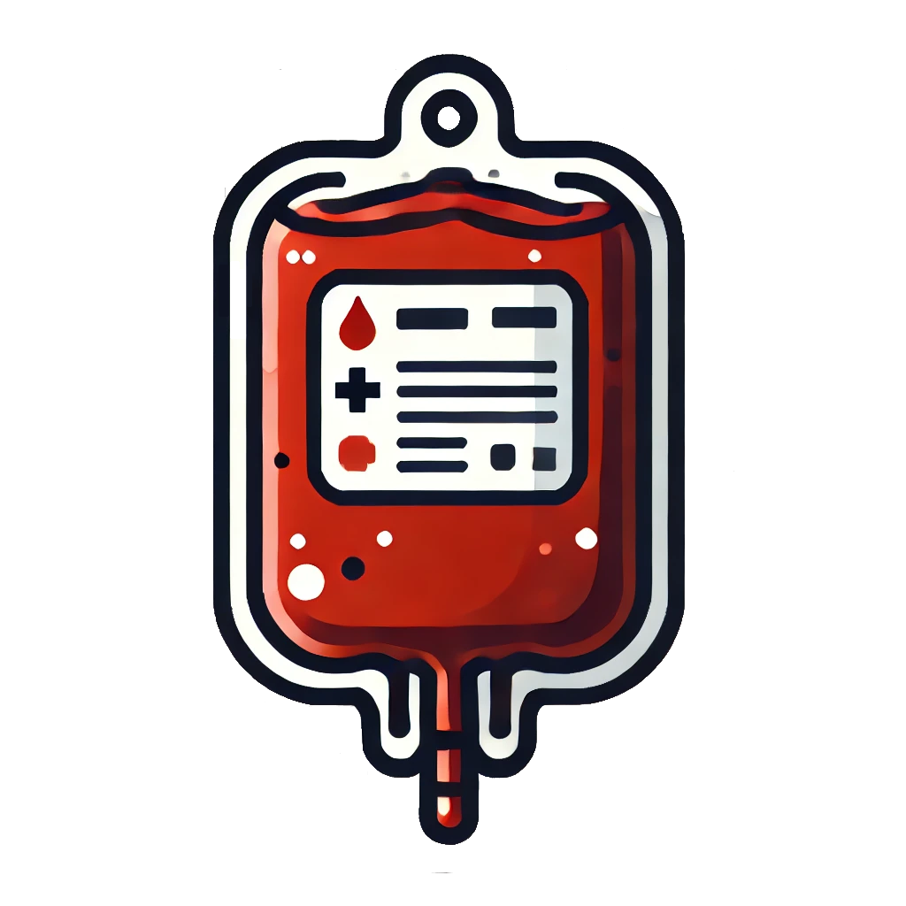

@import "/.crossnote/style.less";

# More Injuries User Manual

_This document is intended to provide a comprehensive guide to the More Injuries mod for RimWorld. It is intended to be a reference for players who are looking to understand the mod's features and mechanics, as well as how to use them effectively._

## About More Injuries

The More Injuries mod aims to increase the simulation depth of RimWorld's medical system by adding a variety of new injuries, medical conditions, and treatment options, as well as simulating body part damage in more detail. Its goal is to make the medical system more challenging and interesting in some aspects, while also making it more realistic and immersive. A detailed mod settings menu is provided to allow players to customize many aspects of the mod to their liking.

## Table of Contents
<!-- @import "[TOC]" {cmd="toc" depthFrom=1 depthTo=6 orderedList=false} -->

<!-- code_chunk_output -->

- [More Injuries User Manual](#more-injuries-user-manual)
  - [About More Injuries](#about-more-injuries)
  - [Table of Contents](#table-of-contents)
  - [New Injuries and Medical Conditions](#new-injuries-and-medical-conditions)
    - [Adrenaline Rush](#adrenaline-rush)
    - [Cardiac Arrest](#cardiac-arrest)
    - [Chemical Peritonitis](#chemical-peritonitis)
    - [Choking](#choking)
      - [Choking on Blood](#choking-on-blood)
      - [Choking on Tourniquet](#choking-on-tourniquet)
    - [Concussion](#concussion)
    - [EMP Shutdown](#emp-shutdown)
    - [Fractures](#fractures)
      - [Bone Fracture](#bone-fracture)
      - [Healing Bone Fracture](#healing-bone-fracture)
      - [Bone Fragment Laceration](#bone-fragment-laceration)
    - [Gangrene](#gangrene)
      - [Dry Gangrene](#dry-gangrene)
      - [Wet Gangrene](#wet-gangrene)
    - [Hearing Loss](#hearing-loss)
      - [Temporary Hearing Loss](#temporary-hearing-loss)
      - [(Permanent) Hearing Loss](#permanent-hearing-loss)
    - [Hemorrhagic Stroke](#hemorrhagic-stroke)
    - [Hydrostatic Shock](#hydrostatic-shock)
    - [Hypovolemic Shock](#hypovolemic-shock)
    - [Inhalation Injury](#inhalation-injury)
    - [Lung Collapse](#lung-collapse)
    - [Organ Hypoxia](#organ-hypoxia)
    - [Paralysis](#paralysis)
    - [Spalling Injury](#spalling-injury)
  - [New Body Parts](#new-body-parts)
    - [Small and Large Intestines](#small-and-large-intestines)
    - [Femoral and Popliteal Arteries](#femoral-and-popliteal-arteries)
    - [Spinal Cord](#spinal-cord)
  - [Medical Devices and Treatments](#medical-devices-and-treatments)
    - [Splint](#splint)
    - [Defibrillator](#defibrillator)
    - [CPR](#cpr)
    - [First Aid](#first-aid)
    - [Epinephrine Autoinjector](#epinephrine-autoinjector)
    - [Tourniquet](#tourniquet)
    - [Airway Suction Device](#airway-suction-device)
    - [Blood Bag](#blood-bag)
    - [Hearing Protection](#hearing-protection)
  - [Surgeries](#surgeries)
    - [Trepanation](#trepanation)
    - [Decompressive Craniectomy](#decompressive-craniectomy)
    - [Stereotactic Surgery](#stereotactic-surgery)
    - [Repair Lung Collaps Placeholder TODO](#repair-lung-collaps-placeholder-todo)
    - [Repair Fracture Placeholder TODO](#repair-fracture-placeholder-todo)
  - [New Work Types](#new-work-types)
  - [Known Issues and Incompatibilities](#known-issues-and-incompatibilities)

<!-- /code_chunk_output -->

## New Injuries and Medical Conditions

The following sections provide an overview of the new injuries and medical conditions added by the More Injuries mod, as well as their effects and treatment options.

### Adrenaline Rush

Adrenaline, also known as epinephrine, is a naturally occurring hormone that is released in response to stress or danger. It increases heart rate, blood pressure, and energy levels, preparing the body for a fight-or-flight response. In the game, an adrenaline rush can occur naturally in pawns as a result of combat and injury, or it can artificially be induced through the use of an [epinephrine injection](#epinephrine-autoinjector).

> **In-Game Description**
> _"**Adrenaline rush** &mdash; A rush of adrenaline temporarily increases heart rate and blood pressure, providing a boost of energy and alertness. The body's fight-or-flight response is triggered, increasing strength and speed.
> However, if the rush is too intense, it can cause anxiety, panic, and overdose symptoms such as dizziness, double vision, and nausea. In extreme overdose cases, the body can go into shock, causing heart attack, stroke, or death."_

**Causes**: Injuries or [epinephrine injections](#epinephrine-autoinjector).

**Effects**: At lower levels, an adrenaline rush can provide a temporary boost to consciousness, moving, and pain tolerance. At higher levels, it can cause a reduction in manipulation and sight. In extreme cases of overdose, it can lead to anxiety, panic, nausea, as well as, coma, [cardiac arrest](#cardiac-arrest), [hemorrhagic stroke](#hemorrhagic-stroke), and subsequent death. As adrenaline raises the heart rate and blood pressure, it can also reduce the effects of [hypovolemic shock](#hypovolemic-shock) for a short period of time.

**Treatment**: Adrenaline is naturally metabolized by the body over time and effects last between a few minutes to a few hours in severe cases. In cases of overdose, the pawn may require medical treatment to treat symptoms and secondary effects.

### Cardiac Arrest

Cardiac arrest is a sudden loss of blood flow resulting from the failure of the heart to effectively pump blood. It is generally divided into two categories: `ventricular fibrillation` and asystole (flatline, `clinical death`). `Ventricular fibrillation` is a condition in which the heart's electrical signals become disorganized, causing the heart to quiver or "fibrillate" instead of pumping blood effectively. In cases of `ventricular fibrillation`, a [defibrillator](#defibrillator) can be used to shock the heart back into a normal rhythm, which may be faster and more effective than [CPR](#cpr). If left untreated, `ventricular fibrillation` can progress to `clinical death`, which is a condition in which the heart stops beating completely and [CPR](#cpr) must be performed to restore blood flow and hopefully restart the heart. Applying a [defibrillator](#defibrillator) to a clinically dead patient will not be effective and may cause additional harm.

> **In-Game Description**
> _"**Cardiac arrest** &mdash; Cardiac arrest is a sudden loss of blood flow resulting from the failure of the heart to effectively pump blood. The lack of blood flow causes the body to stop working properly, resulting in loss of consciousness and death if not treated immediately. Causes for cardiac arrest include conditions that starve the heart of oxygen, such as extreme blood loss.
> A skilled doctor must perform CPR to restore blood flow and hopefully restart the heart. In early stages of cardiac arrest, during ventricular fibrillation, a defibrillator can also be used to shock the heart back into a normal rhythm, which may be faster and more effective than CPR."_

**Causes**: Extreme blood loss ([hypovolemic shock](#hypovolemic-shock)), [adrenaline overdose](#adrenaline-rush), and other conditions that starve the heart of oxygen.

**Effects**: Loss of consciousness, coma, multiple organ failure, and death if not treated immediately.

**Treatment**: Cardiac arrest must be treated immediately with [CPR](#cpr) to restore blood flow and hopefully restart the heart. In cases of `ventricular fibrillation`, a [defibrillator](#defibrillator) can be used to shock the heart back into a normal rhythm, which may be faster and more effective than [CPR](#cpr). In cases of `clinical death`, only [CPR](#cpr) will be effective.

### Chemical Peritonitis

Also known as _"intestinal spillage,"_ chemical peritonitis is a life-threatening condition that occurs when gastric acid or other digestive fluids leak into the abdominal cavity, causing inflammation and tissue damage to surrounding organs ([small and large intestines](#small-and-large-intestines), stomach, kidneys, and liver). The condition carries a major risk of infection which can be life-threatening if left untreated.

> **In-Game Description**
> _"**Chemical peritonitis** &mdash; As a result of a perforating injury to the intestines or stomach, gastric acid has inflicted tissue damage on surrounding organs, causing inflammation. Carries a major risk of infection."_

**Causes**: A perforating injury to the intestines or stomach, such as a gunshot wound or stab wound, that allows gastric acid to leak into the abdominal cavity and cause tissue damage.

**Effects**: Inflammation of the abdominal cavity, severe pain, and a major risk of infection. Potentially life-threatening if a resulting infection is left untreated.

**Treatment**: Medical treatment of the perforating injury and inflammation using high-quality medicine to prevent infection.

### Choking

Choking is a medical emergency that occurs when a foreign object becomes lodged in the throat or windpipe, blocking the flow of air. It can be a life-threatening situation that requires immediate intervention to clear the airway and restore breathing.

#### Choking on Blood

> **In-Game Description**
> _"**Choking on blood** &mdash; Blood from traumatic injuries being aspirated into the airways triggers coughing and causes suffocation. The bleeding must be stopped and the airways cleared to prevent death. If the patient is conscious, they may be able to cough up the blood on their own and clear the airway. Otherwise, the airways must be cleared using a specialized airway suction device or by compressing the chest using CPR to expel the blood and restore breathing."_

**Causes**: Severe injuries to the mouth, throat, or chest that cause bleeding into the airways.

**Effects**: Coughing, suffocation, and death if not treated immediately.

**Treatment**: Stopping the bleeding of the mouth, throat, or chest will prevent further blood from entering the airways and slow the progression of the condition. If the patient is conscious, they may be able to cough up the blood on their own and clear the airway. If the patient is unconscious, the airways must be cleared using a specialized [airway suction device](#airway-suction-device) or by compressing the chest using [CPR](#cpr) to expel the blood and restore breathing.

#### Choking on Tourniquet

> **In-Game Description**  
> _"**Choking on tourniquet** &mdash; A severe lack of intellect caused a potentially fatal mishap in form of a misapplied tourniquet."_

**Causes**: Someone had the bright idea to apply a [tourniquet](#tourniquet) to the neck :woozy_face: Only a severe lack of intellect and medical incompetence can cause this condition.

**Effects**: Suffocation and death if not treated immediately.

**Treatment**: Removing the [tourniquet](#tourniquet) from the neck will restore breathing and prevent death.

### Concussion

> **In-Game Description**  
> _"**Concussion** &mdash; A concussion, also known as a mild traumatic brain injury (mTBI), is a head injury that temporarily affects brain functioning. Symptoms may include loss of consciousness; memory loss; headaches; difficulty with thinking, concentration, or balance; nausea; blurred vision; dizziness; sleep disturbances, and mood changes.
> Should resolve on its own within a few days, but can be worsened by repeated head injuries."_

**Causes**: Blunt force trauma to the head. May be caused by any violent impact to the head, such as hand-to-hand combat, being struck by a projectile, or explosions.

**Effects**: A concussion may range from a mild headache to full unconsciousness, depending on the severity of the injury. The pawn may experience a temporary loss of consciousness, memory loss, painful headaches, disorientation,difficulty with thinking, nausea and vomiting, blurred vision, and dizziness. Repeated head injuries may worsen the condition or lead to a [hemorrhagic stroke](#hemorrhagic-stroke).

**Treatment**: Concussions are generally self-limiting and will resolve on their own within a few days.

### EMP Shutdown

> **In-Game Description**
> _"**Servos disabled** &mdash; A bionic bodypart was disabled by an EMP blast. It will take around one day to reboot itself."_

**Causes**: Exposure to sources of strong electromagnetic interference, such as EMP grenades or psychic abilities.

**Effects**: The affected bionic body part will be disabled and unusable for a period of time.

**Treatment**: The bionic body part will reboot itself after around one day and return to normal function.

### Fractures

When a pawn takes damage to a bone or solid body part, there is a chance that a fracture will occur, based on the severity of the injury and the mod settings.

#### Bone Fracture

> **In-Game Description**  
> _"**Bone fracture** &mdash; A partial or complete break of a bone caused by trauma, overuse, or disease. The bone may be cracked, splintered, or completely broken into two or more pieces. Until properly treated, the affected limb will be unable to bear weight or move properly, causing severe pain and loss of function.  
> Must either be splinted to immobilize the bone and promote healing over time, or surgically repaired to realign and stabilize the bone, allowing for quick recovery."_

**Causes**: Sharp or blunt damage to a bone or solid body part.

**Effects**: A bone fracture will cause the affected limb to be unable to bear weight or move properly, causing full immobility of the corresponding body part and `+15%` pain. Bone fractures may also cause [bone fragment lacerations](#bone-fragment-laceration) if bone fragments break off and cut into the surrounding tissue.

**Treatment**: Bone fractures must be treated using a [splint](#splint) to immobilize the bone and promote [healing over time](#healing-bone-fracture), or [surgery](#repair-fracture-placeholder-todo) to realign and stabilize the bone, allowing for an immediate recovery.

#### Healing Bone Fracture

> **In-Game Description**  
> _"**Healing bone fracture** &mdash; A bone fracture that is in the process of healing. The bone is still weak and restricted in movement, but the limb is slowly regaining function as the bone knits back together.
> Over time, the bone will become stronger and the limb will regain full function."_

**Causes**: A [bone fracture](#bone-fracture) that has been stabilized with a [splint](#splint) and is in the process of healing.

**Effects**: The affected limb will be usable but restricted in movement. Over time, the effects will slowly diminish as the bone heals and the limb regains full function.

**Treatment**: Healing bone fractures do not require any additional treatment and will naturally heal over the course of several days to weeks, depending on how skillfully the [splint](#splint) was applied.

#### Bone Fragment Laceration

When a bone is fractured, there is a chance that fragments of the bone will break off and cause additional damage to the surrounding tissue, resulting in a laceration injury (a cut). The occurance and chance of bone fragment laceration can be adjusted in the mod settings.

> **In-Game Description**  
> _"**Cut (bone fragments)** &mdash; A cut caused by fragments of a bone."_

**Causes**: A [bone fracture](#bone-fracture) may result in sharp bone fragments breaking off and cutting into the surrounding tissue.

**Effects**: A bone fragment laceration will cause additional pain and bleeding, as well as a risk of infection if not properly treated.

**Treatment**: Bone fragment lacerations can be treated like any other cut or laceration, by treating the wound with or without medicine, preferably in a clean environment to reduce the risk of infection.

### Gangrene

Gangrene is a type of tissue death caused by a lack of blood supply. Symptoms may include a change in skin color to red or black, numbness, swelling, pain, skin breakdown, and coolness. Depending on the presence of infection, gangrene may be classified as dry or wet.

#### Dry Gangrene

> **In-Game Description**
> _"**Gangrene (dry)** &mdash; Dry gangrene is a form of coagulative necrosis that develops in ischemic tissue, where the blood supply is inadequate to keep tissue viable. The affected part is dry, shrunken, and dark reddish-black. The line of separation usually brings about complete separation, with eventual falling off of the gangrenous tissue if it is not removed surgically, a process called autoamputation.
> Over time, dry gangrene may develop into wet gangrene if an infection develops in the dead tissues.
> The affected body part is irreversibly damaged and should be amputated to prevent sepsis."_

**Causes**: A lack of blood supply to a body part, often due to a [tourniquet](#tourniquet) that has been applied for too long or other conditions that restrict blood flow.

**Effects**: The affected body part will become dry, shrunken, and dark reddish-black, and may eventually fall off if not removed surgically. Dry gangrene may progress to [wet gangrene](#wet-gangrene) if an infection develops in the dead tissues.

**Treatment**: The affected body part is irreversibly damaged and should be amputated to prevent life-threatening infection.

#### Wet Gangrene

> **In-Game Description**
> _"**Gangrene (wet)** &mdash; Wet, or infected, gangrene is characterized by thriving bacteria and has a poor prognosis (compared to dry gangrene) due to sepsis resulting from the free communication between infected fluid and circulatory fluid. The affected part is saturated with stagnant blood, which promotes the rapid growth of bacteria. The toxic products formed by bacteria are absorbed, causing systemic manifestation of sepsis and finally death.
> The affected body part should be amputated as soon as possible to save the patient's life._"

**Causes**: A lack of blood supply to a body part that caused the tissue to die and become infected with bacteria, often due to a [tourniquet](#tourniquet) that has been applied for too long or due to [dry gangrene](#dry-gangrene) that has become infected.

**Effects**: The affected body part will become saturated with stagnant blood, promoting the rapid growth of bacteria. The toxic products formed by bacteria are absorbed, causing systemic manifestation of sepsis and eventually death.

**Treatment**: The affected body part should be amputated as soon as possible to save the patient's life.

### Hearing Loss

Hearing loss is a partial or total inability to hear. It may be temporary or permanent and can affect one or both ears and can be commonly caused by exposure to loud noises, trauma, or age-related degeneration.

#### Temporary Hearing Loss

> **In-Game Description**
> _"**Temporary hearing loss** &mdash; Temporary deafness caused by prolonged exposure to loud noises, such as gunfire, explosions, or machinery. The hair cells in the inner ear are damaged, leading to hearing loss. The damage can become permanent if the exposure is severe or prolonged."_

**Causes**: Prolonged exposure to gunfire or explosions without [hearing protection](#hearing-protection). More likely to occur indoors or in close proximity to the source of the noise.

**Effects**: Temporary reduction in hearing ability, ranging from mild to complete deafness, depending on the severity of the exposure. May progress to [permanent hearing loss](#permanent-hearing-loss) if the exposure is severe or prolonged.

**Treatment**: Temporary hearing loss will resolve on its own over time, but may become permanent if the exposure is severe or prolonged.

#### (Permanent) Hearing Loss

_Vanilla RimWorld condition, see [Hearing loss (RimWorld Wiki)](https://rimworldwiki.com/wiki/Ailments#Hearing_loss)_.

**Causes**: See [Hearing loss (RimWorld Wiki)](https://rimworldwiki.com/wiki/Ailments#Hearing_loss), but can also be caused by severe [temporary hearing loss](#temporary-hearing-loss).

**Effects**: Permanent reduction in hearing ability, see [Hearing loss (RimWorld Wiki)](https://rimworldwiki.com/wiki/Ailments#Hearing_loss).

**Treatment**: Implants or bionic ears (see [Hearing loss (RimWorld Wiki)](https://rimworldwiki.com/wiki/Ailments#Hearing_loss)), or surgery to repair the damaged inner ear.

### Hemorrhagic Stroke

In extreme cases of head trauma, a rupture of a blood vessel in the brain may occur, causing a life-threatening condition known as a hemorrhagic stroke. Blood from the ruptured vessel leaks into the brain, causing pressure to build up and compress the surrounding tissue, starving it of oxygen and nutrients and leading to rapid loss of consciousness and death if not surgically treated.

_Basically a more severe and dangerous version of a [concussion](#concussion)._

> **In-Game Description**
> _"**Hemorrhagic stroke** &mdash; A life-threatening condition caused by a rupture of a blood vessel in the brain. If left untreated, the patient will quickly lose consciousness as pressure builds up in the brain. Symptoms range from initial confusion and vomiting to coma and death.
> Can be temporarily stabilized to slow progression until surgery can be performed to permanently repair the rupture."_

**Causes**: Severe blunt force trauma to the head, e.g., any violent impact to the head, such as hand-to-hand combat, being struck by a projectile, or explosions, as well as extreme blood pressure caused by [adrenaline overdose](#adrenaline-rush) may cause a rupture of a blood vessel in the brain. If simulation of [hydrostatic shock](#hydrostatic-shock) is enabled in the mod settings, high-energy projectiles that cause massive temporary cavity formation and pressure waves in the tissue may also cause a hemorrhagic stroke.

**Effects**: Headache, memory loss, confusion, vomiting, rapid loss of consciousness, coma, and death if not surgically treated.

**Treatment**: Hemorrhagic stroke can be temporarily stabilized using medicine to slow progression until surgery can be performed to permanently repair the rupture. Ultimately, surgical intervention through [trepanation](#trepanation), [decompressive craniectomy](#decompressive-craniectomy), or [stereotactic surgery](#stereotactic-surgery) is required to save the patient's life.

### Hydrostatic Shock

> :warning: **Note**: The concept is controversial and not universally accepted in the medical community.

Hydrostatic shock, also known as Hydro-shock, is the controversial concept that a penetrating projectile (such as a bullet) can produce a pressure wave that causes _"remote neural damage"_, _"subtle damage in neural tissues"_ and _"rapid effects"_ in living targets.

Due to the controversial nature of the concept, it is implemented as an optional feature that can be enabled in the mod settings.

If enabled, high-energy projectiles, such as bullets, may cause [hemorrhagic stroke](#hemorrhagic-stroke), even if the projectile does not directly hit the head.

### Hypovolemic Shock

When a pawn loses a significant amount of blood, there may not be enough blood volume to circulate to the body's organs, leading to a life-threatening condition known as hypovolemic shock. Without immediate treatment, the insufficient blood flow can starve the organs of oxygen and nutrients, causing tissue damage, multiple organ failure, and ultimately death.

> **In-Game Description**
> _"**Hypovolemic shock** &mdash; A life threating state caused by insufficient blood flow to the body. Hypovolemic shock is a medical emergency; if left untreated, the insufficient blood flow can cause damage to organs, leading to hypoxia and multiple organ failure. 
> Severity scales directly with blood loss severity until 60% severity, after which it continues to worsen, even if bleeding is stopped. Must be treated with blood transfusion or other means to restore blood volume. Progession can also be slowed by administering adrenaline to increase heart rate and blood pressure."_

**Causes**: Severe blood loss from injuries, such as lacerations, gunshot wounds, or surgical procedures.

**Effects**: Hypovolemic shock is a medical emergency that can cause a rapid decline in consciousness, blood pressure, and heart rate, leading to [organ hypoxia](#organ-hypoxia), multiple organ failure, [cardiac arrest](#cardiac-arrest), and death if not treated immediately. Once the progression of hypovolemic shock reaches 60% severity, it will start causing [organ hypoxia](#organ-hypoxia) and accelerate the progression of the condition, even if the bleeding is stopped.

**Treatment**: Hypovolemic shock is *primarily treated* by treating the underlying cause of the blood loss (e.g., stopping the bleeding) and restoring blood volume to compensate for the loss of blood. Depending on the severity of the condition, preventing further blood loss may be sufficient to allow the body to recover on its own. In more severe cases, when the progression of hypovolemic shock has reached above 60% severity, blood volume must be restored through transfusion using [blood bags](#blood-bag), [hemogen packs](https://rimworldwiki.com/wiki/Hemogen_pack), or other means (i.e., any other mod that reduces blood loss severity). Once the blood loss is no longer `severe`, the severity of hypovolemic shock will start to decrease over time, allowing the patient to recover. Note that this recovery period may take several hours as the blood volume is restored by the IV fluids or blood transfusion. During this recovery period, the patient must be kept under close observation, especially when past 60% severity, and secondary effects, like [organ hypoxia](#organ-hypoxia) or [cardiac arrest](#cardiac-arrest), must be treated as they might still occur until the patient has been fully stabilized (blood loss severity at `moderate` or lower and hypovolemic shock severity below 60%).  
During the initial emergency treatment of hypovolemic shock, its progression can be slowed by administering [epinephrine](#adrenaline-rush) to increase heart rate and blood pressure, which will help to increase the blood flow to the organs and reduce the risk of organ hypoxia and multiple organ failure. Additionally, hypovolemic shock itself may be treated using conventional medicine to decrease progression further for a short period of time until the patient can be fully stabilized using blood transfusion. Note, however, that **the only way to fully stabilize and save the patient's life is to restore blood volume.**

> :bulb: **Tip**: As time is of the essence when treating hypovolemic shock, it is recommended to have a stockpile of [blood bags](#blood-bag) or other blood transfusion items ready in your hospital to quickly treat patients with severe blood loss. You may even want to assign some medically skilled pawns to be dedicated combat medics who keep a few blood bags in their inventory at all times to immediately stabilize and treat injured pawns on the battlefield. This can be achieved by telling the medic to "pick up" a number of blood bags (or including blood bags in [Combat Extended](https://github.com/CombatExtended-Continued/CombatExtended) loadouts) and then telling the drafted medic to `transfuse blood (from inventory, stabilize)` to the injured pawn.

### Inhalation Injury

Inhalation injuries are caused by the inhalation of hot gases, steam, or smoke, which can cause burns to the respiratory tract and lungs. If enabled in the mod settings, inhalation injuries manifest themselves as burn injuries to the lungs, for example, when a pawn is exposed to a fire or explosion.

### Lung Collapse

When a creature is exposed to a sudden change in pressure, such as caused by thermobaric weapons and other high-explosive devices, the lung tissue may rupture, causing air to leak into the chest cavity and compress the lung, leading to a life-threatening condition known as a lung collapse.

> **In-Game Description**
> _"**Lung collapse** &mdash; A buildup of air inside the chest cavity creates pressure against the lung. Pressure increases as more air enters this space. The lung collapses, impairing normal breathing causing surrounding structures to shift. When severe enough to cause these shifts and hypotension, it is called a tension pneumothorax. In this life-threatening condition, the increased pressure inside the chest can compress the heart and lead to a collapse of the blood vessels that drain to the heart, causing obstructive shock. With the heart unable to fill, cardiac output drops. Hypotension and shock ensue. If left untreated treated, it can lead to cardiac arrest and death.
> Must be surgically repaired."_

**Causes**: Exposure to a sudden change in pressure, such as caused by thermobaric weapons and other high-explosive devices.

**Effects**: Impaired breathing, chest pain, and a life-threatening condition known as a tension pneumothorax, which can lead to obstructive shock, [cardiac arrest](#cardiac-arrest), and death if not surgically treated.

**Treatment**: Resuscitation if the patient goes into [cardiac arrest](#cardiac-arrest) and immediate [surgery](#repair-lung-collaps-placeholder-todo) to repair the lung collapse and prevent further complications.

### Organ Hypoxia

Hypoxia is a condition in which the body or a region of the body is deprived of adequate oxygen supply at the tissue level. The cause of hypoxia may vary, but it is often the result of a severe lack of blood flow to the affected area, such as in cases of [hypovolemic shock](#hypovolemic-shock).

> **In-Game Description**
> _"**Organ hypoxia** &mdash; Damage from lack of oxygen to the organ. Most commonly caused by insufficient blood flow."_

**Causes**: Severe lack of blood flow to an organ, such as in cases of [hypovolemic shock](#hypovolemic-shock).

**Effects**: Damage to the affected organ, which may lead to multiple organ failure and death if not treated immediately.

**Treatment**: Organ hypoxia must be treated by restoring blood flow to the affected organ, which may require treating the underlying cause of the blood loss, such as stopping the bleeding or restoring blood volume through transfusion. See [hypovolemic shock](#hypovolemic-shock) for more information on treatment.

### Paralysis

> **In-Game Description**
> _"**Paralysis** &mdash; Damage of spinal cord caused irrepairable movement disability, ranging from sensory loss to complete loss of movement. Paralysis is often a life-changing condition and may require the use of bionic implants or prosthetics to restore function."_

**Causes**: Severe back injuries, such as a gunshot wound or stab wound to the spine, that crush or sever the spinal cord.

**Effects**: Damage to the spinal cord prevents the transmission of signals between the brain and the affected body parts, causing a loss of movement and sensation in the affected limbs. Depending on the severity of the injury, patients may experience a range of symptoms, from sensory loss to complete loss of movement.

**Treatment**: By itself, paralysis is an irreversible condition that cannot be treated with conventional medicine. However, bionic implants or prosthetics may be used to restore partial or full function to the affected body parts.

### Spalling Injury

When high-velocity projectiles are stopped by armor, the large amount of kinetic energy can cause the projectile and top layer of the armor to shatter into fragments, which can cause additional injuries to the wearer of the armor, even if the projectile itself did not penetrate. The chance and severity of spalling depends on a variety of factors, such as the angle of impact and the hardness and condition of the armor. 

Modern armor is designed to prevent spalling by adding softer layers above the hard armor plates to catch and absorb bullet fragments. As armor condition deteriorates after absorbing damage, the chance of spalling naturally increases when these absorbing layers are compromised.

> **In-Game Description**
> _"**Cut (spall)** &mdash; A cut caused by spall of a bullet and armor fragments."_

**Causes**: High-velocity projectiles impacting degraded armor plating.

**Effects**: Additional cuts and lacerations caused by bullet fragments and armor shrapnel.

**Treatment**: Spalling injuries can be treated like any other cut or laceration, by treating the wound with or without medicine, preferably in a clean environment to reduce the risk of infection.

> :bulb: **Tip**: You can significantly reduce the risk of spalling injuries or even prevent them entirely by keeping your armor in good condition and replacing it when it becomes damaged. Alternatively, you can research into advanced spacer armor types that are designed to prevent spalling entirely.

> :bulb: **Tip**: You can tweak the chance, severity, and armor condition thresholds for spalling injuries in the mod settings to better balance the risk and reward of using degraded armor plating in combat.

## New Body Parts

More Injuries simulates a variety of new body parts and re-scales the coverage of existing body parts to provide a more detailed and realistic simulation of injuries and medical conditions.

### Small and Large Intestines

The small and large intestines are part of the digestive system and play a crucial role in the absorption of nutrients and the elimination of waste. Damage to the intestines can cause life-threatening internal bleeding or cases of [chemical peritonitis](#chemical-peritonitis), which poses a major risk of infection.

### Femoral and Popliteal Arteries

  
The femoral and popliteal arteries are major blood vessels that supply blood to the legs and feet. As such, injuries to the legs can cause severe blood loss and can quickly lead to [hypovolemic shock](#hypovolemic-shock), loss of consciousness, and death if not treated immediately. Cutting the femoral artery is especially dangerous due to the high volume of blood that flows through it. 

Emergency treatment often requires the use of a [tourniquet](#tourniquet) to restrict blood flow to the affected limb and prevent the patient from bleeding out.
  

### Spinal Cord

The spinal cord is a bundle of nerves that runs down the center of the back and connects the brain to the rest of the body. Damage to the spinal cord can cause irreversible and life-changing [paralysis](#paralysis), ranging from sensory loss in the legs to complete loss of movement in the entire body. Surgical intervention and bionic implants may be used to restore partial or full function to the affected body parts.

## Medical Devices and Treatments

In order to effectively treat the new injuries and medical conditions introduced by More Injuries, several new medical devices and treatment options have been added to the game.

### Splint

  
  
  
> **In-Game Description**
> _"**Splint** &mdash; A splint is a rigid device used for immobilizing and protecting an injured bone or joint. It is used to prevent further damage to the bone and surrounding tissue and promote healing over time. Splints are commonly used to treat bone fractures, sprains, and dislocations."_
  

**Used for**: Treating [bone fractures](#bone-fracture), allowing them to heal over time (see [healing bone fracture](#healing-bone-fracture)).

**Usage**

1. Tell a *drafted* pawn capable of doctoring to apply a splint to a pawn with a bone fracture using the `Splint fractures` option in the right-click context menu. The splint must be accessible in a stockpile or the doctor's inventory. Due to its simplicity, the procedure can be performed anywhere and even in combat situations, to quickly restore partial stability to the injured limb and allow the pawn to move again. However, this treatment method comes at the cost of treatment quality and a slightly longer time for the fracture to heal.
2. Alternatively, use the *operations* tab of the injured pawn to schedule the application of a splint to a bone fracture in a controlled environment, such as a hospital bed, to ensure the highest treatment quality and fastest healing time.

> :bulb: **Tip**: Alternatively to splinting the fracture, the bone can be [surgically repaired](#repair-fracture-placeholder-todo) to realign and stabilize the bone, allowing for an immediate recovery.

**Production**: At a crafting spot or machining table.  
**Production Skill Requirement**: None  
**Research Requirements**: None  
**Ingredients**: 4x `Wood` or `Steel`, 1x `any textile`  
**Success Chance**: 100%

### Defibrillator

Defibrillation is a treatment for life-threatening conditions that affect the rhythm of the heart, such as [heart attacks](https://rimworldwiki.com/wiki/Ailments#Heart_attack) and the `ventricular fibrillation` stage of [cardiac arrest](#cardiac-arrest). It involves delivering a high-energy electric shock to the heart with a reusable device called a defibrillator to restore normal heart rhythm. It is a more specialized and faster treatment than [CPR](#cpr) in these cases, however, it requires a defibrillator to be available and accessible to the treating doctor.

  

> **In-Game Description**
> _"**Defibrillator** &mdash; A defibrillator is a reusable device that gives a high energy electric shock to the heart through the chest wall to restore normal heart rhythm in cases of ventricular fibrillation (irregular heartbeat) which may be caused by heart attacks or in early stages of cardiac arrest.
> Note that the defibrillator can only be used on patients suffering from heart attack or ventricular fibrillation. In case of full cardiac arrest (clinical death), only CPR can save the patient."_

**Used for**: Treating [heart attacks](https://rimworldwiki.com/wiki/Ailments#Heart_attack) and [cardiac arrest](#cardiac-arrest) during the `ventricular fibrillation` stage.

**Usage**

1. Tell a *drafted* pawn capable of doctoring to use the defibrillator on a pawn suffering from a [heart attack](https://rimworldwiki.com/wiki/Ailments#Heart_attack) or [`ventricular fibrillation`](#cardiac-arrest) using the `Defibrillate` option in the right-click context menu. The defibrillator must be accessible in a stockpile or the doctor's inventory. Self-treatment is not possible. In case of the `clinical death` stage of [cardiac arrest](#cardiac-arrest), only [CPR](#cpr) can save the patient.
2. Defibrillation is part of the [First Aid](#first-aid) order for *drafted* pawns.
3. Alternatively, resuscitating patients using a defibrillator is now part of a new general, high-priority work type for all doctors. So, if you have a patient in a hospital bed with a heart attack or ventricular fibrillation, any non-drafted doctor will automatically attempt to resuscitate the patient using a defibrillator or [CPR](#cpr), in accordance with the configured work priorities.

**Production**: At a machining table.  
**Production Skill Requirement**: `Crafting` at level 6  
**Research Requirements**: `Medicine Production`  
**Ingredients**: 25x `Steel`, 20x `Chemfuel`, 4x `Component`, 25x `Plasteel`, 10x `Gold`, 100x `Silver`  
**Success Chance**: `<medicine skill>  / 8`, but at least the configured minimum success chance in the mod settings.

### CPR

Cardiopulmonary resuscitation (CPR) is an emergency procedure that combines chest compressions with artificial ventilation to manually preserve brain function until further measures can be taken to restore spontaneous blood circulation and breathing in a person who is in [cardiac arrest](#cardiac-arrest), suffering from a [heart attack](https://rimworldwiki.com/wiki/Ailments#Heart_attack), or is [choking on blood](#choking-on-blood).

> **In-Game Description**
> _"**CPR** &mdash; Perform CPR to stabilize patients with cardiac or respiratory arrest."_

**Used for**: Stabilizing patients suffering from [cardiac arrest](#cardiac-arrest) (during `ventricular fibrillation` and `clinical death` stages), [heart attacks](https://rimworldwiki.com/wiki/Ailments#Heart_attack), and [choking on blood](#choking-on-blood).

**Usage**

1. Tell a *drafted* pawn capable of doctoring to perform CPR on a pawn suffering from [cardiac arrest](#cardiac-arrest) (during `ventricular fibrillation` and `clinical death` stages), [heart attack](https://rimworldwiki.com/wiki/Ailments#Heart_attack), or [choking on blood](#choking-on-blood) using the `Perform CPR` option in the right-click context menu. Self-treatment is not possible.
2. CPR is part of the [First Aid](#first-aid) order for *drafted* pawns.
3. Alternatively, resuscitating patients using CPR is now part of a new general, high-priority work type for all doctors. So, if you have a patient in a hospital bed with a condition that requires CPR, any non-drafted doctor will automatically attempt to resuscitate the patient using CPR or a [defibrillator](#defibrillator), in accordance with the configured work priorities.

**Severity Reduction**: $f_{\text{sigmoid}}($ `medicine skill> / 15` $)$ where $f_{\text{sigmoid}}$ is a diffused sigmoid function defined as $f_{\text{sigmoid}}(x) = \frac{1}{1 + e^{-10\cdot(x - 0.5)}} + c$ where $c$ is a random factor between $-0.1$ and $0.1$.

> :warning: **Note**: Depending on the randomized factor $c$, poor medical skill of the doctor may do more harm than good when performing CPR. It is recommended to have a decently skilled doctor perform CPR to ensure the best possible outcome.

### First Aid

### Epinephrine Autoinjector

### Tourniquet

### Airway Suction Device

### Blood Bag

### Hearing Protection

## Surgeries

TODO: Add detailed information about surgeries.

### Trepanation

### Decompressive Craniectomy

### Stereotactic Surgery

### Repair Lung Collaps Placeholder TODO

TODO: implement https://en.wikipedia.org/wiki/Video-assisted_thoracoscopic_surgery and https://en.wikipedia.org/wiki/Thoracotomy

### Repair Fracture Placeholder TODO

## New Work Types

## Known Issues and Incompatibilities
