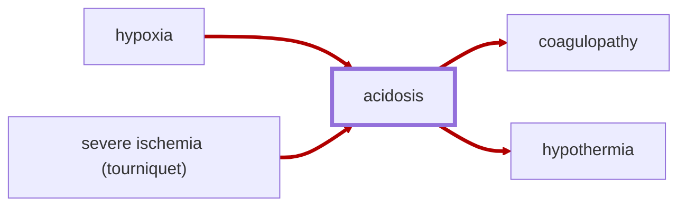

# Acidosis

<!-- @generate_breadcrumb_trail {"template": "_:file_folder: {0}_", "connector": " $\\rightarrow$ "} -->
_:file_folder: [More Injuries User Manual](/docs/content/README.md) $\rightarrow$ [Injuries and Medical Conditions A-Z](/docs/content/injuries-and-medical-conditions-a-z/README.md) $\rightarrow$ [Acidosis](/docs/content/injuries-and-medical-conditions-a-z/acidosis.md)_
<!-- @end_generated_block -->

Acidosis is a serious metabolic condition caused by an excessive buildup of acid in the body, typically caused by inadequate oxygen delivery to tissues ([hypoxia](#hypoxia)) following severe blood loss ([hypovolemic shock](#hypovolemic-shock)), [cardiac arrest](#cardiac-arrest), or other forms of shock. As oxygenated blood stops flowing to the tissues (due to one or more of above conditions), the body shifts to anaerobic metabolism, meaning it starts producing energy without oxygen, which results in the production of lactic acid and the accumulation of carbon dioxide. These byproducts lower the blood pH, leading to acidosis.

The condition contributes to a dangerous cycle known as the [lethal triad of trauma](#lethal-triad-of-trauma): acidosis, [hypothermia](#hypothermia), and [coagulopathy](#coagulopathy). As blood pH drops, blood clotting function becomes impaired, increasing the risk of uncontrolled [hemorrhage](#hemorrhage-spontaneous) and [trauma-induced coagulopathy](#coagulopathy). At the same time, acidosis impairs mitochondrial function (the powerhouse of the cell), leading to decreased ATP (energy) production in cells, which is required for thermogenesis and maintaining body temperature. This contributes to [hypothermia](#hypothermia) and further exacerbates the cycle of trauma.

> **In-Game Description**
> _"**Acidosis** &mdash; Acidosis is a serious metabolic condition characterized by an excessive buildup of acid in the body, typically caused by inadequate oxygen delivery to tissues (hypoxia) following severe blood loss (hypovolemia), cardiac arrest, or other forms of shock. As oxygen becomes scarce, the body shifts to anaerobic metabolism, producing lactic acid and accumulating carbon dioxide, which together lower blood pH.  
> The condition contributes to a dangerous cycle known as the "lethal triad" of trauma: acidosis, hypothermia, and coagulopathy. As blood pH drops, clotting function becomes impaired, increasing the risk of uncontrolled bleeding and trauma-induced coagulopathy (TIC). At the same time, mitochondrial function declines and cell-energy production is impaired, hindering thermogenesis and maintaining body temperature, ultimately leading to hypothermia and further exacerbating the cycle of trauma.  
> Acidosis is treated by restoring oxygen delivery to tissues - typically through rapid control of bleeding, fluid resuscitation with blood products, and correction of hypoxia. Once tissue oxygenation is restored, acid levels gradually normalize as the body clears metabolic byproducts through the lungs, liver, and kidneys."_

**Causes**: [Hypoxia](#hypoxia) or [severe ischemia after prolonged tourniquet application](#ischemia-tourniquet).

**Effects**: Directly contributes to [coagulopathy](#coagulopathy) and [hypothermia](#hypothermia).

*See the section on the [pathophysiological system](#pathophysiological-system) for more information on the graphical representation.*

**Treatment**: Restore oxygen delivery to tissues: control bleeding, provide fluid resuscitation, preferably with [blood products](#blood-bag), and treat effects coagulopathy and hypothermia. Once underlying causes are addressed, acid levels gradually normalize as the body clears metabolic byproducts through the lungs, liver, and kidneys.

> [!WARNING]
> Acidosis naturally "lags behind" the underlying causes, meaning that it doesn't set in immediately after oxygen delivery to tissues is impaired, and it may take some time for the body to clear metabolic byproducts after oxygen delivery is restored. This means that even after a pawn has been stabilized and blood volume has been restored, they may still suffer from acidosis for a while. Keep a close eye on their condition and be prepared to provide further treatment as needed.

<!-- @generate_link_to_top {"template": "---\n_[back to the top]({1})_"} -->
---
_[back to the top](#acidosis)_
<!-- @end_generated_block -->
