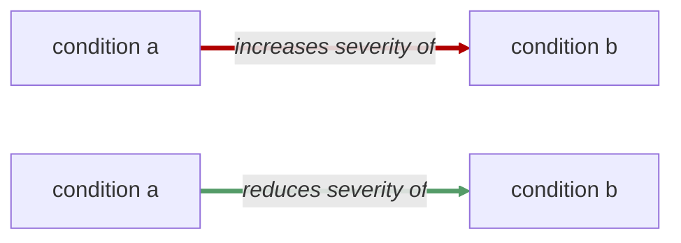

# Pathophysiological System

<!-- @generate_breadcrumb_trail {"template": "_:file_folder: {0}_", "connector": " :arrow_right: "} -->
_:file_folder: [More Injuries User Manual](/docs/content/README.md) :arrow_right: [Pathophysiological System](/docs/content/pathophysiological-system.md)_
<!-- @end_generated_block -->

The More Injuries mod introduces a pathophysiological system that simulates the interactions between injuries and medical conditions in a more realistic and immersive way. This system allows for complex interactions between different injuries and medical conditions, leading to cascading effects that can be difficult to manage. For example, the presence of one injury may exacerbate the effects of another, or injecting a certain drug may have different effects depending on the presence of other injuries or medical conditions.

To aid in understanding these interactions, this manual introduces a graphical representation of the pathophysiological system, including flowcharts and diagrams that illustrate the chain of cause and effect between different injuries and medical conditions. The direction of these interactions is indicated by arrows, whereas arrow colors indicate whether the interaction lessens (green) or worsens/causes (red) the condition, as shown in the following diagram:

Additional arrow labels may be used to indicate conditional effects or modifiers, for example:

In this example, condition a usually improves condition b, but in cases of overdose, it may actually worsen condition b instead.

Some conditions may not improve or worsen other conditions directly, but instead may influence treatment outcomes of other conditions. For example, epinephrine administration in cases of cardiac arrest may improve the chances of successful defibrillation, while opioid-based painkillers may reduce the effectiveness of CPR. These interactions are represented by dashed arrows, the colors of which indicate the nature of the interaction (green for beneficial effects, red for harmful effects).

<!-- @generate_link_to_top {"template": "---\n_[back to the top]({1})_"} -->
---
_[back to the top](#pathophysiological-system)_
<!-- @end_generated_block -->
