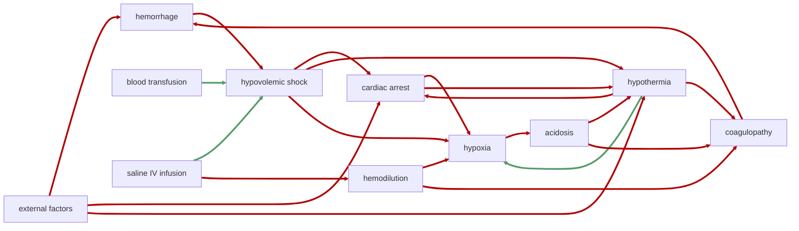

# Concepts

<!-- @generate_breadcrumb_trail {"template": "_:file_folder: {0}_", "connector": " :arrow_right: "} -->
_:file_folder: [More Injuries User Manual](/docs/wiki/README.md) :arrow_right: [Concepts](/docs/wiki/concepts.md)_
<!-- @end_generated_block -->

This section provides an overview of key concepts related to trauma and injury management simulated by the More Injuries mod. These concepts are crucial for understanding how injuries and medical conditions interact with each other, and how they can be treated effectively.

<!-- @generate_toc {"source": "$self", "indent": 2} -->
- [Concepts](#concepts)
  - [Lethal Triad of Trauma](#lethal-triad-of-trauma)
  - [Hemodilution Simulation](#hemodilution-simulation)
<!-- @end_generated_block -->

## Lethal Triad of Trauma

  
The "lethal triad of trauma" is a critical concept in trauma medicine that describes the dangerous cycle of three interrelated conditions: [acidosis](/docs/wiki/injuries/acidosis.md#acidosis), [hypothermia](/docs/wiki/injuries/hypothermia.md#hypothermia), and [coagulopathy](/docs/wiki/injuries/coagulopathy.md#coagulopathy). These conditions often occur together in severely injured patients and can lead to a rapid deterioration of the patient's condition, ultimately resulting in death if not addressed promptly.

More Injuries tries to simulate these interactions in a gamified, yet realistic way, making severe blood loss and trauma more challenging and interesting to manage. An overview of the interactions between these conditions is provided below, along with a flowchart that illustrates the relationships between them.

*See the section on the [pathophysiological system](/docs/wiki/pathophysiological-system.md#pathophysiological-system) for more information on the graphical representation.*

As per basegame RimWorld, external factors like injuries or environmental conditions can quickly lead to hypothermia or bleeding injuries. More Injuries extends this simulation depth by simulating follow-up conditions and potential cascading effects that can arise from these initial injuries.

In the context of trauma management, this means that a seemingly minor injury can rapidly escalate into life-threatening conditions if not properly addressed. Let's explore some examples of these cascading effects.

If a pawn suffers a severe injury that causes significant blood loss, they may go into [hypovolemic shock](/docs/wiki/injuries/hypovolemic-shock.md#hypovolemic-shock), meaning their body is unable to maintain adequate blood pressure and perfusion to vital organs. This, in turn, may cause a cascade of complications, further worsening the pawn's condition. For example, the reduced flow of oxygenated blood to the tissues can starve the cells of oxygen, which leads to [hypoxia](/docs/wiki/injuries/hypoxia.md#hypoxia) and cell death, which not only affects the local tissue (e.g., causing organ failure, brain damage, or death), but can also trigger a systemic condition. In their oxygen-deprived state, the cells begin to switch to anaerobic metabolism, producing lactic acid which lowers the blood pH, leading to [acidosis](/docs/wiki/injuries/acidosis.md#acidosis). The increased acidity in the blood hinders the cells' ability to produce energy, which is required for thermogenesis and maintaining body temperature, leading to [hypothermia](/docs/wiki/injuries/hypothermia.md#hypothermia), which is further accelerated by the reduced blood flow caused by hypovolemic shock, so warmer blood is not able to reach the extremities. Both, hypothermia and acidosis, negatively affect the blood's ability to clot, leading to [coagulopathy](/docs/wiki/injuries/coagulopathy.md#coagulopathy), a condition where even minor injuries can cause uncontrolled bleeding or even new spontaneous hemorrhages. This can create a dangerous cycle known as the "lethal triad of trauma," where uncontrolled bleeding further exacerbates hypovolemic shock, leading to more hypoxia, more acidosis, and more severe hypothermia, which in turn worsens coagulopathy and increases the risk of further hemorrhages.

In order to break this vicious cycle, it is crucial to address the underlying causes of each condition. For example, stopping severe arterial bleeding in the limbs with a [tourniquet](/docs/wiki/medical-devices.md#tourniquet) will buy time to bandage the wound and perform fluid resuscitation with [blood transfusions](/docs/wiki/medical-devices.md#blood-bag) or [IV saline infusion](/docs/wiki/medical-devices.md#saline-iv-bag) to restore blood volume and combat hypovolemic shock. If the patient is hypothermic, they should be wrapped in warm blankets or placed in a warm environment to prevent further heat loss. This might involve warming up the operating room to uncomfortably high temperatures to ensure the patient retains heat. 

Depending on how far gone the patient is, continued medical treatment may be required to stabilize the patient and prevent further deterioration, even during recovery. [Defibrillation](/docs/wiki/medical-devices.md#defibrillator) or [CPR](/docs/wiki/medical-devices.md#cpr) may be required in cases of [cardiac arrest](/docs/wiki/injuries/cardiac-arrest.md#cardiac-arrest) due to hypothermia or hypovolemic shock, and [hemodilution](/docs/wiki/injuries/hemodilution.md#hemodilution) caused by excessive use of [saline IVs](/docs/wiki/medical-devices.md#saline-iv-bag) may require administering additional [blood transfusions](/docs/wiki/medical-devices.md#blood-bag) to restore adequate blood volume and improve tissue perfusion. 

To reduce the amount of micro-management required, new [work types](/docs/wiki/work-types.md#new-work-types) have been added to allow doctors to automatically triage and treat patients ***who are in hospital beds*** based on their injuries and conditions. Nevertheless, after severe injuries, it is still recommended to keep a close eye on the patient and monitor their condition, and to manually intervene if necessary, especially if new conditions arise while the doctor is busy treating unrelated conditions or other patients.

Keep in mind that the human body is a complex system and requires some time to stabilize and for conditions to start improving. Even after blood volume has been restored, it takes time to break down and clear metabolic byproducts like lactic acid from the body, and to restore normal blood pH levels. It is not uncommon for patients to require multiple rounds of triage and treatment before they are fully stabilized and start recovering by themselves.

> [!WARNING]
> Once a certain point of no return has been reached and the lethal triad of trauma has caused the patient to enter a death spiral, it may become impossible to save them, even with the best medical care. As such, it is crucial to act quickly and decisively in the face of severe injuries and complications. Keep trained medics with the appropriate equipment on standby when engaging in combat and have pawns carry life-saving equipment like [tourniquets](/docs/wiki/medical-devices.md#tourniquet) at all times.

> [!TIP]
> While More Injuries attempts to approximate the complexities of real-world trauma care, it is understandable if you don't want to deal with the added complexity of the lethal triad of trauma in your game. Keep in mind that you can customize many aspects of the mod in the mod settings. If you want to disable the advanced trauma simulation, you can do so by un-checking the `Enable advanced trauma simulation` option.

> [!TIP]
> If you prefer realistic trauma simulation, consider enabling the experimental `Prevent direct death by blood loss` option in the mod settings. This will prevent pawns from dying immediately once blood loss reaches 100%. Instead, they will receive cerebral hypoxia over time as the cardiovascular system collapses completely, buying you a few minutes to restore blood volume and save them at the cost of potentially permanent brain damage.

## Hemodilution Simulation

More Injuries simulates hemodilution, which is the dilution of the concentration of red blood cells and plasma constituents in the blood, as a result of excessive fluid resuscitation, particularly in trauma patients. To simulate this in a realistic manner, the mod employs a mathematical model that takes into account various factors such as blood loss severity, current circulating volume, and infusion volume partitioning.

The following sections outline the key components of the hemodilution simulation model and present the relevant equations. Note, that all variables are defined over the real numbers ($\mathbb{R}$), within the limitations of the 32-bit IEEE-754 floating-point representation.

**1. Blood Loss Severity $\rightarrow$ Missing Volume**

As per vanilla RimWorld, blood loss severity is defined on a normalized scale:

- $0$: no blood loss (healthy)
- $1$: lethal blood loss

Since in real life death occurs before **100% volume loss**, we remap such that **death occurs at 50% of blood volume lost**:

$$V_{\text{missing}} = s_{\text{loss}} \cdot 0.5$$

where

- $s_{\text{loss}} \in [0,1]$ is the **blood loss severity**  
- $V_{\text{missing}} \in [0,0.5]$ is the **fraction of blood volume missing**  

**2. Current Circulating Volume**

The remaining circulating blood volume is then given by:

$$V_{\text{current}} = 1 - V_{\text{missing}}$$

**3. Infusion Volume Partitioning**

An administered infusion volume $V_{\text{add}}$ is partitioned into:

- **Replaced Volume** (limited by missing volume):

$$V_{\text{replaced}} = \min\left(V_{\text{add}}, \, V_{\text{missing}}\right)$$

- **Overflow Volume** (exceeds missing capacity):

$$V_{\text{overflow}} = V_{\text{add}} - V_{\text{replaced}}$$

**4. Dilution Factor**

The **dilution factor** determines infusion type:

$$d = 
\begin{cases} 
+1 & \text{saline (dilutes blood)} \\
-1 & \text{whole blood (restores concentration)}
\end{cases}$$

**5. Dilution Contribution**

Only **saline in the replaced volume** contributes to dilution:

$$D_{\text{contrib}} = \max(0, d) \cdot V_{\text{replaced}}$$

**6. New Hemodilution (Before Overflow)**

The weighted average after adding the replaced volume is then given by

$$H' = \frac{H \cdot V_{\text{current}} + D_{\text{contrib}}}{V_{\text{current}} + V_{\text{replaced}}}$$

where  

- $H$ = current hemodilution level ($0 \leq H \leq 1$)  
- $H'$ = hemodilution after replaced volume infusion  

**7. Overflow Contribution**

If there is overflow, it fully adopts the infusion’s dilution factor:

$$H'' = H' + V_{\text{overflow}} \cdot d$$

**8. Final Hemodilution Change**

The final change of hemodilution severity $\Delta H$ is given by the **change relative to baseline**:

$$\Delta H = H'' - H$$

**9. Summary of Core Equation**

Putting everything together yields:

$$\Delta H = \left(\frac{H \cdot V_{\text{current}} + \max(0,d)\cdot V_{\text{replaced}}}{V_{\text{current}} + V_{\text{replaced}}} + V_{\text{overflow}}\cdot d \right) - H$$

<!-- @generate_link_to_top {"template": "---\n_[back to the top]({1})_"} -->
---
_[back to the top](#concepts)_
<!-- @end_generated_block -->
