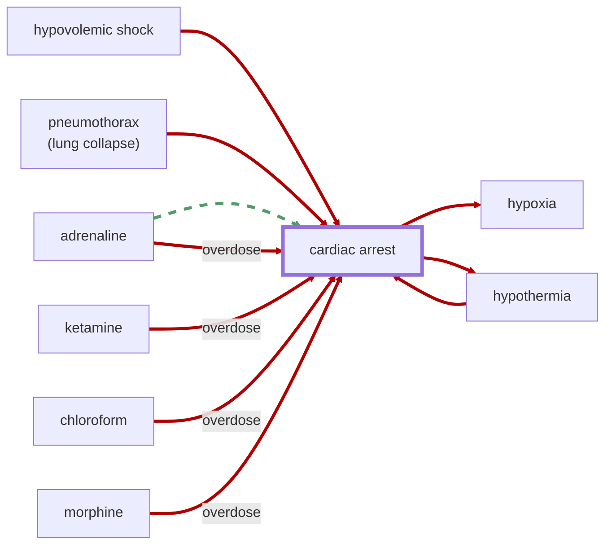

# Cardiac Arrest

<!-- @generate_breadcrumb_trail {"template": "_:file_folder: {0}_", "connector": " :arrow_right: "} -->
_:file_folder: [More Injuries User Manual](/docs/wiki/README.md) :arrow_right: [Injuries and Medical Conditions A-Z](/docs/wiki/injuries-and-medical-conditions-a-z/README.md) :arrow_right: [Cardiac Arrest](/docs/wiki/injuries-and-medical-conditions-a-z/cardiac-arrest.md)_
<!-- @end_generated_block -->

Cardiac arrest is a sudden loss of blood flow resulting from the failure of the heart to effectively pump blood. It is generally divided into two categories: `ventricular fibrillation` and asystole (flatline, `clinical death`). `Ventricular fibrillation` is a condition in which the heart's electrical signals become disorganized, causing the heart to quiver or "fibrillate" instead of pumping blood effectively. In cases of `ventricular fibrillation`, a [defibrillator](#defibrillator) can be used to shock the heart back into a normal rhythm, which may be faster and more effective than [CPR](#cpr). If left untreated, `ventricular fibrillation` can progress to `clinical death`, which is a condition in which the heart stops beating completely and [CPR](#cpr) must be performed to restore blood flow and hopefully restart the heart. Applying a [defibrillator](#defibrillator) to a clinically dead patient will not be effective and may cause additional harm.

> **In-Game Description**
> _"**Cardiac arrest** &mdash; Cardiac arrest is a sudden loss of blood flow resulting from the failure of the heart to effectively pump blood. The lack of blood flow causes the body to stop working properly, resulting in loss of consciousness and death if not treated immediately. Causes for cardiac arrest include conditions that starve the heart of oxygen, such as extreme blood loss.  
> A skilled doctor must perform CPR to restore blood flow and hopefully restart the heart. In early stages of cardiac arrest, during ventricular fibrillation, a defibrillator can also be used to shock the heart back into a normal rhythm, which may be faster and more effective than CPR."_

**Causes**: Extreme blood loss ([hypovolemic shock](#hypovolemic-shock)), [pneumothorax](#lung-collapse), [adrenaline overdose](#adrenaline-rush), [ketamine overdose](#ketamine-buildup), [chloroform overdose](#chloroform-buildup), [morphine overdose](#morphine-high), or other conditions that starve the heart of oxygen.

**Effects**: Loss of consciousness, coma, [hypoxia](#hypoxia), multiple organ failure, and death if not treated immediately. [Hypothermia](#hypothermia) will set in quickly as the body is unable to distribute heat effectively.

*See the section on the [pathophysiological system](#pathophysiological-system) for more information on the graphical representation.*

**Treatment**: Cardiac arrest must be treated immediately with [CPR](#cpr) (which needs to be researched first) to restore blood flow and hopefully restart the heart. In cases of `ventricular fibrillation`, a [defibrillator](#defibrillator) can be used to shock the heart back into a normal rhythm, which may be faster and more effective than [CPR](#cpr). In cases of `clinical death`, only [CPR](#cpr) will be effective. [Epinephrine](#epinephrine-autoinjector) may be administered to assist with defibrillation efforts and [CPR](#cpr) in cases of cardiac arrest, but it is not required.

> [!NOTE]
> **Biotech DLC**: Sanguaphages are immune to cardiac arrest and will automatically recover from it once entering deathrest.

<!-- @generate_link_to_top {"template": "---\n_[back to the top]({1})_"} -->
---
_[back to the top](#cardiac-arrest)_
<!-- @end_generated_block -->
