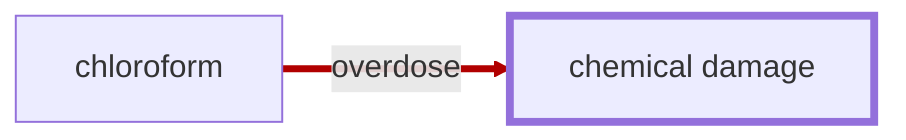

# Chemical Damage

<!-- @generate_breadcrumb_trail {"template": "_:file_folder: {0}_", "connector": " :arrow_right: "} -->
_:file_folder: [More Injuries User Manual](/docs/wiki/README.md) :arrow_right: [Injuries and Medical Conditions A-Z](/docs/wiki/injuries-and-medical-conditions-a-z/README.md) :arrow_right: [Chemical Damage](/docs/wiki/injuries-and-medical-conditions-a-z/chemical-damage.md)_
<!-- @end_generated_block -->

Chemical damage is a collective term for various toxic effects caused by exposure to harmful substances, such as drugs, chemicals, or toxins.

> **In-Game Description**
> _"**Chemical damage** &mdash; Tissue damage caused by toxic chemical exposure. This may result from direct contact with harmful substances or from the organ's own metabolic processing of certain drugs or toxins, producing reactive intermediates. Such damage often leads to cellular stress, necrosis, or scarring, and may cause irreversible harm to the affected organ, potentially leading to full organ failure if severe enough."_

**Causes**: [Chloroform buildup](#chloroform-buildup) (from overdose) causes chemical damage to the liver and kidneys.

**Effects**: Damage to the affected organ, which may lead to complete organ failure if severe enough. The severity of the damage depends on the type and amount of chemical exposure, as well as the duration of exposure.

*See the section on the [pathophysiological system](#pathophysiological-system) for more information on the graphical representation.*

**Treatment**: Treatment of chemical damage typically involves removing the source of exposure and providing supportive care to the affected organ. In severe cases, surgical intervention may be required to replace the damaged organ.

<!-- @generate_link_to_top {"template": "---\n_[back to the top]({1})_"} -->
---
_[back to the top](#chemical-damage)_
<!-- @end_generated_block -->
