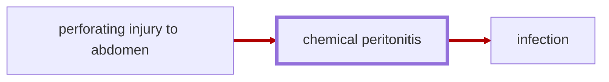

# Chemical Peritonitis

<!-- @generate_breadcrumb_trail {"template": "_:file_folder: {0}_", "connector": " :arrow_right: "} -->
_:file_folder: [More Injuries User Manual](/docs/wiki/README.md) :arrow_right: [Injuries and Medical Conditions A-Z](/docs/wiki/injuries-and-medical-conditions-a-z/README.md) :arrow_right: [Chemical Peritonitis](/docs/wiki/injuries-and-medical-conditions-a-z/chemical-peritonitis.md)_
<!-- @end_generated_block -->

Also known as _"intestinal spillage,"_ chemical peritonitis is a life-threatening condition that occurs when gastric acid or other digestive fluids leak into the abdominal cavity, causing inflammation and tissue damage to surrounding organs ([small and large intestines](#small-and-large-intestines), stomach, kidneys, and liver). The condition carries a major risk of infection which can be life-threatening if left untreated.

> **In-Game Description**
> _"**Chemical peritonitis** &mdash; As a result of a perforating injury to intestines or stomach, gastric acid has inflicted tissue damage on surrounding organs, causing inflammation. Carries a major risk of infection."_

**Causes**: A perforating injury to the intestines or stomach, such as a gunshot wound or stab wound, that allows gastric acid to leak into the abdominal cavity and cause tissue damage.

**Effects**: Inflammation of the abdominal cavity, severe pain, and a major risk of infection. Potentially life-threatening if a resulting infection is left untreated.

*See the section on the [pathophysiological system](#pathophysiological-system) for more information on the graphical representation.*

**Treatment**: Medical treatment of the perforating injury and inflammation using high-quality medicine to prevent infection.

<!-- @generate_link_to_top {"template": "---\n_[back to the top]({1})_"} -->
---
_[back to the top](#chemical-peritonitis)_
<!-- @end_generated_block -->
