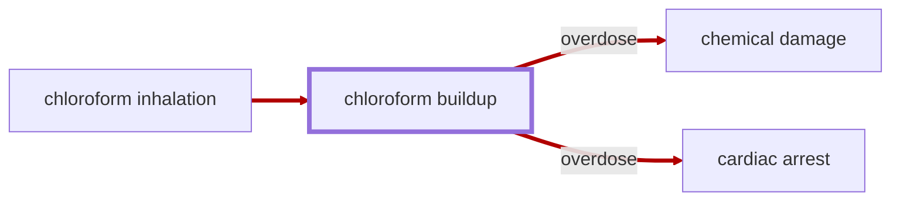

# Chloroform Buildup

<!-- @generate_breadcrumb_trail {"template": "_:file_folder: {0}_", "connector": " :arrow_right: "} -->
_:file_folder: [More Injuries User Manual](/docs/wiki/README.md) :arrow_right: [Injuries and Medical Conditions A-Z](/docs/wiki/injuries-and-medical-conditions-a-z/README.md) :arrow_right: [Chloroform Buildup](/docs/wiki/injuries-and-medical-conditions-a-z/chloroform-buildup.md)_
<!-- @end_generated_block -->

Chloroform buildup is a condition that occurs when a pawn is exposed to [chloroform](#chloroform-soaked-cloth). Chloroform is metabolized by the liver and kidneys, and excessive exposure can lead to a severe buildup of chloroform in the body. This can cause [chemical damage](#chemical-damage) to the liver and kidneys, leading to organ failure if severe enough.

> **In-Game Description**
> _"**Chloroform buildup** &mdash; Chloroform is a volatile anesthetic that induces unconsciousness and analgesia by depressing the central nervous system. It was historically used in surgical procedures and as a solvent in laboratories. Chloroform is rapidly absorbed through the lungs, skin, and gastrointestinal tract, leading to systemic distribution and metabolism primarily in the liver.  
> While effective at low doses, chloroform can cause toxicity and overdose at higher concentrations, leading to symptoms such as renal and hepatic damage, respiratory depression, and cardiac arrest. Due to its potential for severe side effects and the difficulty of controlling dosage through inhalation, chloroform is rarely used in modern medicine.

**Causes**: Inhalation of [chloroform](#chloroform-soaked-cloth).

**Effects**: Loss of consciousness, respiratory depression, [chemical damage](#chemical-damage) to the liver and kidneys, and [cardiac arrest](#cardiac-arrest) in severe cases of overdose. The severity of the effects strongly depends on the administered dose and the duration of exposure. Generally, skilled doctors will be able to administer chloroform in a way that prevents overdose, but due to the nature of administration (inhalation), it is difficult to achieve a precise dosage.

*See the section on the [pathophysiological system](#pathophysiological-system) for more information on the graphical representation.*

**Treatment**: Chloroform is naturally metabolized by the body over time and effects last between a few minutes to a few hours in severe cases. In cases of overdose, the pawn may require medical treatment to treat symptoms and secondary effects.

<!-- @generate_link_to_top {"template": "---\n_[back to the top]({1})_"} -->
---
_[back to the top](#chloroform-buildup)_
<!-- @end_generated_block -->
