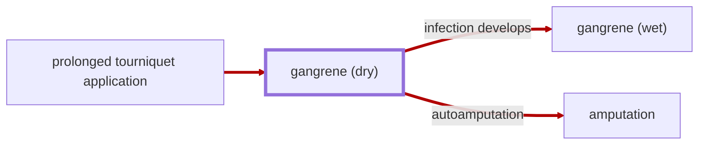
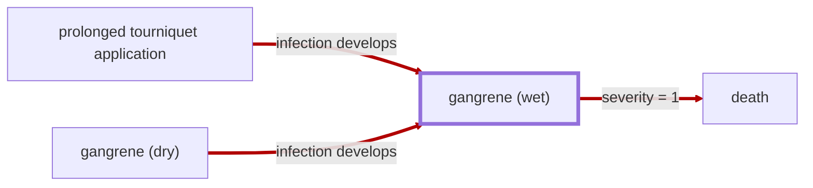

# Gangrene

<!-- @generate_breadcrumb_trail {"template": "_:file_folder: {0}_", "connector": " :arrow_right: "} -->
_:file_folder: [More Injuries User Manual](/docs/wiki/README.md) :arrow_right: [Injuries and Medical Conditions A-Z](/docs/wiki/injuries-and-medical-conditions-a-z/README.md) :arrow_right: [Gangrene](/docs/wiki/injuries-and-medical-conditions-a-z/gangrene.md)_
<!-- @end_generated_block -->

Gangrene is a type of tissue death caused by a lack of blood supply. Symptoms may include a change in skin color to red or black, numbness, swelling, pain, skin breakdown, and coolness. Depending on the presence of infection, gangrene may be classified as dry or wet.

## Dry Gangrene

> **In-Game Description**
> _"**Gangrene (dry)** &mdash; Dry gangrene is a form of coagulative necrosis that develops in ischemic tissue, where the blood supply is inadequate to keep tissue viable. The affected part is dry, shrunken, and dark reddish-black. The line of separation usually brings about complete separation, with eventual falling off of the gangrenous tissue if it is not removed surgically, a process called autoamputation.  
> Over time, dry gangrene may develop into wet gangrene if an infection develops in the dead tissues.  
> The affected body part is irreversibly damaged and should be amputated to prevent sepsis."_

**Causes**: A lack of blood supply to a body part, often due to a [tourniquet](#tourniquet) that has been applied for too long or other conditions that restrict blood flow.

**Effects**: The affected body part will become dry, shrunken, and dark reddish-black, and may eventually fall off if not removed surgically. Dry gangrene may progress to [wet gangrene](#wet-gangrene) if an infection develops in the dead tissues.

*See the section on the [pathophysiological system](#pathophysiological-system) for more information on the graphical representation.*

**Treatment**: The affected body part is irreversibly damaged and should be amputated to prevent life-threatening infection.

## Wet Gangrene

> **In-Game Description**
> _"**Gangrene (wet)** &mdash; Wet, or infected, gangrene is characterized by thriving bacteria and has a poor prognosis (compared to dry gangrene) due to sepsis resulting from the free communication between infected fluid and circulatory fluid. The affected part is saturated with stagnant blood, which promotes the rapid growth of bacteria. The toxic products formed by bacteria are absorbed, causing systemic manifestation of sepsis and finally death.  
> The affected body part should be amputated as soon as possible to save the patient's life._"

**Causes**: A lack of blood supply to a body part that caused the tissue to die and become infected with bacteria, often due to a [tourniquet](#tourniquet) that has been applied for too long or due to [dry gangrene](#dry-gangrene) that has become infected.

**Effects**: The affected body part will become saturated with stagnant blood, promoting the rapid growth of bacteria. The toxic products formed by bacteria are absorbed, causing systemic manifestation of sepsis and eventually death.

*See the section on the [pathophysiological system](#pathophysiological-system) for more information on the graphical representation.*

**Treatment**: The affected body part should be amputated as soon as possible to save the patient's life.

<!-- @generate_link_to_top {"template": "---\n_[back to the top]({1})_"} -->
---
_[back to the top](#gangrene)_
<!-- @end_generated_block -->
