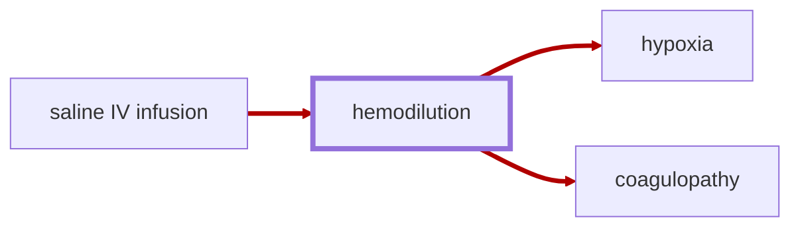

# Hemodilution

<!-- @generate_breadcrumb_trail {"template": "_:file_folder: {0}_", "connector": " :arrow_right: "} -->
_:file_folder: [More Injuries User Manual](/docs/wiki/README.md) :arrow_right: [Injuries and Medical Conditions A-Z](/docs/wiki/injuries-and-medical-conditions-a-z/README.md) :arrow_right: [Hemodilution](/docs/wiki/injuries-and-medical-conditions-a-z/hemodilution.md)_
<!-- @end_generated_block -->

Hemodilution is a condition that occurs when the concentration of red blood cells in the blood is reduced, such as through excessive usage of [saline IV infusions](#saline-iv-bag) for fluid resuscitation, leading to a decrease in the blood's ability to carry oxygen.

> **In-Game Description**
> _"**Hemodilution** &mdash; Hemodilution is the dilution of the concentration of red blood cells and plasma constituents by partially substituting the blood with colloids or crystalloids. It often occurs as a result of excessive fluid resuscitation, particularly in trauma patients, when large volumes of saline or other intravenous fluids are administered to restore blood volume and pressure after significant blood loss.  
> While the body can compensate for some degree of hemodilution, excessive dilution can lead to a significant reduction in the oxygen-carrying capacity of the blood and impair coagulation. In severe cases, it can result in hypoxia and dilutional coagulopathy, both of which can lead to increased risk of hemorrhage, organ failure, and death if not managed appropriately.  
> Hemodilution is typically treated by carefully managing fluid resuscitation, using blood products to restore red blood cell and plasma levels, and monitoring the patient's hemodynamic status closely to prevent complications."_

**Causes**: Excessive usage of [saline IV infusions](#saline-iv-bag) for fluid resuscitation, particularly in trauma patients, when large volumes of saline or other intravenous fluids are administered to restore blood volume and pressure after significant blood loss. Keep in mind that dilution will be more pronounced if the patient has already lost a significant amount of blood, as the remaining blood volume will be diluted by the additional fluids.

**Effects**: Hemodilution can lead to a significant reduction in the oxygen-carrying capacity of the blood and impair coagulation. In severe cases, it can result in loss of consciousness, [hypoxia](#hypoxia) and [dilutional coagulopathy](#coagulopathy), both of which can lead to increased risk of [hemorrhage](#hemorrhage-spontaneous), organ failure, and death if not managed appropriately.

*See the section on the [pathophysiological system](#pathophysiological-system) for more information on the graphical representation.*

**Treatment**: Hemodilution will resolve on its own over time as the body regenerates red blood cells and plasma constituents. However, in severe cases of hemodilution, it may be necessary to administer [blood products](#blood-bag) to restore red blood cell and plasma levels immediately, as well as carefully managing fluid resuscitation to prevent further dilution.

<!-- @generate_link_to_top {"template": "---\n_[back to the top]({1})_"} -->
---
_[back to the top](#hemodilution)_
<!-- @end_generated_block -->
