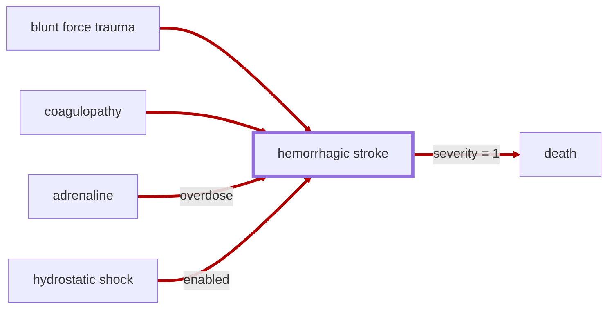

# Hemorrhagic Stroke

<!-- @generate_breadcrumb_trail {"template": "_:file_folder: {0}_", "connector": " :arrow_right: "} -->
_:file_folder: [More Injuries User Manual](/docs/wiki/README.md) :arrow_right: [Injuries and Medical Conditions A-Z](/docs/wiki/injuries-and-medical-conditions-a-z/README.md) :arrow_right: [Hemorrhagic Stroke](/docs/wiki/injuries-and-medical-conditions-a-z/hemorrhagic-stroke.md)_
<!-- @end_generated_block -->

In extreme cases of head trauma, a rupture of a blood vessel in the brain may occur, causing a life-threatening condition known as a hemorrhagic stroke. Blood from the ruptured vessel leaks into the brain, causing pressure to build up and compress the surrounding tissue, starving it of oxygen and nutrients and leading to rapid loss of consciousness and death if not surgically treated.

_Basically a more severe and dangerous version of a [concussion](#concussion)._

> **In-Game Description**
> _"**Hemorrhagic stroke** &mdash; A life-threatening condition caused by a rupture of a blood vessel in the brain. If left untreated, the patient will quickly lose consciousness as pressure builds up in the brain. Symptoms range from initial confusion and vomiting to coma and death.  
> Can be temporarily stabilized to slow progression until surgery can be performed to permanently repair the rupture."_

**Causes**: Severe blunt force trauma to the head, e.g., any violent impact to the head, such as hand-to-hand combat, being struck by a projectile, or explosions, as well as extreme blood pressure caused by [adrenaline overdose](#adrenaline-rush) may cause a rupture of a blood vessel in the brain. [Coagulopathy](#coagulopathy) may cause micro-ruptures in the blood vessels supplying the brain to occur and worsen over time, leading to a hemorrhagic stroke.  
If simulation of [hydrostatic shock](#hydrostatic-shock) is enabled in the mod settings, high-energy projectiles that cause massive temporary cavity formation and pressure waves in the tissue may also cause a hemorrhagic stroke.

**Effects**: Headache, memory loss, confusion, vomiting, rapid loss of consciousness, coma, and death if not surgically treated.

*See the section on the [pathophysiological system](#pathophysiological-system) for more information on the graphical representation.*

**Treatment**: Hemorrhagic stroke can be temporarily stabilized using medicine to slow progression until surgery can be performed to permanently repair the rupture. Ultimately, surgical intervention through [trepanation](#trepanation), [decompressive craniectomy](#decompressive-craniectomy), or [stereotactic surgery](#stereotactic-surgery) is required to save the patient's life.

<!-- @generate_link_to_top {"template": "---\n_[back to the top]({1})_"} -->
---
_[back to the top](#hemorrhagic-stroke)_
<!-- @end_generated_block -->
