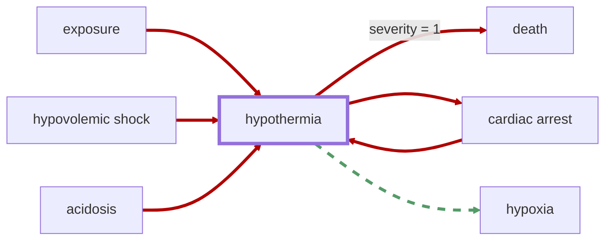

# Hypothermia

<!-- @generate_breadcrumb_trail {"template": "_:file_folder: {0}_", "connector": " :arrow_right: "} -->
_:file_folder: [More Injuries User Manual](/docs/wiki/README.md) :arrow_right: [Injuries and Medical Conditions A-Z](/docs/wiki/injuries-and-medical-conditions-a-z/README.md) :arrow_right: [Hypothermia](/docs/wiki/injuries-and-medical-conditions-a-z/hypothermia.md)_
<!-- @end_generated_block -->

_Vanilla RimWorld condition, see [Hypothermia (RimWorld Wiki)](https://rimworldwiki.com/wiki/Ailments#Hypothermia)_

**Causes**: Exposure to cold temperatures (see [Hypothermia (RimWorld Wiki)](https://rimworldwiki.com/wiki/Ailments#Hypothermia)), hypoperfusion due to [hypovolemic shock](#hypovolemic-shock) or [cardiac arrest](#cardiac-arrest), and reduced thermogenesis due to [acidosis](#acidosis).

**Effects**: Hypothermia can cause a range of symptoms, including shivering, confusion, fatigue, and impaired motor function. In severe cases, it can lead to loss of consciousness, [cardiac arrest](#cardiac-arrest), and death if not treated promptly. Due to reduced cellular metabolism at extremely low body temperatures, hypothermia can protect the body from further damage from [hypoxia](#hypoxia), albeit within limits.

*See the section on the [pathophysiological system](#pathophysiological-system) for more information on the graphical representation.*

**Treatment**: Hypothermia is primarily treated by warming the patient, either through external means (e.g., blankets, heating pads) or by ensuring adequate perfusion and thermogenesis (e.g., preventing [acidosis](#acidosis) and restoring blood volume using [blood bags](#blood-bag)). Hypothermia caused by exposure is best pro-actively prevented by ensuring that pawns are properly equipped with warm clothing and shelter in cold environments.

<!-- @generate_link_to_top {"template": "---\n_[back to the top]({1})_"} -->
---
_[back to the top](#hypothermia)_
<!-- @end_generated_block -->
