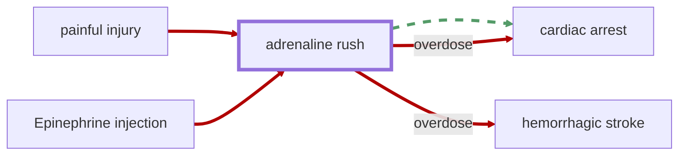

# Adrenaline Rush

<!-- @generate_breadcrumb_trail {"template": "_:file_folder: {0}_", "connector": " :arrow_right: "} -->
_:file_folder: [More Injuries User Manual](/docs/wiki/README.md) :arrow_right: [Injuries and Medical Conditions A-Z](/docs/wiki/injuries/README.md) :arrow_right: [Adrenaline Rush](/docs/wiki/injuries/adrenaline-rush.md)_
<!-- @end_generated_block -->

Adrenaline, also known as epinephrine, is a naturally occurring hormone that is released in response to stress or danger. It increases heart rate, blood pressure, and energy levels, preparing the body for a fight-or-flight response. In the game, an adrenaline rush can occur naturally in pawns as a result of combat and injury, or it can artificially be induced through the use of an [epinephrine injection](/docs/wiki/medical-devices.md#epinephrine-autoinjector).

> **In-Game Description**
> _"**Adrenaline rush** &mdash; A rush of adrenaline temporarily increases heart rate and blood pressure, providing a boost of energy and alertness. The body's fight-or-flight response is triggered, increasing strength and speed.  
> However, if the rush is too intense, it can cause anxiety, panic, and overdose symptoms such as dizziness, double vision, and nausea. In extreme overdose cases, the body can go into shock, causing heart attack, stroke, or death."_

**Causes**: Injuries or [epinephrine injections](/docs/wiki/medical-devices.md#epinephrine-autoinjector).

**Effects**: At lower levels, an adrenaline rush can provide a temporary boost to consciousness, moving, and pain tolerance. At higher levels, it can cause a reduction in manipulation and sight. In extreme cases of overdose, it can lead to anxiety, panic, nausea, as well as, coma, [cardiac arrest](/docs/wiki/injuries/cardiac-arrest.md#cardiac-arrest), [hemorrhagic stroke](/docs/wiki/injuries/hemorrhagic-stroke.md#hemorrhagic-stroke), and subsequent death. As adrenaline raises the heart rate and blood pressure, it can also reduce the effects of [hypovolemic shock](/docs/wiki/injuries/hypovolemic-shock.md#hypovolemic-shock) for a short period of time.  
In a similar way, epinephrine injections may be used to assist with [defibrillation](/docs/wiki/medical-devices.md#defibrillator) efforts and [CPR](/docs/wiki/medical-devices.md#cpr) in cases of [cardiac arrest](/docs/wiki/injuries/cardiac-arrest.md#cardiac-arrest).

*See the section on the [pathophysiological system](/docs/wiki/pathophysiological-system.md#pathophysiological-system) for more information on the graphical representation.*

**Treatment**: Adrenaline is naturally metabolized by the body over time and effects last between a few minutes to a few hours in severe cases. In cases of overdose, the pawn may require medical treatment to treat symptoms and secondary effects.

<!-- @generate_link_to_top {"template": "---\n_[back to the top]({1})_"} -->
---
_[back to the top](#adrenaline-rush)_
<!-- @end_generated_block -->
