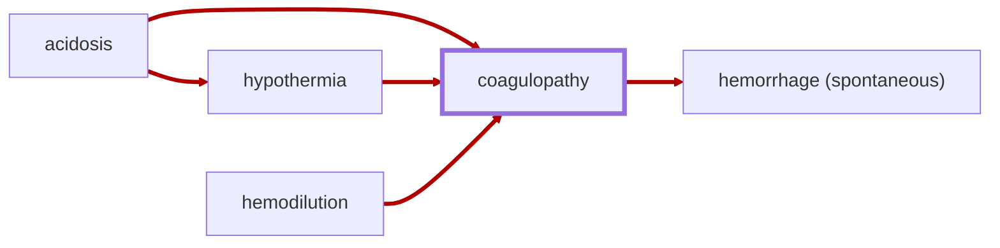

# Coagulopathy

<!-- @generate_breadcrumb_trail {"template": "_:file_folder: {0}_", "connector": " :arrow_right: "} -->
_:file_folder: [More Injuries User Manual](/docs/wiki/README.md) :arrow_right: [Injuries and Medical Conditions A-Z](/docs/wiki/injuries/README.md) :arrow_right: [Coagulopathy](/docs/wiki/injuries/coagulopathy.md)_
<!-- @end_generated_block -->

Coagulopathy is a dangerous condition that directly contributes to the [lethal triad of trauma](/docs/wiki/concepts.md#lethal-triad-of-trauma). It is characterized by a reduced ability of blood to clot, leading to an increased risk of bleeding and hemorrhage.

> **In-Game Description**  
> _"**Coagulopathy** &mdash; Trauma-induced coagulopathy (TIC) is a life-threatening condition in which the blood's ability to clot is impaired, often developing after severe trauma, blood loss, or shock. Without intervention, it can progress into disseminated intravascular coagulation (DIC), where widespread clotting depletes clotting factors and causes bruising and uncontrolled internal bleeding, leading to multiple organ failure and, ultimately, death. Treatment requires aggressive management of the underlying causes, such as hypothermia, acidosis, certain toxins, or dilution of clotting factors, and rapid replacement of blood components to restore coagulation function.  
> Treatment is focused on addressing the underlying causes and may include measures such as warming the patient, correcting acidosis by restoring adequate oxygenation and blood flow, restoring blood volume through transfusions, and triaging patients based on the severity of their condition."_

*See the section on the [pathophysiological system](/docs/wiki/pathophysiological-system.md#pathophysiological-system) for more information on the graphical representation.*

**Causes**: [Acidosis](/docs/wiki/injuries/acidosis.md#acidosis), [hemodilution](/docs/wiki/injuries/hemodilution.md#hemodilution), [hypothermia](/docs/wiki/injuries/hypothermia.md#hypothermia), or other conditions that impair the blood's ability to clot.

**Effects**: Globally increased bleeding rates, increased risk of spontaneous [hemorrhaging](/docs/wiki/injuries/hemorrhage.md#hemorrhage-spontaneous), and a key contributor to the [lethal triad of trauma](/docs/wiki/concepts.md#lethal-triad-of-trauma).

**Treatment**: Coagulopathy is an emerging condition that requires treatment of the underlying causes, such as warming the patient to prevent [hypothermia](/docs/wiki/injuries/hypothermia.md#hypothermia), restoring adequate oxygenation and blood flow to correct [acidosis](/docs/wiki/injuries/acidosis.md#acidosis), which is caused by [hypoxia](/docs/wiki/injuries/hypoxia.md#hypoxia), and restoring blood volume by administering [blood products](/docs/wiki/medical-devices.md#blood-bag) to correct [hypovolemic shock](/docs/wiki/injuries/hypovolemic-shock.md#hypovolemic-shock) or [hemodilution](/docs/wiki/injuries/hemodilution.md#hemodilution). Once the underlying causes are addressed, the body's clotting function will gradually normalize over time as the body recovers and regenerates any missing clotting factors.

> [!NOTE]
> For more information on the pathophysiology of coagulopathy, see [lethal triad of trauma](/docs/wiki/concepts.md#lethal-triad-of-trauma).

<!-- @generate_link_to_top {"template": "---\n_[back to the top]({1})_"} -->
---
_[back to the top](#coagulopathy)_
<!-- @end_generated_block -->
