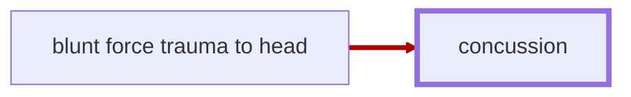

# Concussion

<!-- @generate_breadcrumb_trail {"template": "_:file_folder: {0}_", "connector": " :arrow_right: "} -->
_:file_folder: [More Injuries User Manual](/docs/wiki/README.md) :arrow_right: [Injuries and Medical Conditions A-Z](/docs/wiki/injuries/README.md) :arrow_right: [Concussion](/docs/wiki/injuries/concussion.md)_
<!-- @end_generated_block -->

> **In-Game Description**  
> _"**Concussion** &mdash; A concussion, also known as a mild traumatic brain injury (mTBI), is a head injury that temporarily affects brain functioning. Symptoms may include loss of consciousness; memory loss; headaches; difficulty with thinking, concentration, or balance; nausea; blurred vision; dizziness; sleep disturbances, and mood changes.  
> Should resolve on its own within a few days, but can be worsened by repeated head injuries."_

**Causes**: Blunt force trauma to the head. May be caused by any violent impact to the head, such as hand-to-hand combat, being struck by a projectile, or explosions.

**Effects**: A concussion may range from a mild headache to full unconsciousness, depending on the severity of the injury. The pawn may experience a temporary loss of consciousness, memory loss, painful headaches, disorientation,difficulty with thinking, nausea and vomiting, blurred vision, and dizziness. Repeated head injuries may worsen the condition or lead to a [hemorrhagic stroke](/docs/wiki/injuries/hemorrhagic-stroke.md#hemorrhagic-stroke).

*See the section on the [pathophysiological system](/docs/wiki/pathophysiological-system.md#pathophysiological-system) for more information on the graphical representation.*

**Treatment**: Concussions are generally self-limiting and will resolve on their own within a few days.

<!-- @generate_link_to_top {"template": "---\n_[back to the top]({1})_"} -->
---
_[back to the top](#concussion)_
<!-- @end_generated_block -->
