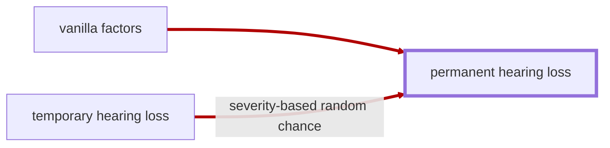

# Hearing Loss

<!-- @generate_breadcrumb_trail {"template": "_:file_folder: {0}_", "connector": " :arrow_right: "} -->
_:file_folder: [More Injuries User Manual](/docs/wiki/README.md) :arrow_right: [Injuries and Medical Conditions A-Z](/docs/wiki/injuries/README.md) :arrow_right: [Hearing Loss](/docs/wiki/injuries/hearing-loss.md)_
<!-- @end_generated_block -->

Hearing loss is a partial or total inability to hear. It may be temporary or permanent and can affect one or both ears and can be commonly caused by exposure to loud noises, trauma, or age-related degeneration.

## Temporary Hearing Loss

> **In-Game Description**
> _"**Temporary hearing loss** &mdash; Temporary deafness caused by prolonged exposure to loud noises, such as gunfire, explosions, or machinery. The hair cells in the inner ear are damaged, leading to hearing loss. The damage can become permanent if the exposure is severe or prolonged."_

**Causes**: Prolonged exposure to gunfire or explosions without [hearing protection](/docs/wiki/medical-devices.md#hearing-protection). More likely to occur indoors or in close proximity to the source of the noise.

**Effects**: Temporary reduction in hearing ability, ranging from mild to complete deafness, depending on the severity of the exposure. May progress to [permanent hearing loss](#permanent-hearing-loss) if the exposure is severe or prolonged.

*See the section on the [pathophysiological system](/docs/wiki/pathophysiological-system.md#pathophysiological-system) for more information on the graphical representation.*

**Treatment**: Temporary hearing loss will resolve on its own over time, but may become permanent if the exposure is severe or prolonged.

## (Permanent) Hearing Loss

_Vanilla RimWorld condition, see [Hearing loss (RimWorld Wiki)](https://rimworldwiki.com/wiki/Ailments#Hearing_loss)_.

**Causes**: See [Hearing loss (RimWorld Wiki)](https://rimworldwiki.com/wiki/Ailments#Hearing_loss), but can also be caused by severe cases of [temporary hearing loss](#temporary-hearing-loss).

**Effects**: Permanent reduction in hearing ability, see [Hearing loss (RimWorld Wiki)](https://rimworldwiki.com/wiki/Ailments#Hearing_loss).

*See the section on the [pathophysiological system](/docs/wiki/pathophysiological-system.md#pathophysiological-system) for more information on the graphical representation.*

**Treatment**: Implants or bionic ears (see [Hearing loss (RimWorld Wiki)](https://rimworldwiki.com/wiki/Ailments#Hearing_loss)), or [cellular regenerative otologic surgery](/docs/wiki/surgeries.md#cellular-regenerative-otologic-surgery) to repair the damaged hair cells in the inner ear.

<!-- @generate_link_to_top {"template": "---\n_[back to the top]({1})_"} -->
---
_[back to the top](#hearing-loss)_
<!-- @end_generated_block -->
