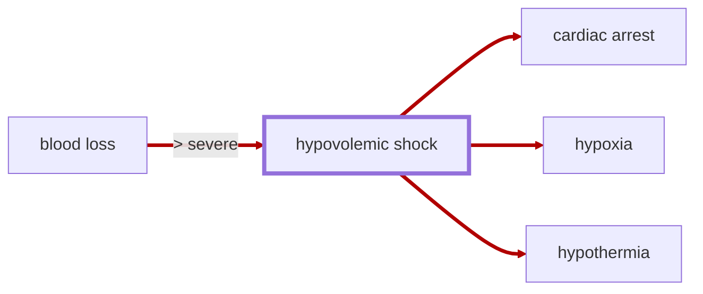

# Hypovolemic Shock

<!-- @generate_breadcrumb_trail {"template": "_:file_folder: {0}_", "connector": " :arrow_right: "} -->
_:file_folder: [More Injuries User Manual](/docs/wiki/README.md) :arrow_right: [Injuries and Medical Conditions A-Z](/docs/wiki/injuries/README.md) :arrow_right: [Hypovolemic Shock](/docs/wiki/injuries/hypovolemic-shock.md)_
<!-- @end_generated_block -->

When a pawn loses a significant amount of blood, there may not be enough blood volume to circulate to the body's organs, leading to a life-threatening condition known as hypovolemic shock. Without immediate treatment, the insufficient blood flow can starve the organs of oxygen and nutrients, causing tissue damage, multiple organ failure, and ultimately death. At the same time, the reduced blood flow prevents body temperature from being adequately maintained, which can lead to [hypothermia](/docs/wiki/injuries/hypothermia.md#hypothermia) and further complications.

> **In-Game Description**
> _"**Hypovolemic shock** &mdash; A life-threatening state caused by insufficient blood flow to the body. Hypovolemic shock is a medical emergency; if left untreated, the insufficient blood flow can cause damage to organs, leading to hypoxia and multiple organ failure.  
> Severity scales directly with blood loss severity until 55% severity, after which it continues to worsen, even if bleeding is stopped. Must be treated with blood transfusion or other means to restore blood volume. Progession can also be slowed by administering adrenaline to increase heart rate and blood pressure."_

**Causes**: Severe blood loss from injuries, such as lacerations, gunshot wounds, or surgical procedures.

**Effects**: Hypovolemic shock is a medical emergency that can cause a rapid decline in consciousness, blood pressure, body temperature, and heart rate, leading to [hypothermia](/docs/wiki/injuries/hypothermia.md#hypothermia), [hypoxia](/docs/wiki/injuries/hypoxia.md#hypoxia), multiple organ failure, and [cardiac arrest](/docs/wiki/injuries/cardiac-arrest.md#cardiac-arrest). The body can compensate for some degree of blood loss, but once the progression of hypovolemic shock reaches 55% severity, the condition will quickly deteriorate, even if the bleeding is stopped, and the patient will enter a [death spiral](/docs/wiki/concepts.md#lethal-triad-of-trauma) that will become increasingly difficult to reverse.

*See the section on the [pathophysiological system](/docs/wiki/pathophysiological-system.md#pathophysiological-system) for more information on the graphical representation.*

**Treatment**: Hypovolemic shock is treated by treating the underlying cause of the blood loss (e.g., stopping the bleeding) and restoring blood volume to compensate for the loss of blood. Depending on the severity of the condition, preventing further blood loss may be sufficient to allow the body to recover on its own. In more severe cases, when the progression of hypovolemic shock has reached above 55% severity, blood volume must be restored through fluid resuscitation using [saline IV infusions](/docs/wiki/medical-devices.md#saline-iv-bag) or [blood transfusion](/docs/wiki/medical-devices.md#blood-bag). Once the blood loss is no longer `severe`, the severity of hypovolemic shock will start to decrease over time, allowing the patient to recover. Note that this recovery period may take several hours as the blood volume is restored by the IV fluids or blood transfusion. During this recovery period, the patient must be kept under close observation, especially when past 55% severity, and secondary effects, like [hypoxia](/docs/wiki/injuries/hypoxia.md#hypoxia) or [cardiac arrest](/docs/wiki/injuries/cardiac-arrest.md#cardiac-arrest), must be treated as they might still occur until the patient has been fully stabilized (blood loss severity at `moderate` or lower and hypovolemic shock severity below 55%).  
During the initial emergency treatment of hypovolemic shock, its progression can be slowed by administering [epinephrine](/docs/wiki/injuries/adrenaline-rush.md#adrenaline-rush) to increase heart rate and blood pressure, which will help to increase the blood flow to the organs and reduce the risk of hypoxia and multiple organ failure. Additionally, hypovolemic shock itself may be treated using conventional medicine to decrease progression further for a short period of time until the patient can be fully stabilized using blood transfusion. Note, however, that **the only way to fully stabilize and save the patient's life is to restore blood volume.**

> [!TIP]
> As time is of the essence when treating hypovolemic shock, it is recommended to have a stockpile of [saline IV bags](/docs/wiki/medical-devices.md#saline-iv-bag), [blood bags](/docs/wiki/medical-devices.md#blood-bag), or other blood transfusion items ready in your hospital to quickly treat patients with severe blood loss. You may even want to assign some medically skilled pawns to be dedicated combat medics who keep a few blood bags in their inventory at all times to immediately stabilize and treat injured pawns on the battlefield. This can be achieved by telling the medic to "pick up" a number of blood bags (or including blood bags in [Combat Extended](https://github.com/CombatExtended-Continued/CombatExtended) loadouts) and then telling the drafted medic to `transfuse blood (from inventory, stabilize)` to the injured pawn.

> [!NOTE]
> **Biotech DLC**: Deathresting sanguaphages will automatically recover from hypovolemic shock over time, as they can regenerate blood on their own.

<!-- @generate_link_to_top {"template": "---\n_[back to the top]({1})_"} -->
---
_[back to the top](#hypovolemic-shock)_
<!-- @end_generated_block -->
