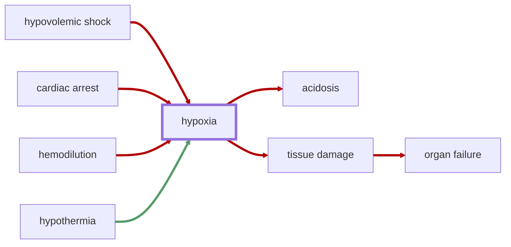
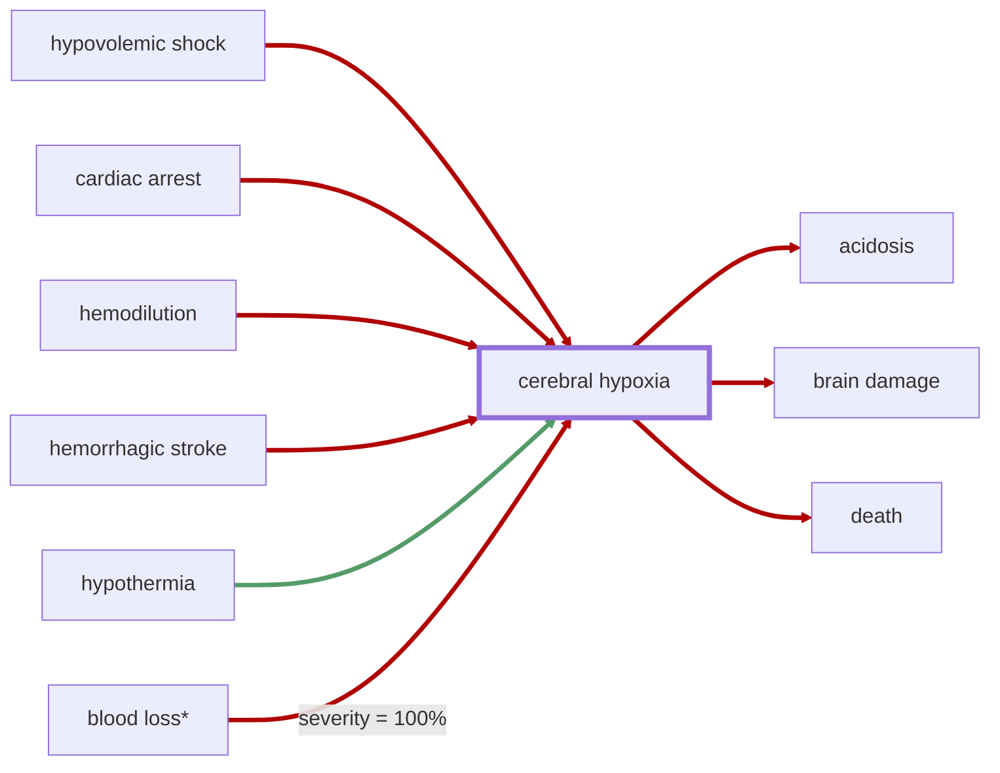

# Hypoxia

<!-- @generate_breadcrumb_trail {"template": "_:file_folder: {0}_", "connector": " :arrow_right: "} -->
_:file_folder: [More Injuries User Manual](/docs/wiki/README.md) :arrow_right: [Injuries and Medical Conditions A-Z](/docs/wiki/injuries/README.md) :arrow_right: [Hypoxia](/docs/wiki/injuries/hypoxia.md)_
<!-- @end_generated_block -->

Hypoxia is a condition in which the body or a region of the body is deprived of adequate oxygen supply at the tissue level. The cause of hypoxia may vary, but it is often the result of a severe lack of blood flow to the affected area, such as in cases of [hypovolemic shock](/docs/wiki/injuries/hypovolemic-shock.md#hypovolemic-shock) and [cardiac arrest](/docs/wiki/injuries/cardiac-arrest.md#cardiac-arrest), or due to reduced oxygen levels in the blood, for example, caused by [hemodilution](/docs/wiki/injuries/hemodilution.md#hemodilution). Hypoxia can lead to tissue damage, multiple organ failure, and death if not treated immediately. Additionally, cells will start to metabolize anaerobically in hypoxic conditions, leading to the production of lactic acid and [acidosis](/docs/wiki/injuries/acidosis.md#acidosis), which can further exacerbate the overall condition of the patient.

> **In-Game Description**
> _"**Hypoxia** &mdash; Insufficient oxygen supply to this part of the body has caused cells to start metabolizing anaerobically, leading to the production of lactic acid and acidosis, and to eventually die, causing tissue damage. If the underlying cause of the hypoxia is not immediately treated, the affected tissue will continue to deteriorate, eventually leading to multiple organ failure and death."_

*See the section on the [pathophysiological system](/docs/wiki/pathophysiological-system.md#pathophysiological-system) for more information on the graphical representation.*

**Causes**: Hypoperfusion due to [hypovolemic shock](/docs/wiki/injuries/hypovolemic-shock.md#hypovolemic-shock) or [cardiac arrest](/docs/wiki/injuries/cardiac-arrest.md#cardiac-arrest), reduced oxygen-carrying abilities of the blood due to [hemodilution](/docs/wiki/injuries/hemodilution.md#hemodilution), or other conditions that prevent adequate oxygen supply to the affected area.  
[Hypothermia](/docs/wiki/injuries/hypothermia.md#hypothermia) may slow down the progression of hypoxia, as the reduced cellular metabolism at extremely low body temperatures can protect the body from further damage, albeit within limits.

**Effects**: Damage to the affected tissue, and anaerobic metabolism leading to the production of lactic acid and [acidosis](/docs/wiki/injuries/acidosis.md#acidosis). If not treated immediately, hypoxia can lead to tissue damage, multiple organ failure, and death.

**Treatment**: Rapid correction of the underlying cause of hypoxia is essential. This may involve resuscitation measures to restore blood flow and oxygen supply to the affected area, such as [saline IV infusions](/docs/wiki/medical-devices.md#saline-iv-bag) or, preferably, [blood transfusions](/docs/wiki/medical-devices.md#blood-bag) to restore blood volume, or [cardiopulmonary resuscitation (CPR)](/docs/wiki/research.md#cardiopulmonary-resuscitation-cpr) to restore circulation and oxygenation in cases of cardiac arrest. Additionally, treating the damaged tissue with conventional medicine can help improve recovery and reduce the risk of further complications. In cases of hypoxia caused by [hemodilution](/docs/wiki/injuries/hemodilution.md#hemodilution), it is necessary to administer [blood products](/docs/wiki/medical-devices.md#blood-bag) to restore red blood cell and plasma levels.

## Cerebral Hypoxia

> **In-Game Description**
> _"**Cerebral hypoxia** &mdash; Prolonged lack of oxygen to the brain has caused neurological damage. Depending on the severity and duration of the hypoxia, damaged cells may be able to recover, or they may die off and cause permanent brain damage and disability. There's nothing else to do but wait and see."_

**Causes**: Hypoperfusion due to [hypovolemic shock](/docs/wiki/injuries/hypovolemic-shock.md#hypovolemic-shock) or [cardiac arrest](/docs/wiki/injuries/cardiac-arrest.md#cardiac-arrest), reduced oxygen-carrying abilities of the blood due to [hemodilution](/docs/wiki/injuries/hemodilution.md#hemodilution), [hemorrhagic stroke](/docs/wiki/injuries/hemorrhagic-stroke.md#hemorrhagic-stroke), or other conditions that prevent adequate oxygen supply to the affected area.  
[Hypothermia](/docs/wiki/injuries/hypothermia.md#hypothermia) may slow down the progression of hypoxia, as the reduced cellular metabolism at extremely low body temperatures can protect the body from further damage, albeit within limits.

**Effects**: Same as [hypoxia](/docs/wiki/injuries/hypoxia.md#hypoxia), but additionally can lead to [brain damage](/docs/wiki/injuries/brain-damage.md#brain-damage) and associated cognitive deficits. As more and more brain cells die off, the patient may become unconscious, enter a coma, or decease.

*\*If `Prevent direct death by blood loss` is enabled in the mod settings, then blood loss reaching 100% will kill over time through cerebral hypoxia*.

*See the section on the [pathophysiological system](/docs/wiki/pathophysiological-system.md#pathophysiological-system) for more information on the graphical representation.*

**Treatment**: See [hypoxia](/docs/wiki/injuries/hypoxia.md#hypoxia).

<!-- @generate_link_to_top {"template": "---\n_[back to the top]({1})_"} -->
---
_[back to the top](#hypoxia)_
<!-- @end_generated_block -->
