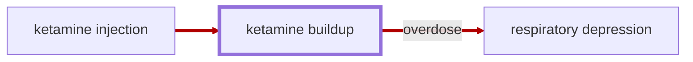

# Ketamine Buildup

<!-- @generate_breadcrumb_trail {"template": "_:file_folder: {0}_", "connector": " :arrow_right: "} -->
_:file_folder: [More Injuries User Manual](/docs/wiki/README.md) :arrow_right: [Injuries and Medical Conditions A-Z](/docs/wiki/injuries/README.md) :arrow_right: [Ketamine Buildup](/docs/wiki/injuries/ketamine-buildup.md)_
<!-- @end_generated_block -->

> **In-Game Description**
> _"**Ketamine buildup** &mdash; Ketamine is a fast-acting dissociative anesthetic used for pain relief, sedation, and anesthesia. It works by disrupting communication between the thalamus and cerebral cortex, producing a trance-like, pain-free state without significantly suppressing cardiovascular function at recommended doses.  
> Once administered, ketamine is distributed systemically and slowly metabolized by the liver. Blood concentrations diminish over time, but repeated or excessive doses can lead to dangerous accumulation resulting in toxicity and overdose.  
> Symptoms of ketamine toxicity range from amnesia, confusion, and hallucinations to brain damage, respiratory depression, and death in severe cases of overdose."_

**Causes**: Administration of one or more [ketamine autoinjectors](/docs/wiki/medical-devices.md#ketamine-autoinjector) lead to a buildup of ketamine in the body, which gets naturally metabolized over time.

**Effects**: At therapeutic doses, ketamine provides pain relief and sedation. Memory loss, confusion, and hallucinations may occur, especially as doses increase or with prolonged use. While generally safe at recommended doses, overdose can lead to respiratory depression, unconsciousness, and death.

**Treatment**: Ketamine is automatically metabolized by the body over time. Supportive care in cases of overdose may include administering [epinephrine](/docs/wiki/medical-devices.md#epinephrine-autoinjector) to stimulate breathing and counteract respiratory depression.

> [!TIP]
> Anesthetics offer a wide range of possibilities in RimWorld gameplay. From ensuring hostile pawns stay unconscious while rendering first aid before capturing them, safely "calming down" colonists on violent mental breaks, or even for self-sedation and "playing dead" as a last resort in combat when escape is not an option. Feel free to experiment with the new possibilites. Beware though that sedating someone without medical necessity is considered a hostile action.

<!-- @generate_link_to_top {"template": "---\n_[back to the top]({1})_"} -->
---
_[back to the top](#ketamine-buildup)_
<!-- @end_generated_block -->
