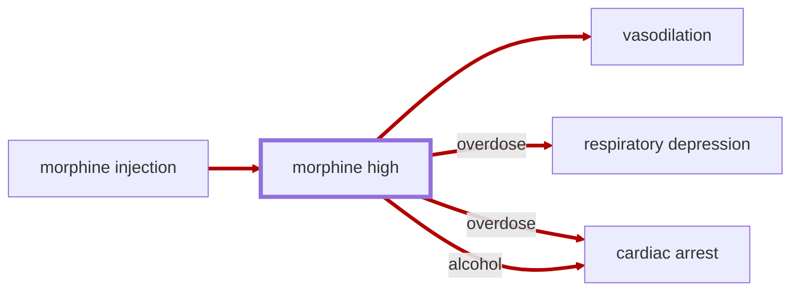

# Morphine High

<!-- @generate_breadcrumb_trail {"template": "_:file_folder: {0}_", "connector": " :arrow_right: "} -->
_:file_folder: [More Injuries User Manual](/docs/wiki/README.md) :arrow_right: [Injuries and Medical Conditions A-Z](/docs/wiki/injuries/README.md) :arrow_right: [Morphine High](/docs/wiki/injuries/morphine-high.md)_
<!-- @end_generated_block -->

> **In-Game Description**
> _"**Morphine high** &mdash; Morphine is a powerful opioid analgesic used for rapid pain relief in battlefield trauma and emergency care. It works by suppressing the central nervous system, blocking pain signals, inducing sedation, and providing a sense of euphoria. However, it can cause dangerous respiratory depression, lower blood pressure, and worsen shock, making it especially hazardous during uncontrolled bleeding or resuscitation efforts, and potentially fatal in overdose."_

Morphine causes [vasodilation](/docs/wiki/injuries/vasodilation.md#vasodilation), a widening of blood vessels, which decreases vascular resistance and increases blood flow. As such, hemorrhagic resistance is reduced, leading to increased bleeding and a reduced tolerance to [hypovolemia](/docs/wiki/injuries/hypovolemic-shock.md#hypovolemic-shock). Therefore, morphine should be used with caution in patients with uncontrolled bleeding or shock.

*See the section on the [pathophysiological system](/docs/wiki/pathophysiological-system.md#pathophysiological-system) for more information on the graphical representation.*

**Causes**: Administering a [morphine autoinjector](/docs/wiki/medical-devices.md#morphine-autoinjector).

**Effects**: Euphoria, pain relief, reduced consciousness, and [vasodilation](/docs/wiki/injuries/vasodilation.md#vasodilation). In high doses or when mixed with other depressants like alcohol, it can lead to respiratory depression, [cardiac arrest](/docs/wiki/injuries/cardiac-arrest.md#cardiac-arrest), and death.

**Treatment**: Currently, no specific antidote for morphine overdose has been implemented in the game. Treatment for overdose involves supportive care and treating symptoms as they arise.

**Thoughts per Stage**:
> _"**Slight buzz** (+3) &mdash; Ah... yeah... things aren't as sharp anymore."_  
> _"**Warm pudding limbs** (+10) &mdash; Yeah... that's the stuff. My limbs feel like warm pudding."_  
> _"**Pure euphoria** (+15) &mdash; Wheeeeeeeeeeeeeeeeeeeeeeee."_  
> _"**Too comfy to care** (+5) &mdash; Whoa... the walls are melting. ...uh... stay awake... nah, too comfy..."_

> [!WARNING]
> Due to its adverse effects on the respiratory systems, morphine should be used with caution, and patients should be closely monitored for any signs of complications.

> [!NOTE]
> While a decisive factor in real-world medical scenarios, the addictive properties of morphine are not currently simulated in the game.

<!-- @generate_link_to_top {"template": "---\n_[back to the top]({1})_"} -->
---
_[back to the top](#morphine-high)_
<!-- @end_generated_block -->
